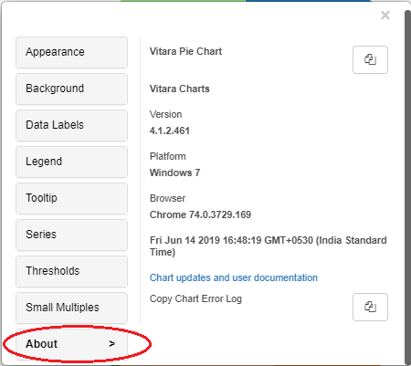

# How to find the version of Vitaracharts being used?

Hover the cursor on any of the vitara chart to get ‘Edit’ button. When we click on ‘Edit’ button properties popup window will be displayed on the screen. Click on ‘About’ tab in the properties window. The “About” tab will display details like; name of the chart, vitara charts version number, OS details of the client machine, browser details and time stamp etc.

<figure><figcaption></figcaption></figure>
