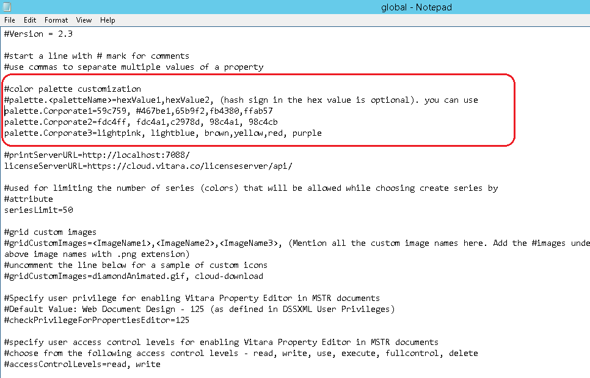

# Custom Color Palette

These features are supported in the release 4.2 (or newer)

Users can create custom color palettes for Vitara charts. VitaraCharts comes with three custom color palettes by default: **Corporate1**, **Corporate2** and **Corporate3**.

In any of the Vitara chart, go to - edit → appearance → color palette.You may see these three color palettes if you expand the color palette tab. We can change the colors in existing color palettes and create new ones.

## Steps to create and deploy a custom color palette <a href="#steps-to-create-and-deploy-a-custom-color-palette" id="steps-to-create-and-deploy-a-custom-color-palette"></a>

### **Step 1:**

Open the file named **global.txt** in the following path,

```
Tomcat 8.0\webapps\MicroStrategy\plugins\VitaraCharts\custom
```

In this file, you can see the three properties called **palette.Corporate1**, **palette.Corporate2** and **palette.Corporate3**. These are the sample custom palettes’ declarations. Please refer the below screenshot of the ‘global.txt’ file.

<figure><figcaption></figcaption></figure>

### **Step 2:**

Create a palette. Color names, hex values, and RGB values are all valid color values. As an example,

```
palette.Vitara=red,green,blue,#12ffd4,rgb(123,215,168)
```

### **Step 3:**

There is a palette.list property. This property contains all of the custom palettes (separated by commas) that must be reflected in the charts.

Add the name of the custom palette that you want to see in the chart’s list of color palettes.

As an example,

```
palette.list=Corporate1,Corporate2,Corporate3,Vitara
```

### **Step 4:**

To see the color palette applied on the chart, For example to select the palette named **Vitara**,

Click

```
- Edit → Appearance → Color Palette → Vitara
```

Below is the screenshot of an existing custom palette **Corporate1** in the chart.

<figure><figcaption></figcaption></figure>

## Steps to set a custom palette as the default palette <a href="#steps-to-set-a-custom-palette-as-the-default-palette" id="steps-to-set-a-custom-palette-as-the-default-palette"></a>

### **Step 1:**

There is a key in **global.txt** named **palette.defaultPalette**. So, you need to specify which custom palette defined in the **global.txt** should be the default palette for all the charts. For example,

```
palette.defaultPalette=Corporate3
```

<figure><figcaption></figcaption></figure>

## **Note:**

* Palette will be shown as **Misconfigured** in the list of color palettes, on failed to parse user-defined palette from **global.txt**. For example,
* ```
  Vitara {Misconfigured}
  ```
* If the default palette set in the **global.txt** is **misconfigured**, the color palette is defaulted to the chart’s default palette.
* Users can define any number of colors in a given palette.
* After adding any new color, refresh the dossier/document to reflect the new color in Vitara charts.
* You can disable any of these custom color palettes, add **#** at the starting of the palette definition.
* You have to clear your the browser’s cache to reflect this change into any of the Vitara charts.

#### Enhancements (Introduced in Version 5.3.6)

* A new tool called the **Customization Tool** has been introduced.\
  It allows users to easily **edit configuration files** such as `global.txt` and `customStyles.css` through a **user-friendly interface**.\
  👉 [Click here](customization-tool.md) for more details.
* The **Health Tool** is now available to:
  * Verify **Vitara Charts plugin** deployment
  * Detect **configuration or compatibility issues**
  * Validate presence and structure of **custom configuration files**\
    👉[ Click here ](../install-docs/health-tool.md)to access the Health Tool.
