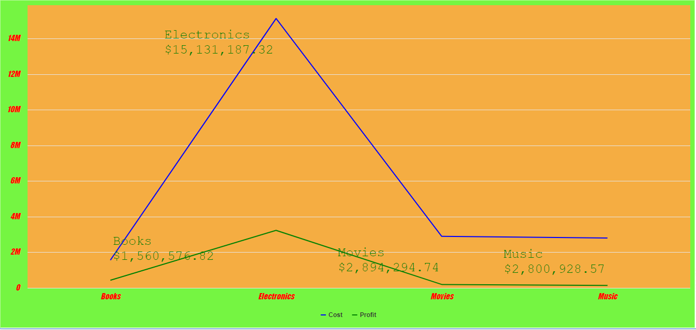
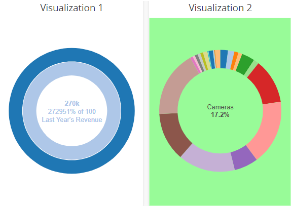

# Custom CSS Samples

## Chart Area Background

Applied chart area background color to be rgb(117, 245, 66)&#x20;

```
.vitara-chart-background{
  fill: rgb(117, 245, 66);
  background-color: rgb(117, 245, 66)
}
```

####

<figure><figcaption></figcaption></figure>

## Plot Area Background

Applied plot area background color to be #f5ad42

```
.vitara-plot-background{
    fill: #f5ad42;
    background-color: #f5ad42
}
```

####

<figure><figcaption></figcaption></figure>

## Axes Labels and Data Labels

Applied the ChartArea background color to be rgb(117, 245, 66)

The PlotArea background color to be #f5ad42

Both Category and Value axes labels font-size to be 15px, color fill to be red , font-family to be Impact and font-style to be italic

For datalabels, the font-size to be 25px, color fill to be green and font-family to be Courier New

```
.vitara-chart-background{
    fill: rgb(117, 245, 66);
    background-color: rgb(117, 245, 66)

}

.vitara-plot-background{
    fill: #f5ad42;
    background-color: #f5ad42
}

.vitara-category-axis, .vitara-value-axis {
    font-size: 15px;
    fill: red;
    font-family: Impact;
    font-style: italic;
}

.vitara-datalabel{
    font-size: 25px;
    color: green;
    font-family: 'Courier New';
}
```

####

<figure><figcaption></figcaption></figure>

## Tooltip

Applied the background color to be aqua , font family to be Comic Sans MS, Comic Sans, cursive and font size to be 35px

```
.vitara-tooltip{
    font-family: "Comic Sans MS, Comic Sans", cursive;
    font-size: 35px;
    background-color: aqua;
}
```

####

<figure><figcaption></figcaption></figure>

## Category Axis with title style different from the label style

For labels, the color fill was rgb(197, 66, 245), the font family was Impact, the text decoration was underline, and the font size was 18px. The color fill for the title was #f56c42, the font family was Helvetica, the text decoration was underline, the font size was 25px, and the font style was italic.

```
.vitara-category-axis{
    fill: rgb(197, 66, 245);
    text-decoration: underline;
    font-family: Impact;
    font-size: 18px
}
.vitara-category-axis .vitara-axis-title{
fill: #f56c42;
text-decoration: underline;
font-style: italic;
font-family: Helvetica;
font-size: 25px
}
```

####

<figure><figcaption></figcaption></figure>

## Border around bars/columns with border styling

Applied border to the column, stroke-width to be 2, stroke to be red and stroke-dasharray to be 5,5

```
.vitara-point{
    stroke-width: 2;
    stroke: red !important;
    stroke-dasharray: 5,5;
}
```

####

<figure><figcaption></figcaption></figure>

## Line Chart with different line style set

Applied stroke-width to be 2 and the stroke-dasharray to be 4,5,2

```
.vitara-line-display{
    stroke-width: 2;
    stroke-dasharray: 4,5,2;
}
```

####

<figure><figcaption></figcaption></figure>

## Legend Styling

Applied font-size to be 20px, the font-family to be Impact and fill to be red

```
.vitara-legend-text{
    fill: red;
    font-family: Impact;
    font-size: 20px;
}
```

####

<figure><figcaption></figcaption></figure>

## Customising Markers

Applied font-size to be 14px, fill to be teal , stroke to be red , stroke-width to be 2

```
.vitara-marker{
	fill:teal;
	font-size: 14px;
	stroke:red;
	stroke-width: 2;
}
```

####

<figure><figcaption></figcaption></figure>

## Customising Grid lines

### Applied stroke to be black , opacity to be 0.2, stroke-dasharray to be 6,6

```
.vitara-grid-line{
    stroke: black;
    opacity: 0.2;
    stroke-dasharray: 6,6;
}
```

####

<figure><figcaption></figcaption></figure>

## Customising a property specific to one or more charts

Applied fill to be palegreen for Pie chart background color

```
.VitaraHCPieChart .vitara-chart-background{
	fill: palegreen;
}
```

<figure><figcaption></figcaption></figure>
