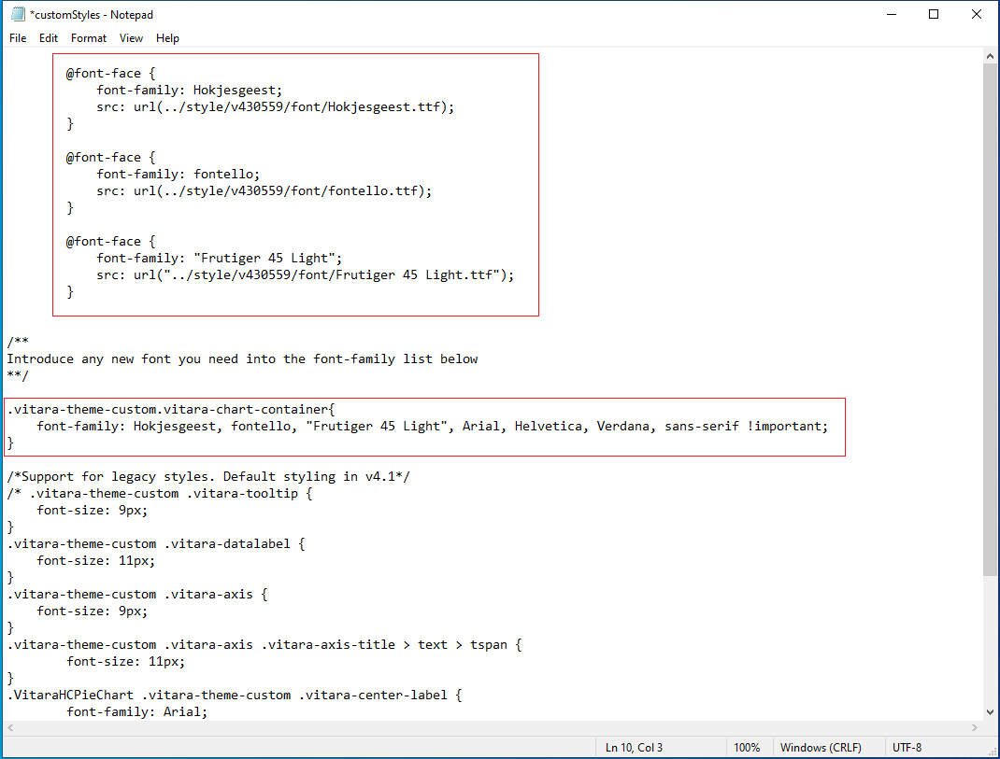

# Custom Fonts

These features are supported in the release 4.2 (or newer)

## Custom fonts in Vitara Charts <a href="#custom-fonts-in-vitara-charts" id="custom-fonts-in-vitara-charts"></a>

Vitara Charts can display text, such as axes labels, data labels, or tooltips, in the text font styles specified by the customer. The processes for deploying custom fonts in Vitara charts are outlined below.

### **Step 1:**

Copy the font file into the following path:

```
\tomcat\webapps\MicroStrategy\plugins\VitaraCharts\style\v430559\font
```

### **Step 2:**

Open customStyles.css file, which will be in the following path

```
plugins\VitaraCharts\custom
```

### **Step 3:**

Uncomment the “@font-face” container by deleting the text /\*\* (in first line) and the text \*\*/ (in the line number seven)

### **Step 4:**

Delete the entire text in the second line: “Uncomment to introduce new font-family and make it available”.

### **Step 5:**

Replace “font-family” with the name of the font you want to add. If your font name contains spaces, use quotation marks at the beginning and end of the name. For instance, ““Frutiger 45 Light.”

### **Step 6:**

In src:url line copy the path of the folder in which we copied the font file.

In the below example Hokjesgeest font is deployed.

```
@font-face {
            font-family: Hokjesgeest;
            src: url(../style/v430559/font/Hokjesgeest.ttf);
           }
```

Another example which has spaces in the font name:

```
@font-face {
            font-family: "Frutiger 45 Light";
            src: url("../style/v430559/font/Frutiger 45 Light.ttf");
           }
```

### **Step 7:**

If you want to add multiple custom fonts, then define font family for each custom font.

```
@font-face {
            font-family: fontello;
            src: url(../style/v430559/font/fontello.ttf);
           }
```

### **Step 8:**

List all the custom fonts names in the font vitara-chart-container.

```
.vitara .vitara-chart-container
{
	font-family:Hokjesgeest, fontello, "Frutiger 45 Light", Arial, Helvetica,
	Verdana, sans-serif !important;
}
```

Below is the screenshot of the updated “customStyle.css” file.

<figure><figcaption></figcaption></figure>

## Steps to show the custom fonts in the font-family dropdowns in property editor and set a particular font as default font. <a href="#steps-to-show-the-custom-fonts-in-the-font-family-dropdowns-in-property-editor-and-set-a-particular" id="steps-to-show-the-custom-fonts-in-the-font-family-dropdowns-in-property-editor-and-set-a-particular"></a>

### **Step 1:**

Open the file named **global.txt** in the following path,

```
Tomcat 8.0\webapps\MicroStrategy\plugins\VitaraCharts\custom
```

In this file, you can find fields named font.customFonts and font.defaultFont

### **Step 2:**

Include all the custom fonts specified in the font.customFonts key, each one separated by a comma (,). For example,

```
font.customFonts=OpenSans, Hokjesgeest, Frutiger 45 Light
```

### **Step 3 (Custom font by default across all charts):**

To set a font as default font for all charts, set the font.defaultFont key. For example,

```
font.defaultFont=Hokjesgeest
```

or

```
font.defaultFont=Frutiger 45 Light
```

Refresh your web browser and open Vitara Charts. Below is the screenshot of the custom font in the Vitara chart.

<figure><figcaption></figcaption></figure>

<figure><figcaption></figcaption></figure>

**Enhancemen**t: _Starting from version 5.3.6, a new tool called the Customization Tool has been introduced. This tool allows users to easily edit configuration files such as global.txt and customStyles.css through a user-friendly interface._\
For more details, \[click here].
