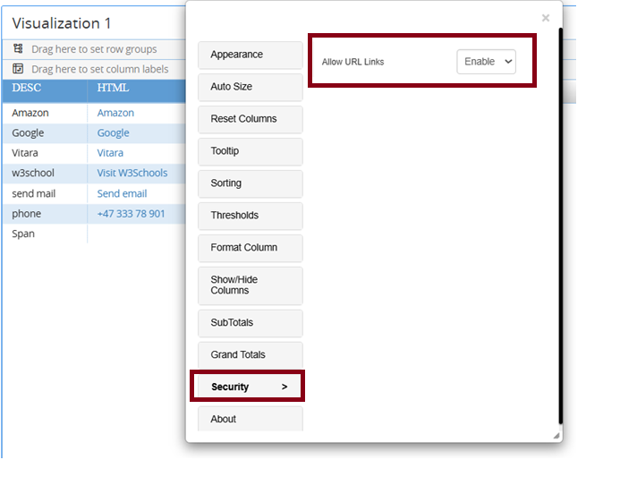

# Customization Tool

## Overview

The **Customization Tool** is a newly introduced interface designed to simplify the editing of key configuration—**global.txt, customStyles.css**, and **translation files**—directly from within the system. This user-friendly tool removes the need for manual file edits, streamlining customization workflows.

**Available from Version 5.3.6**\
This release supports full editing of global.txt and translation files. Partial editing is available for customStyles.css, with full support planned for a future update.

### &#x20;Key Features

* Add and manage **custom palettes**
* Add and manage **custom fonts**
* Modify individual settings in **global.txt**
* Edit individual translated texts in **translation files**
* Switch between available **languages**

📌 **Note**: After configuring your settings, make sure to click Save Changes in the top-right corner. The changes will only reflect in the visualizations once this step is completed.

**Clear your browser cache** to ensure the updated customization appears correctly in the visualizations

 

<figure><figcaption></figcaption></figure>

### Adding a Custom Palette

1. Enter a **name** for the new palette.
2. Click the **“+”** button to add and customize colors.
3. Click **Save Palette**.
4. Your palette will now appear in the saved list:

* **Enable it** using the checkbox.
* Use **Set as Default** if needed. 

5. Click **Save Changes** (top-right) to apply it to your charts.\
   To update an existing palette, click **Edit**, adjust the colors, and hit **Save.** 

### Define and Add a Custom Font

Ensure the font file is placed in the following directory:

* For **MSTR Web** : webapps\MicroStrategy\plugins\VitaraCharts\custom\fonts
* For **MSTR Library** : webapps\MicroStrategyLibrary\plugins\VitaraCharts\custom\fonts

**Note** : If the **fonts** folder does not exist under the custom directory, users can manually create it and then add your font files.

**Steps :**

**1. Enter Font Details**

* Specify the Font Name.
* Provide the source font file
* Click Add Font to save it. The font will now appear in the list of saved fonts. 

**2. Set the Font as Default**

To apply the newly added font as the default:

* Locate it in the Saved Fonts list.
* Enable the Set as Default option.

The selected font will now be used as the default across all  visualizations.

#### Refer to the attached **GIF** below for a demonstration of **custom palette** and **custom font** configuration.

<figure><figcaption></figcaption></figure>

### Modifying global.txt Settings

Toggle individual settings within the tool to replicate the effects of manual edits to **global.txt**, presented in a more intuitive format.

#### Refer to the attached screenshot for details.

<figure><figcaption></figcaption></figure>

### Translation&#x20;

The Translation tab allows users to:

* Edit individual entries in the translation files
* Switch between multiple language options

Below the screenshot for your reference 

<figure><figcaption></figcaption></figure>

### File Access Path

Access the customization interface from the following locations:

* For MicroStrategy Web Application:\
  &#xNAN;**/MicroStrategy/plugins/VitaraCharts/utils/customizations.html**
* For MicroStrategy Library Application:\
  &#xNAN;**/MicroStrategyLibrary/plugins/VitaraCharts/utils/customizations.html** 

📌 **Note**: Customizations must be applied separately for Web and Library  environments.

## Available from Version 5.3.10

The customization interface can be accessed from the following locations starting from version **5.3.10**.

**For MicroStrategy Web Application:**\
`/MicroStrategy/plugins/VitaraCharts/utils/customizations.jsp`

**For MicroStrategy Library Application:**\
`/MicroStrategyLibrary/plugins/VitaraCharts/utils/customizations.jsp`

#### IBCS Settings and Chart Styles

IBCS Settings and Chart Styles have been introduced in this version.

* The **IBCS Settings** option is available under the **Settings** tab.
* A new **Styles** tab has been added to support customization of **Chart Styles**.

Detailed information about both features is provided below.

## IBCS Settings&#x20;

The Customization Tool allows you to define keyword mappings for identifying IBCS scenarios such as Actual, Forecast, Planned, and Previous. These keywords help VitaraCharts automatically detect and classify metrics into the correct scenario.

**Enable IBCS by Default**

Turn this on to apply IBCS formatting automatically to charts.

**IBCS Metric Mappings (AC, PL, FC, PY)**

The configuration file defines how VitaraCharts detects which metric belongs to which IBCS scenario based on the metric name. These mappings are also used for automatic metric identification.

Examples:

* AC = AC, Actual
* PL = PL, Planned
* FC = FC, Forecast
* PY = PY, Previous Year

**Meaning:**\
If a metric name contains the defined keywords (e.g., AC or Actual), it will automatically be classified under the corresponding scenario.

**Purpose:**\
Used for scenario detection and metric identification across Actual, Planned, Forecast, and Previous Year.\
 

<figure><figcaption></figcaption></figure>

.png>)

**Note:**\
We currently have the capability to rename data labels for IBCS deltas. This feature will soon be added to the Customization Tool. For now, you can add these mappings directly using the IBCSglobal.txt file.

For more details and examples of these mappings, please refer to the official VitaraCharts documentation:[ IBCS User Guide – Mapping IBCS Scenarios](https://docs.vitaracharts.com/ibcs-user-guide/ibcs/mapping-ibcs-scenarios).

#### Applying IBCS Custom Styles in the Customization Tool

To apply IBCS styling to your charts using the Customization Tool, follow these steps:

1. **Open the Style tab** in the Customization Tool.
2. Under **Scope & Chart Component**, choose **Change Customization.**
3. Select **IBCS Custom Styles** from the list.

Once selected, you will see two options available under Scope:

* IBCS Standard View
* Waterfall

#### Chart Component Options

Depending on the component you choose, several IBCS styling options will be available, such as:

* Actual Data
* Forecast Data
* Previous Data
* Planned Data
* Delta View (Positive/Negative)

For some components, you can configure background color and line color, while others include only line styling options, as defined by IBCS guidelines.

After customizing the styles, simply save your changes. The chart will update immediately, reflecting the enhanced IBCS-compliant visual appearance.

#### **Example for Reference:**

To help you understand how IBCS styling works, the image below shows a customized Planned Data element. The line stroke color has been modified to match the IBCS guidelines, giving the chart a cleaner and more standardized appearance.

<figure><figcaption></figcaption></figure>

.png>)

## Custom CSS Styling in Vitara Charts&#x20;

Starting from version **5.3.10**, users can apply **custom CSS styles** to Vitara Charts directly through the Customization Tool. This enhancement replicates the functionality previously achieved through manual edits in the global.txt and **CustomCSS** files, but now provides a more intuitive and user-friendly interface. A new Style tab has been introduced in the Customization Tool to support this capability.

Within the Style tab, users can choose between Chart Custom Styles depending on their requirements.

Once a style type is selected (for example, Custom Styles), users can define the scope by selecting the specific charts to which the custom styles should apply.\
In the Scope ,we can see all the chart names&#x20;

Additionally, under the Chart Component section, users can customize individual elements such as axes, data labels, legends, and more. The available styling options include:

* Text color
* Font size
* Text formatting
* Letter spacing
* And other visual properties 

After configuring the desired styles, users must save the changes using the Save button located in the top-right corner of the tool.

To ensure the updated styles are applied, clear your browser cache. Once done, the chart will refresh and immediately display the enhanced visual appearance.

#### **Example for Reference:**

To illustrate how custom styling works, the screenshots below demonstrate how to customize a Grid/Micro chart by applying a subtotal header.\

<figure><figcaption></figcaption></figure>
