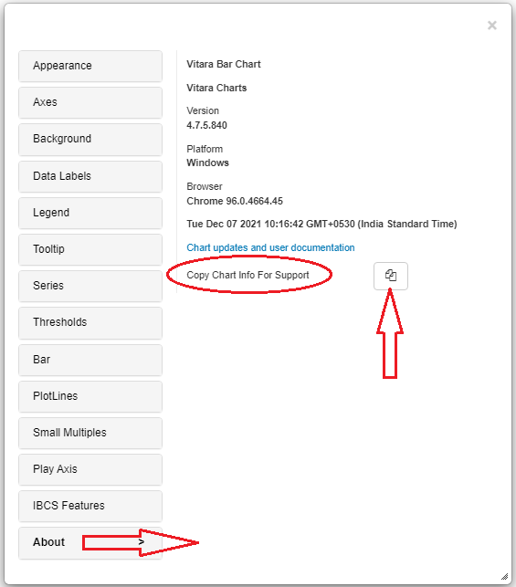

# Where can I find the chart state information?

**Where can I find the chart state information?**

On the ‘About’ (as shown below) tab of the properties editor of the chart for which you want to find details, please click on the ‘Copy Chart Info For Support’ and paste into a text file and send it to the support team.

<figure><figcaption></figcaption></figure>

Last updated 22 days ago
