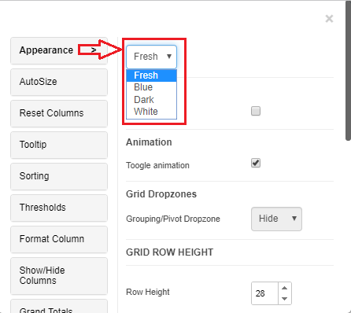

---
layout:
  title:
    visible: true
  description:
    visible: false
  tableOfContents:
    visible: true
  outline:
    visible: true
  pagination:
    visible: true
---

# Appearance

## Properties Menu - Appearance 

Most of the text formatting properties for the Vitara grid chart are available in the ‘Appearance’ tab. This tab can be accessed from the ‘Edit’ button. Hover the cursor on the Vitara grid chart, click on the ‘Edit’ button and select the ‘Appearance’ tab.

<figure><figcaption></figcaption></figure>

## Theme 

Vitara grid chart will come in the ‘Fresh’ theme by default. There are three other themes available in the Vitara grid chart: fresh, dark, and white. The theme can be modified ways, from the edit property window and from the right click property window. Below are the screenshots of accessing the theme from the above mentioned two ways.

Grid theme from edit property window:

<figure><figcaption></figcaption></figure>

Grid theme from right click property window:

<figure><figcaption></figcaption></figure>

From 4.5 version of VitaraCharts, grid chart supports custom themes. To know more about Custom themes, click [here](https://about/customization/GridCustomCSS#custom-themes.html).

## Layout 

There is an option to view the layout from the right to left format from the build 4.1. You can enable the option if want to see the chart from right to left. Below is a screenshot from the property editor.

<figure><figcaption></figcaption></figure>

See the screenshot below when we enable the right to left layout in the grid chart

<figure><figcaption></figcaption></figure>

## Toggle Animation 

Toggle Animation is a property that occurs while sorting the rows, resizing height of rows, filtering the rows and expanding/collapsing a row group. By default, the toggle animation is enabled.

<figure><figcaption></figcaption></figure>

**The grid will animate the rows in following scenarios:**

Row Animations

1. Filtering Rows
2. Sorting Rows
3. Expanding / Collapsing Row Groups
4. Resizing height of rows Each of these animations is turned OFF by default. The example below shows the animation how it works

<figure><figcaption></figcaption></figure>

### Show/Hide Dropzones 

In the Appearance theme you can see a property named Grid Dropzones, where you can Hide/Show the Grouping/ Pivot dropzones in the Grid chart. By default, the drop zones are shown in the grid chart. You can hide the drop zones if needed.

Below is the screenshot of Grid Dropzones property in Appearance tab&#x20;

<figure><figcaption></figcaption></figure>

Below are the examples shown in two ways;

1. Grid Dropzones are hidden&#x20;

<figure><figcaption></figcaption></figure>

2. Grid Dropzones are shown&#x20;

<figure><figcaption></figcaption></figure>

## Grid Row Height 

In Vitara grid chart rows are classified as; normal grid rows, column header row, and group header rows. Vitara grid chart allows users to modify the height of all the above-mentioned row types. Here you can hide the children count by enabling Hide children count checkbox.

<figure><figcaption></figcaption></figure>

“Grouped Row Height” field will be available if we apply to the group on any of the attributes/ metrics.

## Children Count 

In the Appearance property tab, you can see an option hide children count, where you can show/hide the children count of the row groups. By default, the hide children count option will be in enabled state and you cannot see the count of the row groups. This option can be visible only if the grouping is applied in the grid chart.

Below is the screenshot of Hide Children count in the Appearance tab

<figure><figcaption></figcaption></figure>

Below is the example where Hide Children count enabled.

<figure><figcaption></figcaption></figure>

Below is the example where Hide children count is disabled.

<figure><figcaption></figcaption></figure>

## Header and Body Text Styles 

Vitara grid chart offers you all the text formatting options; font family, font size, bold, italic, underline, text color, font alignment and background color. Below is the screenshot of theme properties showing header style options and body style options.

<figure><figcaption></figcaption></figure>
