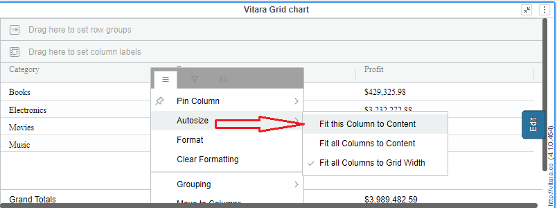
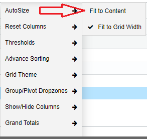
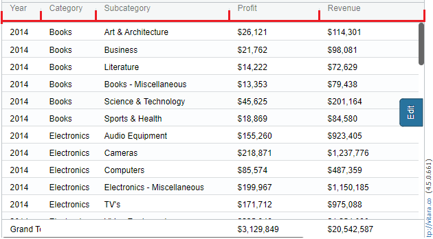
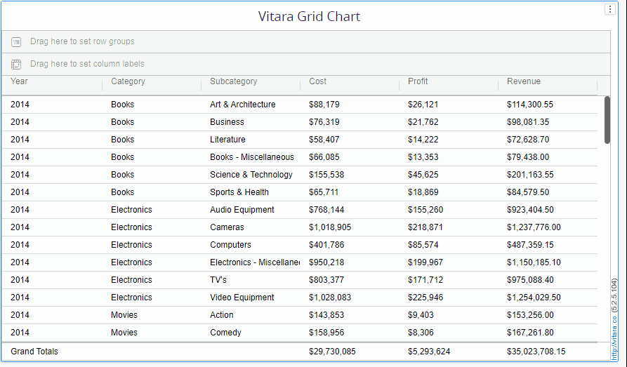

---
layout:
  title:
    visible: true
  description:
    visible: false
  tableOfContents:
    visible: true
  outline:
    visible: true
  pagination:
    visible: true
---

# Auto Size

Auto size property is adjusting the size of the columns in the Grid chart. In Vitara Grid chart there are two kinds of auto size options.

1. **Fit to Grid width**
2. **Fit to content**

By default, when you open the Vitara grid chart, it will adjust all the column contents to ‘Fit to Grid Width’.

‘**Fit to Grid Width**’ will adjust all columns in equal size, within the visualization area in the horizontal direction. Visualization doesn’t show scrollbar in the horizontal direction. ‘Fit to Grid Width’ state will dynamically adjust the size of the window even after we modify, i.e. maximizing or minimizing the visualization, visualization shrinks its area when we add other visualization, visualization area increases when we delete other visualizations etc.

‘**Fit to Content**’ will adjust the grid chart columns to their content width. We can also manually adjust the column size by dragging the column separator line at the column headers. After adjusting you need to save the dossier or document to retain the changes. We can apply ‘Fit to Grid Width’ or Fit to Content’ properties by opening properties windows in any of the three ways.

Each column can be resized by dragging to the right or left side of it’s header in the grid chart.

## Auto Size using the ‘Edit’ button 

Hover the cursor on the chart to display the ‘Edit’ button. Click on the ‘Edit’ button to open the properties window.

<figure><figcaption></figcaption></figure>

The chart will show ‘✔’ symbol beside the respective property which is currently applied on the chart. When we manually adjust the size of the chart, the chart will not show ‘✔’ mark on any of the tabs.

## Auto size using Hamburger Button 

We can open ‘Auto size’ property using the hamburger button of any column. Click on the hamburger button of any column. We have an additional property ‘Fit this Column to Content’ when we open ‘Auto size’ using the hamburger button. Below is a screenshot of this property.

<figure><figcaption></figcaption></figure>

We can apply ‘Fit this Column to Content’ for any individual columns.

## Auto size using ‘Right click’ properties window 

We can open ‘Auto size’ property using right-click menu in the grid chart. Right click on the chart, and apply ‘Fit to Column’ or ‘Fit to Grid width’. The following is a screenshot of ‘Auto size’ property using ‘Right Click’ properties window.

<figure><figcaption></figcaption></figure>

## Column resizing by dragging the header 

Resizing columns gives you the flexibility to customize the chart according to your specific needs. You can prioritize certain columns by making them wider while compressing less important columns to save space. A grid chart’s columns can be resized to improve the data’s readability. It ensures that all the information in each column is visible, making it easier to interpret and analyze the data.

## **How to resize columns in a grid chart ?**

Resizing columns in a table by dragging the sides of the columns in their headers is a convenient feature that allows users to customize the display of information. By simply dragging the right or left side of the columns, users can easily adjust the width of the columns to better fit the content. This flexibility in column resizing enhances the user experience and enables efficient navigation and analysis of data in tables. Whether it is to accommodate longer texts or to create more space for specific data, this feature provides users with the ability to optimize the presentation of information according to their preferences.

Below is a sample gif file that shows how to resize the columns.&#x20;

<figure><figcaption></figcaption></figure>

<figure><figcaption></figcaption></figure>

For information about reordering the columns, [click here.](https://docs.vitaracharts.com/grid-microchart-guide/reorder-columns)
