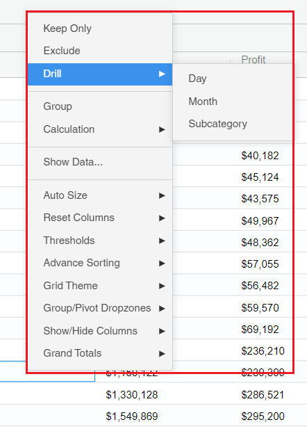
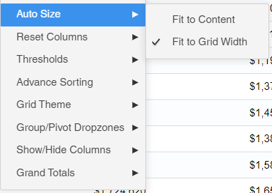

---
layout:
  title:
    visible: true
  description:
    visible: false
  tableOfContents:
    visible: true
  outline:
    visible: true
  pagination:
    visible: true
---

# Context Menu

#### Properties Menu - Context Menu 

Instead of the right click menu in the grid chart, from MSTR 2020 the context menu is displayed when we right-click the chart.

It has all the MSTR 2020 implementations in the context menu.

Below is the screenshot, when we right click the context menu is shown up with all the implementations in the MSTR 2020.

<figure><figcaption></figcaption></figure>

Below is the screenshot where the context menu is shown with only Grid chart related options, as the grouping is applied in the chart.

<figure><figcaption></figcaption></figure>
