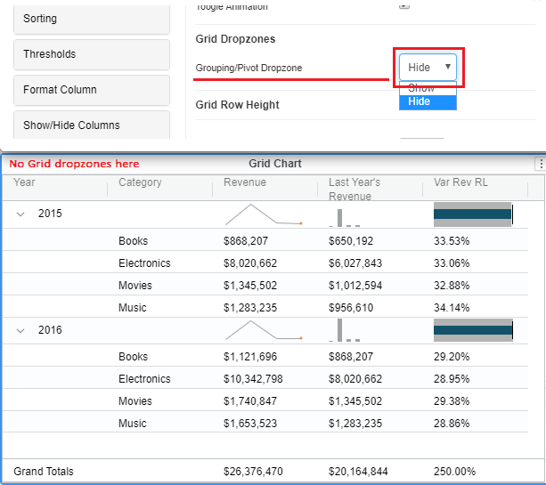

# Creating a micro chart

### Using the grid to create a Micro Chart 

From the 4.1 version of Vitara charts, trendlines feature is added in the Grid chart. With this feature, we can convert the Grid chart into Micro chart.

#### Inputs 

**Attributes required:** 2 or more\
**Metrics required:** 1 or more

Follow the below procedure to convert the Grid chart into Micro chart.\
**Step 1:**\
Create a Grid chart with 2 or more attributes and minimum of 1 metric. For example, we have a grid chart created with 2 attributes and 3 metrics. See the screenshot\

<figure><figcaption></figcaption></figure>

**Step 2:**\
Group by the attribute ‘Year’. In the Micro chart, we have two drop zones for attributes called Category axis and Trend By. In this example, ‘year’ will be the category axis attribute and ‘Category’ will be the Trend By attribute.\
See the screenshot which shows the year attribute in grouped state.\

<figure><figcaption></figcaption></figure>

**Step 3:**\
Now we will apply 3 different trend lines for the 3 different metrics. To know about trend lines click here\
See the screenshot which shows the trendlines applied.\

<figure><figcaption></figcaption></figure>

**Step 4:**\
Finally, hide the Grid dropzones using below steps

1. Open property editor > Appearance tab.
2. Set the ‘Grouping/Pivoting dropzone’ to hide\
   See the screenshot below with hidden Grid dropzones.

<figure><figcaption></figcaption></figure>

If you have noticed the above image, the grid dropzones are hidden. Just compare this screenshot with the screenshot in step 3. And the Grid chart is now converted to Micro chart

For detailed information on configuring Trendline settings, refer to the [Trendline](trend-lines.md) documentation
