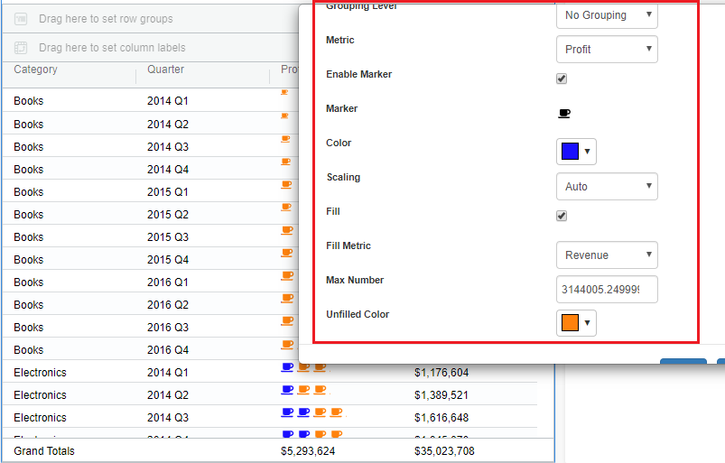

# Custom markers

From the 4.4 version in the Vitara Grid chart, we allow users to represent data markers. Custom Markers popup option will be available in “Display as” menu. Markers can be applied on ‘No grouping’ and ‘Grouped’ rows. The scaling at each aggregation level will be done separately.

<figure><figcaption></figcaption></figure>

**Marker Type & Marker Color**

Click on the marker icon to open the marker selection window. Please refer to the below screenshot.

<figure><figcaption></figcaption></figure>

After selecting the desired marker close the marker selection window. Select the marker color. Below is the screenshot of custom markers applied on cost metric.

<figure><figcaption></figcaption></figure>

When using custom markers we support in three modes: Auto scaled, Fixed scale and Fixed Range scale. The data marker tab with the ‘no grouping’ and ‘grouped’ rows screenshots are shown below.

<figure><figcaption></figcaption></figure>

<figure><figcaption></figcaption></figure>

**Auto Scale**

The number of markers will be calculated based on the column width, and the metric value shown in the column.

**Fill Metric** In addition to rendering the markers themselves, we can allow for fills to be done based on another metric. Users can fill the rendered marker with different color where fill percentage will be calculated based on the value of metric for current cell and max value of the metric.

Below are the examples shown, where data markers applied on Profit & Revenue metrics with Auto scaling on ‘No grouping’ and ‘Grouped’ rows.

<figure><figcaption></figcaption></figure>

<figure><figcaption></figcaption></figure>

Below are the examples shown, where data markers are applied on Profit & Revenue metric with Auto scaling having ‘Fill metric’ on ‘Nogrouping’ and ‘Grouped’ rows.

<figure><figcaption></figcaption></figure>

<figure><figcaption></figcaption></figure>

**Fixed Scale**

User can decide maximum markers to be rendered in a cell. The number of markers in the cell with max value will be equal to user-defined max value while markers in other cells will depend on the cell value and user-defined max value

If “Map data to Scale” is disabled then the number of markers will be equal to the value of the cell( even if the cell value is more than the user-defined max value, markers in the cell will be equal to user-defined value will be plotted)

Below are the examples shown, where data markers applied on Profit & Discount metrics with Fixed scaling (disabled Map data to Scale) on ‘No grouping’ and ‘Grouped’ rows.

<figure><figcaption></figcaption></figure>

<figure><figcaption></figcaption></figure>

Below are the examples shown, where data markers are applied on Profit & Discount metrics with Fixed scaling (enabled Map data to Scale) on ‘No grouping’ and ‘Grouped’ rows.

<figure><figcaption></figcaption></figure>

<figure><figcaption></figcaption></figure>

**Fixed Range Scale**

Fixed range scale is similar to fixed scale with a cap on minimum markers in a cell.

The fixed range option is that we show marker count in the range of 1 to 5(default values); You can change the min and max count values.

Below are the examples shown, where data markers are applied on Profit & Cost metrics with Fixed Range scaling (disabled Map Data to scale) on ‘No grouping’ and ‘Grouped’ rows.

<figure><figcaption></figcaption></figure>

<figure><figcaption></figcaption></figure>

Below are the examples shown, where data markers are applied on Profit & Cost metrics with Fixed Range scaling (enabled Map Data to scale) on ‘No grouping’ and ‘Grouped’ rows.

<figure><figcaption></figcaption></figure>

<figure><figcaption></figcaption></figure>
