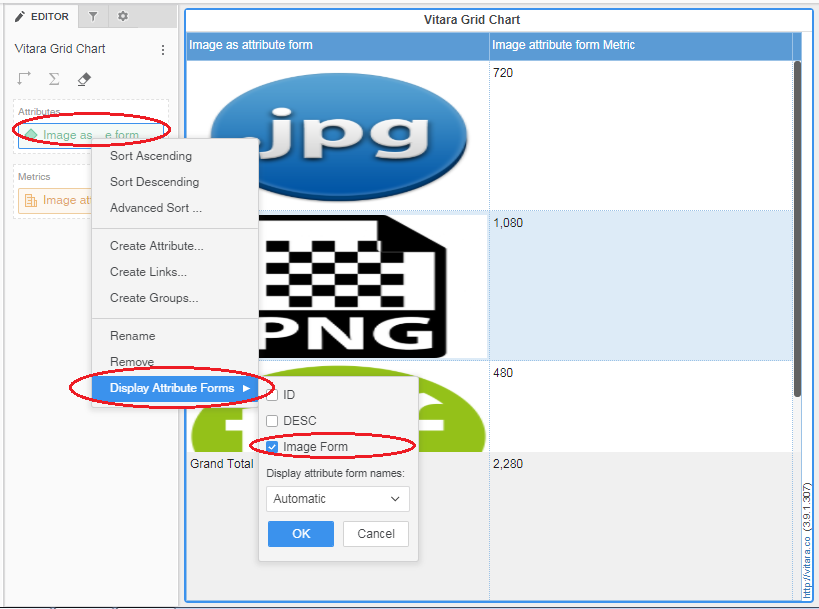

# Embed Images

Vitara grid chart now supports image URLs as an attribute form. Once the attribute form is selected as display form, the Vitara grid chart will load the images related to URLs. Below is a screenshot demonstrating how to change the default attribute form to other attribute forms.

<figure><figcaption></figcaption></figure>

In the drop zone panel right click on the attribute which has image URL as attribute form and expands the “Display Attribute Form” tab. If that particular attribute has more than one form to display, then only MicroStrategy will show the option “Display Attribute Form”. Now you can see all the attribute forms available for that particular attribute. Select the form which has an image URL and deselects the other forms then click ‘OK’. Vitara grid chart will display only one attribute form at a time.

### Adding Images Using HTML Tags

Images can also be added to the Vitara Grid Chart by including a dataset column that contains HTML tags or links. SVG images (such as logos) are triggered using these HTML tags or links specified in the attribute. The logos will automatically display on the chart once this column is included in the attribute.

**Example of Dummy Dataset:**

Below is a sample dataset that demonstrates the required structure for adding logos

<figure><figcaption></figcaption></figure>

Now, when dataset is being added we need to convert the 'IMG SRC' into an HTML tag format like this:

<figure><figcaption></figcaption></figure>

Below is a screenshot of the Vitara Grid Chart displaying the logos.

<figure><figcaption></figcaption></figure>

 
