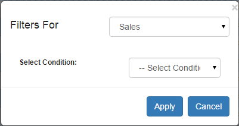
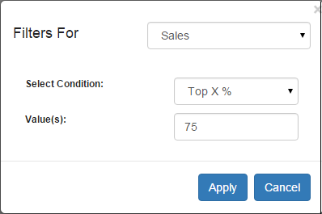
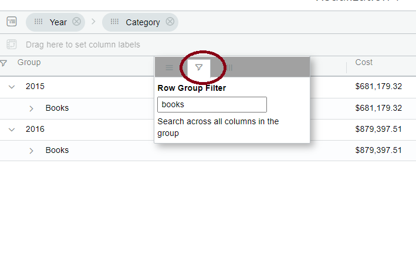

# Filter Data

We can also apply a filter on metrics to filter the data in the Vitara grid chart. Click on the hamburger button of any metric column on which you want to apply a filter, select ‘Filter Data’.

<figure><figcaption></figcaption></figure>

Now filter editor popup window will open.

<figure><figcaption></figcaption></figure>

In the ‘Filter For’ drop down box select the metric on which you want to apply a filter, then click on ‘Add’ button.

<figure><figcaption></figcaption></figure>

In the ‘Select Condition’ drop down box select the appropriate filter condition, give values and then click on the ‘Apply’ button.

<figure><figcaption></figcaption></figure>

Vitara grid chart will be updated with the data applying filter condition.

## Row Group Filtering 

From version 5.1 ,In the hamburger menu, we’ve added group filtering for attribute grouped elements. In the example below, we grouped the attributes ‘Year’ and ‘Category,’ and group filtering was applied from the hamburger menu where we filtered books, and it shows value from both years.

<figure><figcaption></figcaption></figure>
