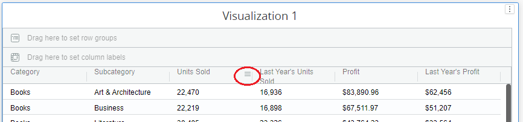
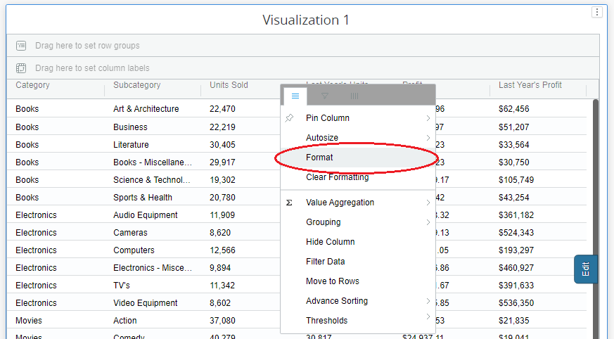
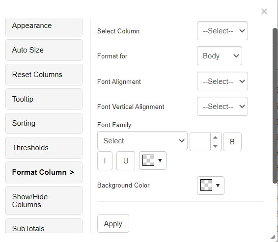
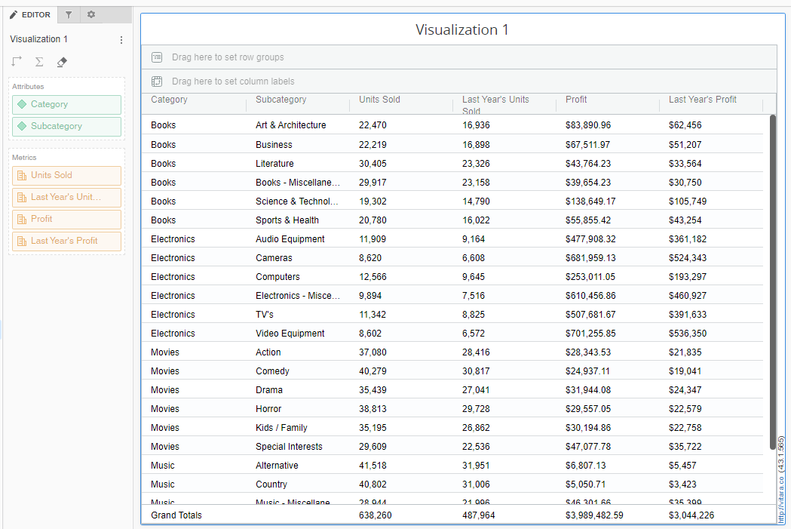
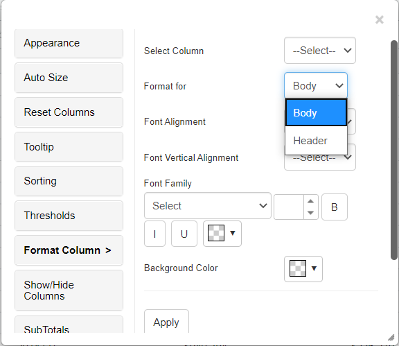
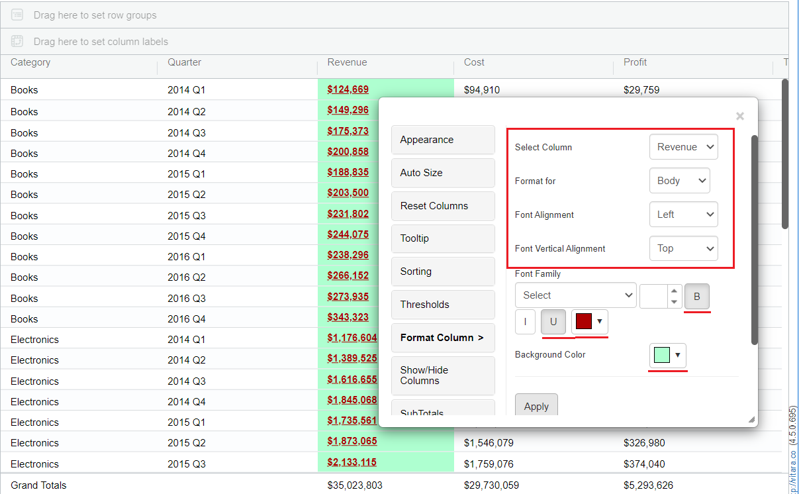
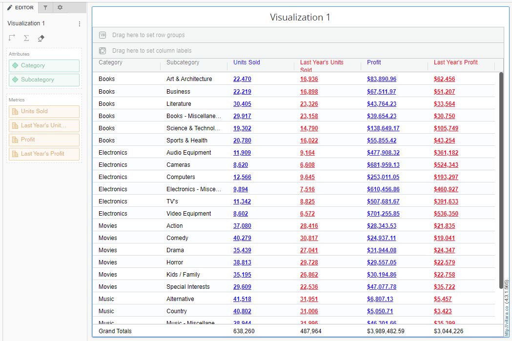
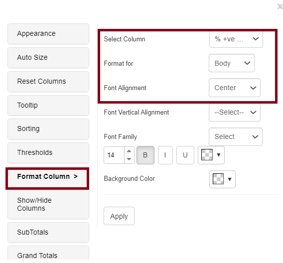
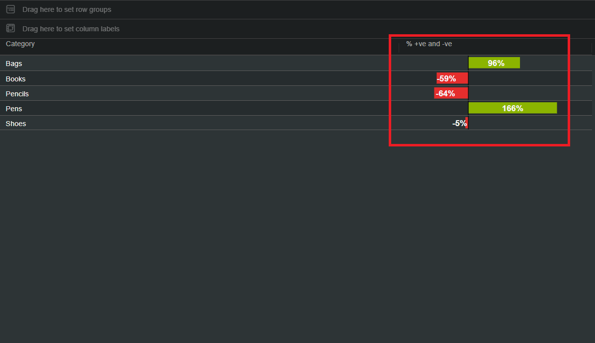

# Format/Clear Format

The text styles we apply using the ‘Grid Theme’ tab will reflect the entire grid i.e all rows and all columns. Whereas the text styles and background color we apply for any column using the ‘Format’ tab will affect only that particular column. As shown in the below screenshot we can access ‘format’ or ‘clear format’ options from the hamburger button of any column.

<figure><figcaption></figcaption></figure>

We can open column formatting menu in two ways.

## **1. Using column header hamburger button.**

Hover the cursor on the header of any column, at the right side corner you will find hamburger button.

<figure><figcaption></figcaption></figure>

Click on this button to open the column menu.&#x20;

<figure><figcaption></figcaption></figure>

\
Click on the “Format” tab.\
When we click on “Format” tab, Vitara charts properies window will be opened showing “Format Column” properties.

&#x20;

<figure><figcaption></figcaption></figure>

## **2. Using Edit button.**

\
Hover the cursor on the grid chart to display “Edit” button. Click on the “Edit” button to open vitara properties window. Open the “Format Column” menu.

\
Hover the cursor on the grid chart to display “Edit” button. Click on the “Edit” button to open vitara properties window. Open the “Format Column” menu.

<figure><figcaption></figcaption></figure>

From 5.2 version User can now an ability to access the custom editor from the hamburger menu by clicking the format button.For more details please refer to the [Custom Editor](https://docs.vitaracharts.com/guideGridFeatures/customeditor.html)

**Note:** The properties applied using the ‘Format’ tab for a particular column, will overwrite the properties applied using the “grid Theme’ tab for that column.\
The ‘Clear Formatting’ tab will delete all the formatting applied on that particular column.

#### Example: 

In the below screenshot vitara grid chart is displaying the data for current year Profit, last year’s Profit, current year Units sold and last year’s Units sold.

<figure><figcaption></figcaption></figure>

To differentiate the current year and previous year columns, i want to apply Blue Color for the current year metrics and Red Color for the previous year metrics.

Open the “Format Column” menu using one of the two ways discribed above. In the ‘Select Column’ drop down box select the column for which you want to apply specific formattings.

<figure><figcaption></figcaption></figure>

\
In the “Format For” drop down box select the part of the column (header or body) to which you want to apply formatting.

<figure><figcaption></figcaption></figure>

\
Apply the text formattings and finally click on ‘Apply’ tab.

<figure><figcaption></figcaption></figure>

\
Below is the screenshot of the grid chart in which current year metrics are given blue color and last year metrics are given red color.

<figure><figcaption></figcaption></figure>

The user can now apply formatting to horizontal bars and pins as of Version 5.1.2. An illustration of a feature is shown below.

<figure><figcaption></figcaption></figure>

<figure><figcaption></figcaption></figure>

To remove applied formatting, user can access the 'Clear Formatting' option from the hamburger menu.

<figure><figcaption></figcaption></figure>
