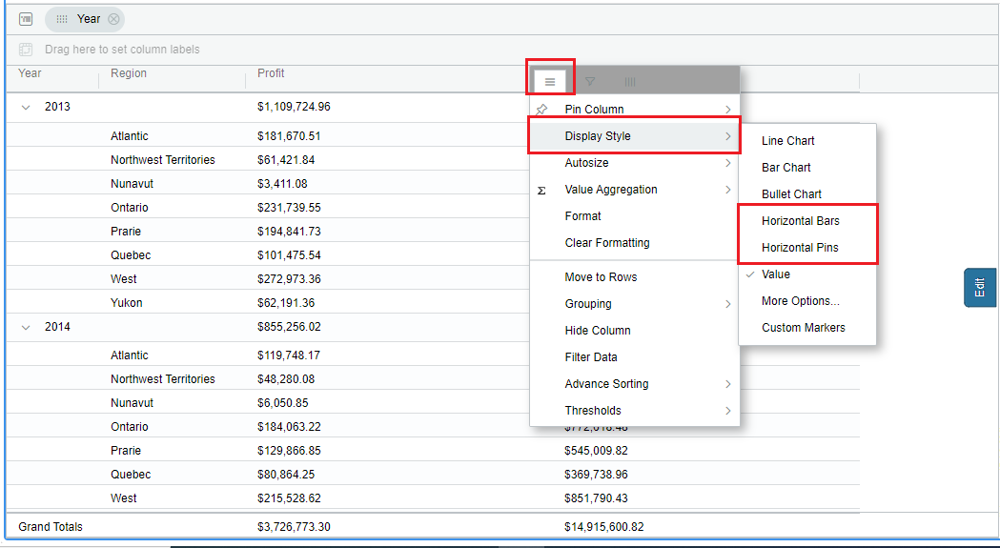
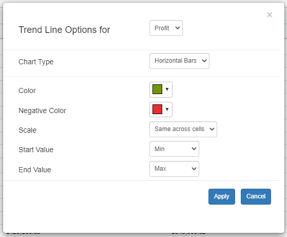
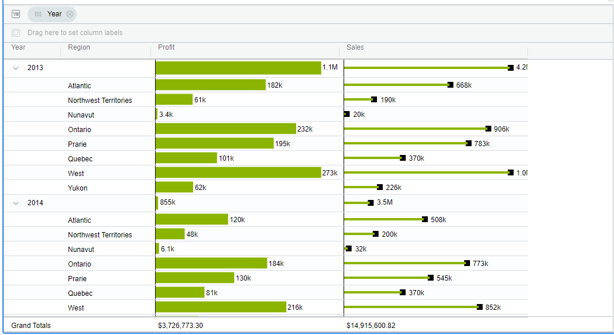
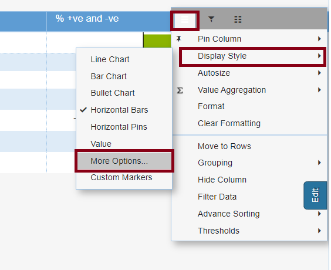
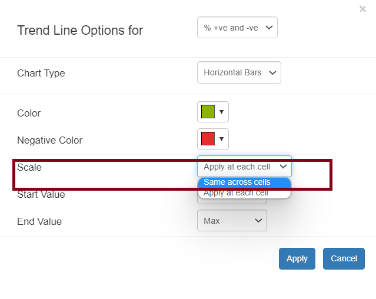
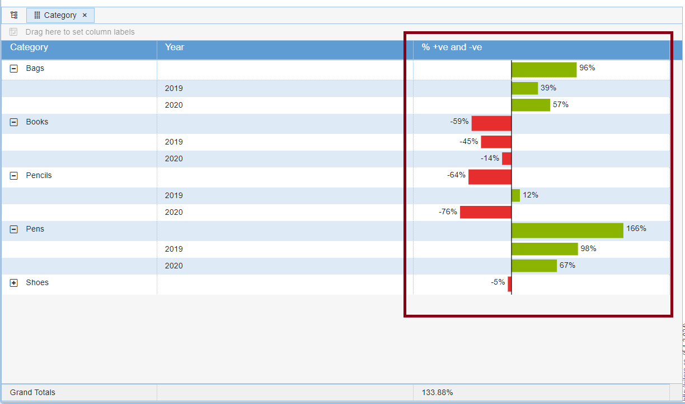

# Horizontal Bars/Pins

## Overview 

The display style property, which can be accessed from the hamburger menu, allows the user to display any given individual metric as a horizontal bar or horizontal pin’s.

It can display the scaling as bars and pins.Hover onto a metric for which the trendlines need to be applied so that the hamburger button will be displayed. Click on the hamburger button, then a menu will be opened. Hover the mouse onto ‘Display Style’, then a submenu will be opened which has the trendline charts. Please refer the below screenshot:

<figure><figcaption></figcaption></figure>

First, for a metric, apply the ‘Horizontal Bars/Pins’ trendline, and then format the bar/pin color and negative color. open the format window, then set the color (e.g Green). Click the ‘Apply’ button

<figure><figcaption></figcaption></figure>

In our case, we’re displaying sales and profits by region and year, with horizontal bars for metric “profit” and horizontal pins for metric “sales”.

<figure><figcaption></figcaption></figure>

### Scaling across cells for Horizontal Bars and Pins 

From Version 5.1.2, We have introduced a new Scaling option which can be found from the Hamburger tab in the Display Option under More Options.

<figure><figcaption></figcaption></figure>

<figure><figcaption></figcaption></figure>

<figure><figcaption></figcaption></figure>

The chart scaling is set to ‘Apply at each cell’ by default; to allow scaling, change the Scale option to ‘Same across cells.’

### How Horizontal Bars or Pins Work When All Values Are the Same?

The Horizontal Bars/Pins visualization represents data values using horizontal bars whose lengths and directions reflect the distribution of values within a column. The bar appearance dynamically adjusts depending on whether the column contains positive, negative, or zero values.

**Display Logic**

The visualization adapts based on the type of values present in the column:

* All **Zero** Values:\
  If all values in the column are zero (e.g., \[0, 0, 0, 0]), the bar appears empty, indicating no positive or negative data distribution.
* All **Positive** Values:\
  If all values in the column are positive (e.g., \[1, 1, 1, 1]), the visualization displays a full-length positive bar, representing that all data points are positive.
* All **Negative** Values:\
  If all values in the column are negative (e.g., \[-1, -1, -1, -1]), the visualization displays a full-length negative bar, representing that all data points are negative.

The screenshot below illustrates this behavior.

<figure><figcaption></figcaption></figure>

\
\
