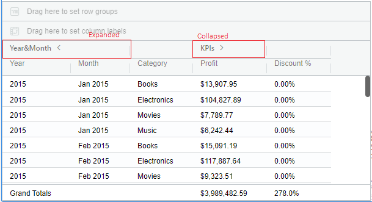
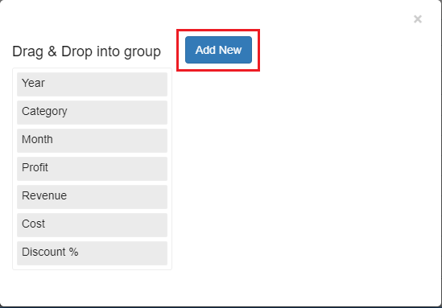
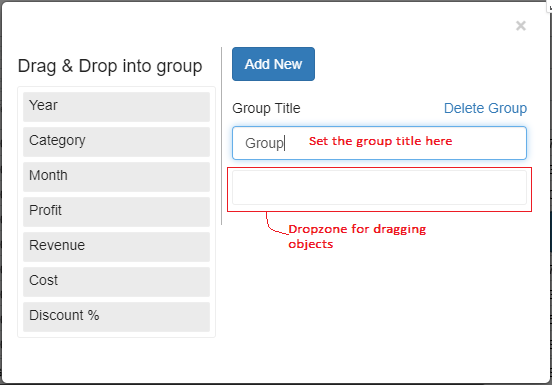
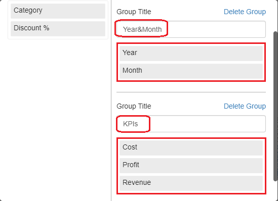
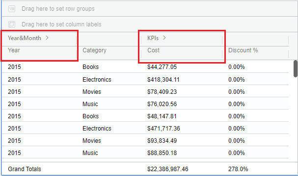
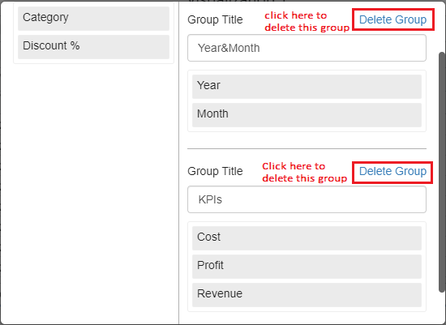

# Manage Column Grouping

## Properties Menu - Manage Column Grouping 

In the vitara grid chart, we can also group the columns which is called ‘column grouping’. Groups can be created with only attributes or only metrics or combination of both. Below screenshot shows the column groups created in the Grid chart.

<figure><figcaption></figcaption></figure>

In the above image, there are two column groups ‘Year\&Month’ and ‘KPIs’ of which the first group is in expanded state and the second column is in collapsed state.

The groups can be expanded or collapsed. If the group is in a collapsed state, then only the first object in the group will be shown on the chart. And the remaining objects can be seen only if the group is expanded. By default, the newly created groups will be collapsed.

### Creating Column Groups 

Let us look into creating column groups in simple steps.

#### **Step 1:**

Open the hamburger menu of a column and hover onto Grouping, then a submenu opens. See the screenshot below

<figure><figcaption></figcaption></figure>

#### **Step 2:**

Click on ‘Manage Column Grouping’. Then a new window will open. See the screenshot

<figure><figcaption></figcaption></figure>

#### **Step 3:**

Click on ‘Add new’ to create a column group. Then a menu will appear with group title textbox and dropzones.

<figure><figcaption></figcaption></figure>

#### **Step 4:**

Now, drag and drop the objects from the left panel into the dropzone and set the group titles. In this case we are creating two groups as below:\
‘Year\&Month’ grouped with attributes ‘Year’ and ‘Month’\
‘KPIs’ grouped with metrics ‘Cost’, ‘Profit’ and ‘Revenue’.\
See the below screenshot

<figure><figcaption></figcaption></figure>

#### **Step 5:**

Close the ‘Manage Column Grouping’ window.Then the groups look like in the below screenshot

<figure><figcaption></figcaption></figure>

From 5.2 version Users can now an ability to create groups for attributes and metrics by holding the ‘Ctrl’ key on the keyboard and selecting the desired attribute/metric which are to be grouped.For more details please refer to the [Custom Editor](https://docs.vitaracharts.com/grid-microchart-guide/custom-editor#id-2.-using-the-hamburger-menu)

### Deleting Groups 

We can also delete the groups using the below steps.

1. Open the ‘Manage Column Grouping’ window as described above in steps 1 and 2.
2. You will find the ‘Delete Group’ text-button for each group. See the screenshot below

<figure><figcaption></figcaption></figure>

3. Click on ‘Delete Group’, then that particular group will be deleted. Do this for whichever group to be deleted.

## Enhanced Metric Organization with Row Metric Grouping in Version 5.2.5 

In the latest release (version 5.2.5), we’ve introduced a powerful feature called Row Metric Grouping, allowing users to efficiently organize metrics when they are moved to rows. This functionality provides a streamlined way to group and categorize metrics based on specific criteria. To gain a deeper understanding of this feature and its benefits, explore the distinctions between Metric Grouping and Column Grouping. This comparison will guide you in optimizing your metric organization for a more intuitive and structured presentation of data. For more detailed insights, click [ManageMetricGrouping](https://docs.vitaracharts.com/guideGridFeatures/managemetricgrouping.html) to delve into the nuances of Metric Grouping versus Column Grouping.
