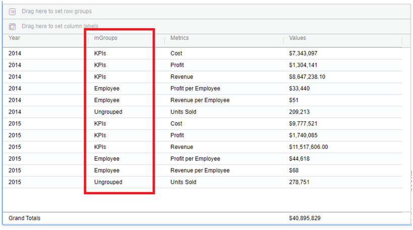
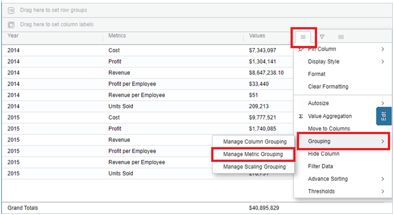
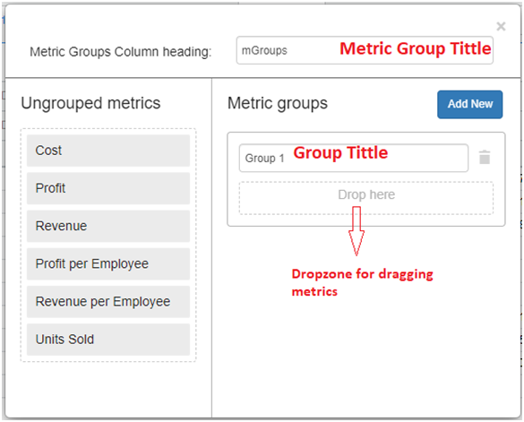
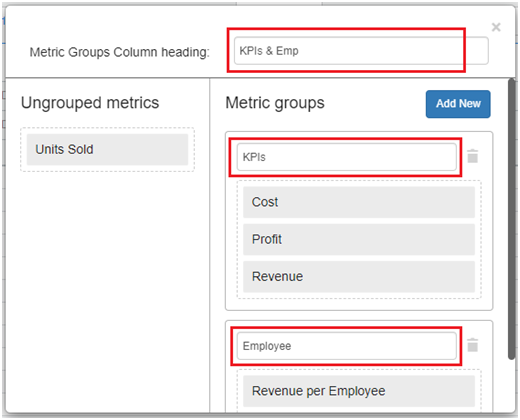
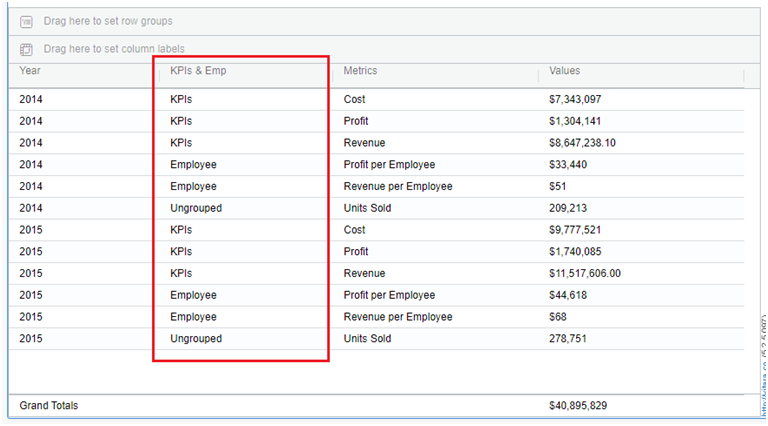
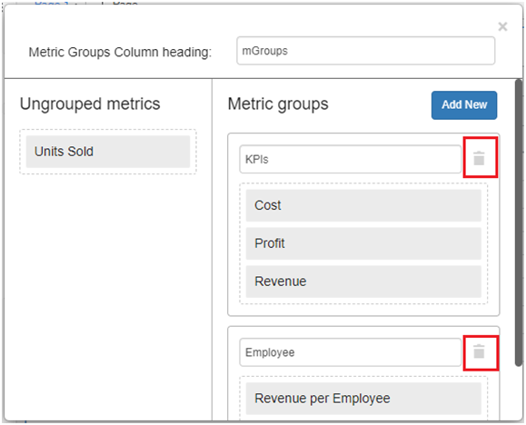
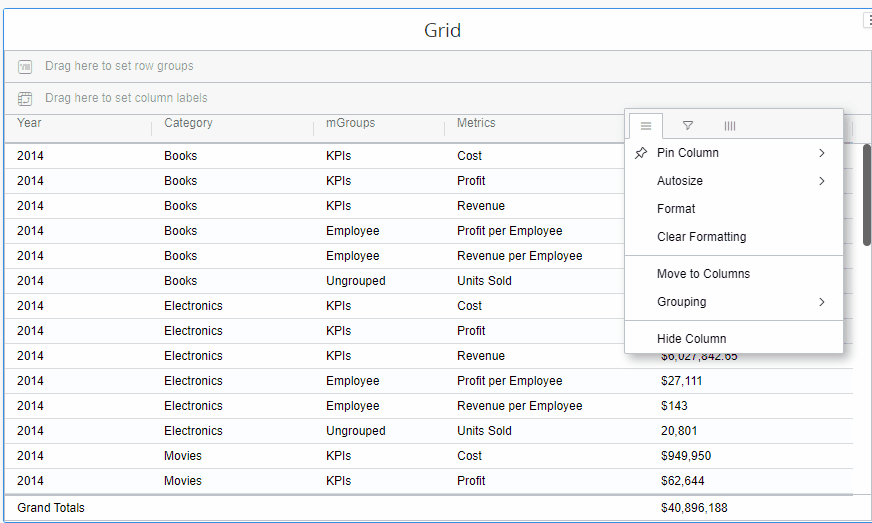
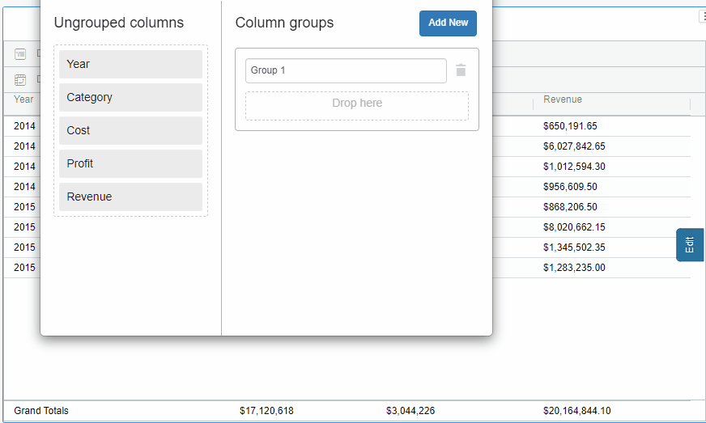
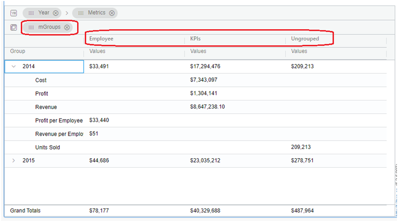
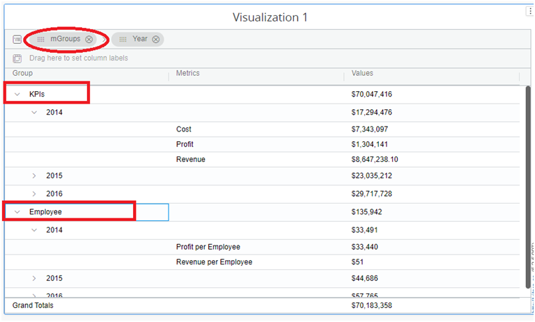

# Manage Metric Grouping

From version **5.2.5**, we have the ability to do row metric grouping, which means grouping metrics when they are moved to rows. The below screenshot shows the row metric groups created in the grid chart.

<figure><figcaption></figcaption></figure>

In the above image, two metric groups are created: KPIs, which contain cost, profit, revenue and Employee, which contains profit per employee and revenue per employee. Users can group single or multiple metrics via the metric grouping option in the hamburger menu.

a. This option will only exist when metrics are in row setup. b. Metrics that are not grouped will be shown “ungrouped”.

### Create Metric Groups 

#### **Step 1:**

Open the hamburger menu of a metric column and hover on to Grouping, then a submenu opens. See the screenshot below.

<figure><figcaption></figcaption></figure>

#### **Step 2:**

Click on ‘Manage Metric Grouping’. Then a new window will open. Click on ‘Add New’ to create a group. Then a menu with a group title textbox and dropzones will appear.

<figure><figcaption></figcaption></figure>

#### **Step 3:**

Now, drag and drop the objects from the left panel into the dropzone and set the group titles. In this case, we are creating two groups, as below: ‘KPIs’ grouped with the metrics ‘Cost’,’Profit’,’ and ‘Revenue’. ‘Employee’ grouped with the ‘ profit per employee’ and ‘revenue per employee.’ See the below screenshot.

<figure><figcaption></figcaption></figure>

#### **Step 4:**

Close the ‘Manage Metric Grouping’ window. Metrics that are not grouped will be displayed as “ungrouped.” This is how the groups appear in the screenshot below.

<figure><figcaption></figcaption></figure>

### Deleting Groups 

We can also delete the groups using the below steps.

1. Open the ‘Manage Metric Grouping’ window as described above in steps 1 & 2.
2. You will find the ‘Delete’ icon for each group. See the screenshot below.

<figure><figcaption></figcaption></figure>

3. Click on the ‘Delete’ icon then that particular group will be deleted. Do this for whichever group is to be deleted.

## Functionality of Row Metric Grouping & Column Grouping 

Column Grouping - Grouping of multiple columns. Row Metric Grouping - Grouping of metrics when they are moved to a row.

Rules:

1. Column grouping & Row Metric grouping can co-exist.
2. The column grouping of the various metrics as columns will transform into row metric grouping when the “Metrics” are moved to rows. E.g.,Cost, profit, and revenue metrics are column grouped and will be automatically row grouped when they are moved to rows.
3. If you move row-grouped metrics to columns, the grouped metrics will be converted to column groups.

E.g., In the Move to Rows scenario, if cost, profit, and revenue metrics are Row Grouped, then when the user moves metrics to columns, these Row Grouped metrics will be Column Grouped. Accordingly Check the gif file for steps 1 and 2.

<figure><figcaption></figcaption></figure>

1. Both the “Attribute” and “Metrics” columns were initially grouped together. If we later move the Metrics columns to the row, the Metric columns element will be row grouped, while the attribute will remain column grouped with the original group name.

E.g., The year attribute, cost and profit, revenue metrics are column grouped. When these metrics are moved to rows, the year attribute will remain column grouped and the “cost” ,profit and “revenue” metrics will be grouped in rows.

<figure><figcaption></figcaption></figure>

1. Row Group and pivot operations can make use of the Metric Grouping column. The screenshot below shows metric group column in row groups and pivot operations.

<figure><figcaption></figcaption></figure>

See the image below. The Grouped column has been moved to row grouping.

<figure><figcaption></figcaption></figure>
