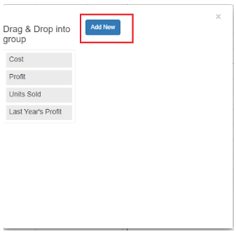
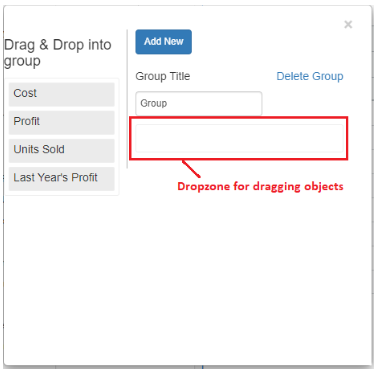
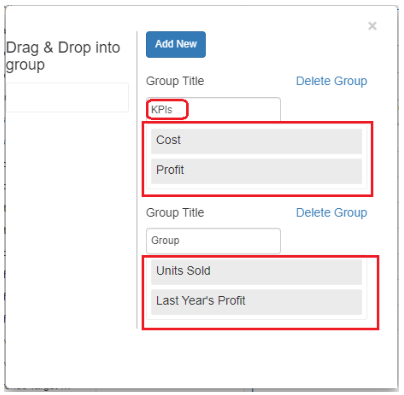
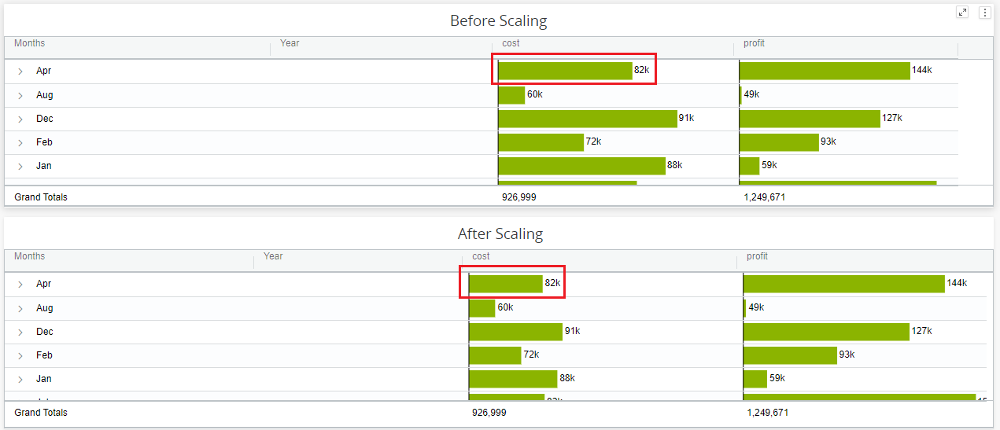
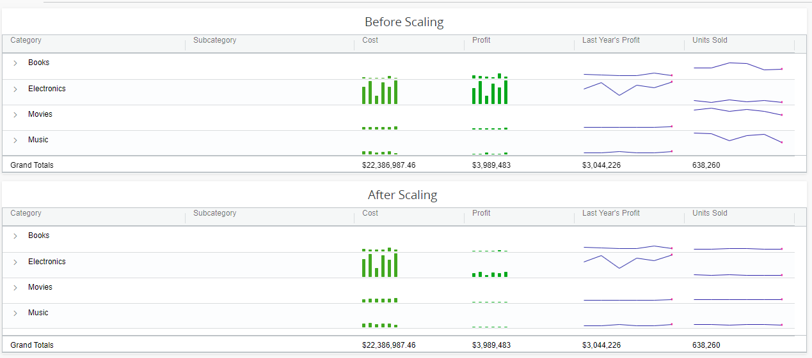

# Manage Scaling Grouping

When we enable scaling grouping and compare metrics trendline, we should expect them to share a common scale based on the data with the greatest range. We can group the columns in the Vitara grid chart using a feature called ‘Scaling grouping.’ Only metrics can be used to create groups.

### Creating Scaling Groups 

Let us look into creating scaling groups in simple steps.

#### Step 1 : 

Open the hamburger menu of a column and hover onto Grouping, then a submenu opens. See the screenshot below:

<figure><figcaption></figcaption></figure>

#### Step 2: 

Click on ‘Manage scaling Grouping’. Then a new window will open. See the screenshot:

<figure><figcaption></figcaption></figure>

#### Step 3: 

Click on ‘Add new’ to create a column group. Then a menu will appear with group title textbox and dropzones.

<figure><figcaption></figcaption></figure>

#### Step 4: 

Now, drag and drop the objects from the left panel into the dropzone and set the group titles. In this case we are creating two groups as below: ‘KPIs’ grouped with metrics ‘Cost’, ‘Profit’ ‘Group’ with metrics ‘unit sold’ and ‘ Last year’s profit ’ See the below screenshot:

<figure><figcaption></figcaption></figure>

#### Step 5: 

For example, the cost and profit data from the same month will be compared, and we’ll be able to tell the difference between before and after scaling by how the horizontal bars change in size as cells are scaled similarly based on the data with the widest range.

The following illustrate shows how the scaling feature appears when we have a visualization that uses the scaling property and another that does not.

<figure><figcaption></figcaption></figure>

In the above example, we are comparing data from the month of April with cost and profit, and we are using scaling to ensure that individual rows share a common scale based on the data with the greatest range. Similarly, for the below image.

<figure><figcaption></figcaption></figure>

### Deleting Groups 

We can also delete the groups using the below steps. Open the ‘Manage Scaling Grouping’ window as described above in Step1 and Step2. You will find the ‘Delete Group’ text-button for each group. See the screenshot below:

<figure><figcaption></figcaption></figure>
