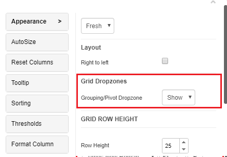
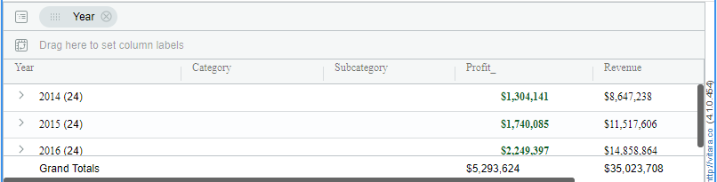
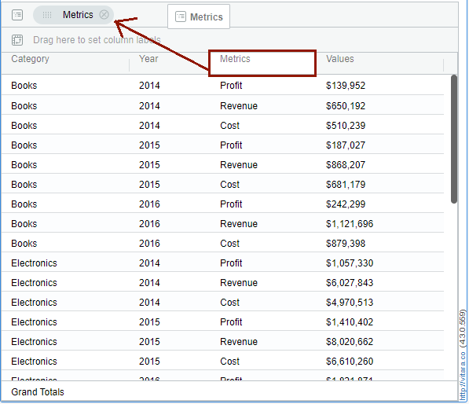
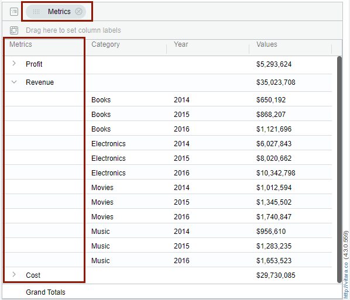
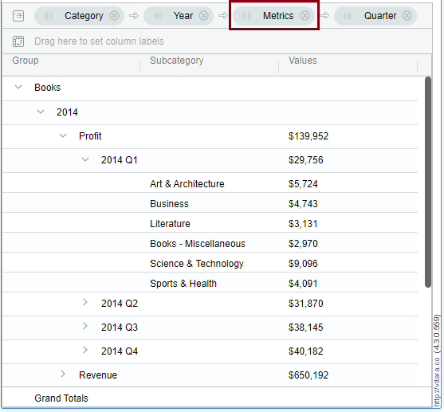
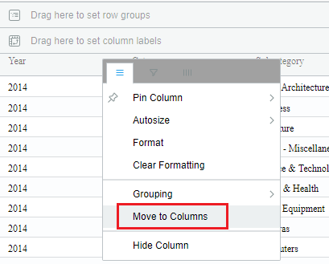
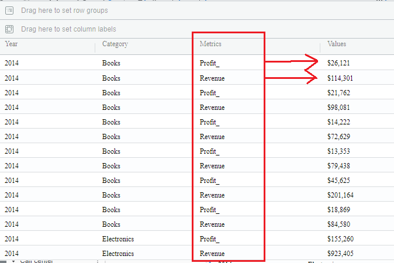
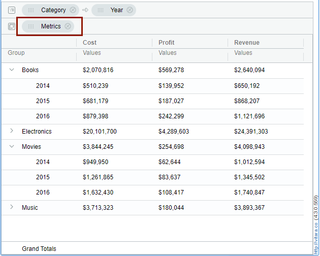
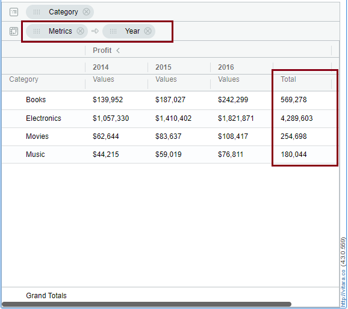
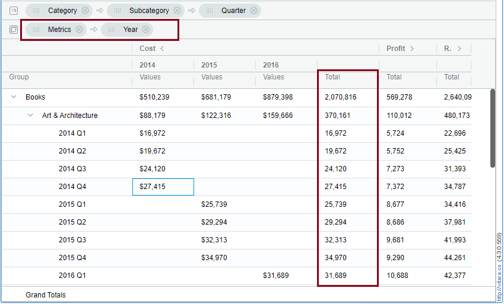

# Pivoting and Row Grouping

\

## Properties Menu - Row Grouping and Pivoting 

There are grouping and pivoting drop zones now in the grid chart, which are introduced in the 4.1 version of Vitara charts. You can now drag and drop the attributes into the drop zones. Below is the screenshot of drop zones.

<figure><figcaption></figcaption></figure>

Here, Region attribute is dragged into pivoting zone and the product category and product sub-category columns will be grouped automatically. Below is the screenshot shown.

<figure><figcaption></figcaption></figure>

You can hide the drop zones from the grid chart. By right clicking, there is an option Group/Pivot drop zones. You can click the hide option if not needed. See the screenshot below.

<figure><figcaption></figcaption></figure>

You can hide the Grouping/ Pivoting drop zones also from the property editor.

<figure><figcaption></figcaption></figure>

## **Grouping**

You can define a group by selecting an attribute or metric. Go to the hamburger button of any attribute, expand ‘Grouping’ and select ‘Group by’ an attribute. For Grouping, you need atleast one attribute and one metric in the grid chart.

<figure><figcaption></figcaption></figure>

In the below screenshot, the grouping is applied on the ‘Year’ attribute level. Vitara grid chart will show the number of sub-elements in each group in round brackets or parenthesis. For example, the group ‘2014’ has 24 sub-elements in it. Click on expand symbol to expand each group.

<figure><figcaption></figcaption></figure>

In the Vitara Grid chart, the state of the expand/collapse of a particular group will be saved. when we reopen the dossier/document the groups which are saved in an expanded state or collapsed state will retain its state.

Now in the latest release we can group by the “Metrics” column, which is formed from the Metric Pivoting. For Example, In a grid chart apply move to rows for the ‘Profit’ column and Group the “Metrics’ column.

<figure><figcaption></figcaption></figure>

<figure><figcaption></figcaption></figure>

There is an example, where ‘Metrics’ column is grouped with the other attributes like Category, Year and Quater. See the screenshot below.

<figure><figcaption></figcaption></figure>

### **Pivoting**

Pivoting is the ability to swap the rows to columns and columns to rows in the Grid chart. Pivoting can be done on attributes and as well as on metrics. Which means we can place the attributes in columns and metrics in rows. To pivot a column we can drag and drop an attribute to Pivot drop zone or we can move attribute to columns. Grouped attributes cannot be pivoted.

### **Attribute Pivoting**

Click on the hamburger of any attribute, then click on the **Move to Columns** option. Below are the screenshots of pivoted attributes.

<figure><figcaption></figcaption></figure>

<figure><figcaption></figcaption></figure>

### **Metric Pivoting**

Click on the hamburger of any metric, then click on the **Move to Rows** option. You can see the ‘Metrics’ and ‘Values’ column in the Vitara Grid chart. Below are the screenshots of pivoted metrics.

<figure><figcaption></figcaption></figure>

<figure><figcaption></figcaption></figure>

Now in the latest release we can pivot the “Metrics” column by dragging the “Metrics” column to the pivot dropzone, which is formed by the option ‘Move to rows’ applied to any Metric column in the Vitara grid chart.

For Example, apply ‘Move to rows’ property to profit metric, then drag the “Metrics” column to the pivot drop zone, you can see the attributes in the Vitara grid chart will be grouped automatically. See the below picture where the Category and Year are in the Group by drop zone and “Metric’ column in the Pivot drop zone.

<figure><figcaption></figcaption></figure>

### **Pivot Totals**

Pivot columns will now collapse and show the ‘Pivot Totals’ in the Vitara Grid chart. Now you need to have at least two attributes and one metric to attain the pivot totals.

First, apply ‘Move to rows’ property on any metric, and drag the ‘Metrics’ columns to the pivot drop zone, as a result you can see the attributes are grouped.Then, to see the pivot totals drag any one of the attribute’s to pivot drop zone and make sure that the ‘Metrics’ column position should be before the Attribute column position in the pivot drop zone. Below are the screenshots of Pivot totals.

<figure><figcaption></figcaption></figure>

For Example, apply ‘Move to rows’ property to Cost metric, then drag the Metrics column to the pivot drop zone, and the attributes Category, Sub-Category, Quarter and Year are grouped, and drag the Year attribute to the pivot drop zone next to the ‘Metrics’ column, here you can see the Year wise Pivot totals in the Vitara Grid chart.

<figure><figcaption></figcaption></figure>

**Enhancement:** Column Totals option will only be used to display total columns in non-pivoted charts.Pivoted charts now include three additional total display options — **Pivot Row Totals**, **Pivot Group** Totals, and **Pivot Group Metric** Totals — providing greater flexibility in data summarization. \[[Click here for more information.\]](https://docs.vitaracharts.com/grid-microchart-guide/subtotals#introducing-pivot-row-total-and-pivot-group-total-for-advanced-subtotaling)
