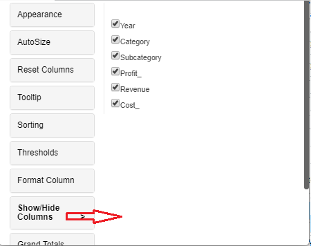

# Show/Hide Column

## Properties Menu - Show/Hide Column 

We can hide or unhide any column in the Vitara Grid chart using the ‘Show/Hide Column’ tab. This feature can be accessed by any of the three ways we can get the properties window, i.e. ‘Edit’ button, Hamburger popup window and Right click menu options window.

Below are the screenshots of all these three ways we can apply the hide column feature.

Show/Hide Columns in the property editor.

<figure><figcaption></figcaption></figure>

Hide column in the Column Hamburger popup window.

<figure><figcaption></figcaption></figure>

Show/Hide columns in the Right click menu options.

<figure><figcaption></figcaption></figure>
