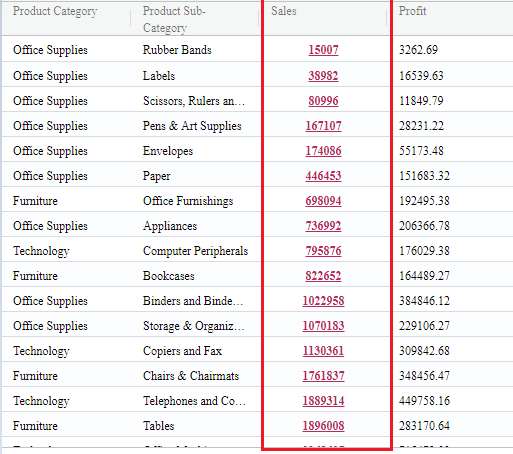
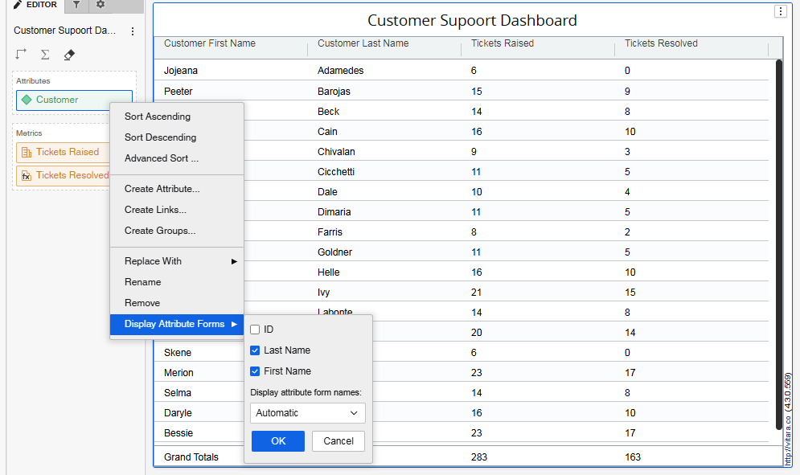
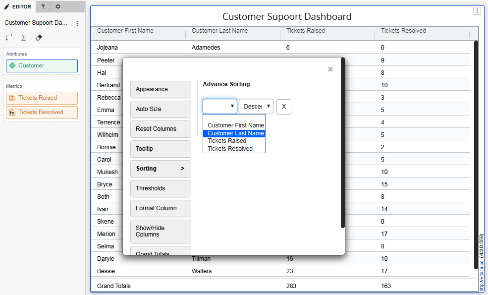
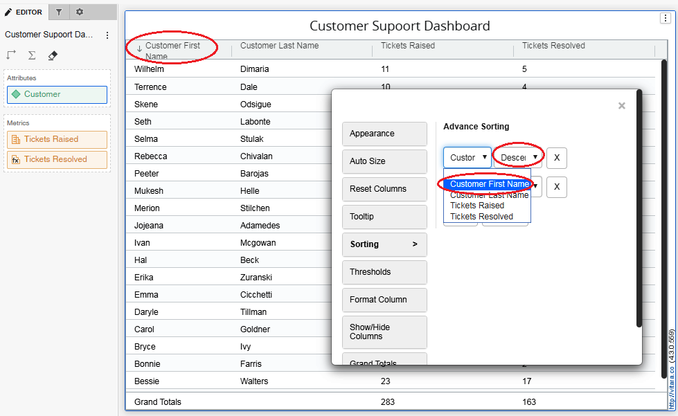
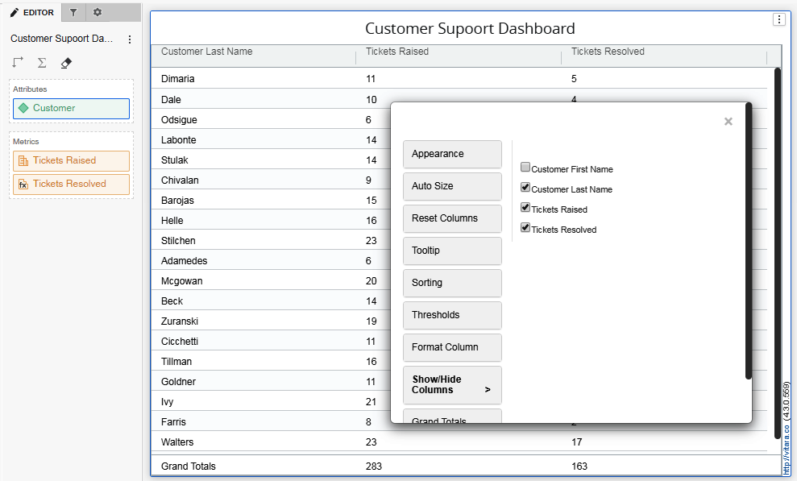
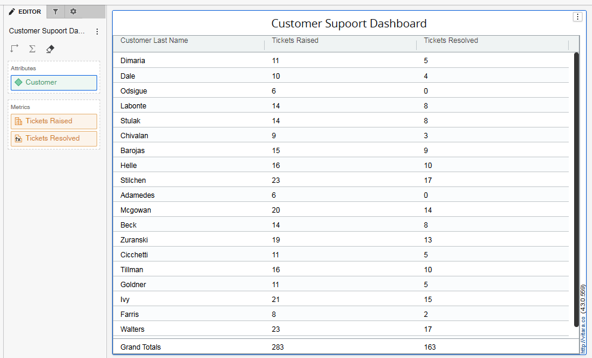

# Sorting

## Properties Menu - Sorting

In Vitara Grid chart with just a click on the header of a column, we can sort the data in that column. For the first click on the column header, representing the column is sorted into ascending order. See the screenshot below which is in Ascending order.

<figure><figcaption></figcaption></figure>

If we want to sort the column in descending order, click a second time on the column header. representing the column is sorted in descending order.

<figure><figcaption></figcaption></figure>

Sorting can be removed by clicking on the column header for the third time. We can also sort multiple columns by holding the ‘shift’ button on your keyboard click on all the column headers which you want to sort.

### **Advanced Sorting**

Advance sorting will allow users to do different sorting on different grouping levels. By this, you can easily sort the columns in your required order. The Property editor has an option of Sorting. See the below-representing sorting option in 3 different ways.

### **Advanced Sorting using Edit Option**

From the Property Editor, click the Sorting tab. The first one square button shows the metrics you want to sort and the second one shows the order what you want to sort. See the screenshot below.

<figure><figcaption></figcaption></figure>

### **Advanced Sorting using the Hamburger option**

From the Hamburger menu, Select any metric, select Advanced Sorting and click on Manage Sorting, it will take you to the Editor tab. See the screenshot below.

<figure><figcaption></figcaption></figure>

### **Advanced Sorting using Right Click properties**

From the Right Click Menu, Select Advanced Sorting then click on Manage Sorting you can able to apply to sort in the Property editor window. See the screenshot below.

<figure><figcaption></figcaption></figure>

### **Advanced Sorting on Grouping Level**

Advanced Sorting can be applied on grouping levels too. Now, once grouping is applied in the grid, there is a button added in the property editor. See the screenshot below where the Sorting is applied on a discount on a product category level.

<figure><figcaption></figcaption></figure>

## **Sorting based on attribute forms in the Vitara Grid chart**

From the 4.3 release, Vitara chart supports multiple attribute forms. In the normal XY charts multiple attribute forms are concatenated and in the grid and micro charts each attribute form will be shown as separate column.

In the below screenshot, for the attribute “Customer” the attribute forms “Customer First Name” and the “Customer Last Name” are enabled.

<figure><figcaption></figcaption></figure>

As shown in the above screenshot, each attribute form will be displayed as a separate column in the Vitara grid chart. We can sort the Vitara grid based on a particular attribute form. Open Vitara properties window by clicking on the “Edit’ button. Open “Advanced Sorting” menu. In the advanced sorting window we can select the attribute form on which we want to sort the grid chart.

<figure><figcaption></figcaption></figure>

In this example I selected the attribute form “Customer First Name” to sort the grid chart.

<figure><figcaption></figcaption></figure>

If we don’t want to display the attribute form on which we applied sorting we can hide that attribute form. Open “Show/Hide Columns” menu and uncheck the attribute form/attribute you don’t want display in the chart.

<figure><figcaption></figcaption></figure>

Below is the result of Vitara grid chart, in which we enabled two attribute forms “Customer First Name” and “Customer Last Name” and the chart is sorted based on the attribute form “Customer First Name” and finally the attribute form “Customer First Name” is not showing in the chart.

<figure><figcaption></figcaption></figure>

## Pivot Sort

When a chart is pivoted, users can apply sorting to the pivot attributes. In the example below, the Year and Quarter attributes are pivoted, and applying sort to these attributes updates the order in the pivot header accordingly.

<figure><figcaption></figcaption></figure>
