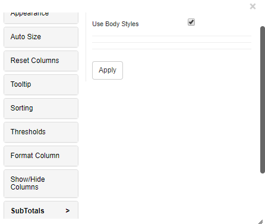
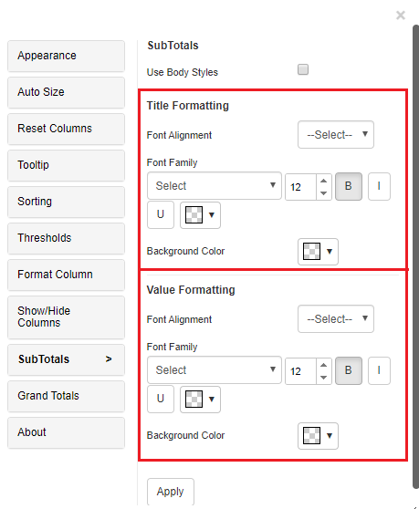
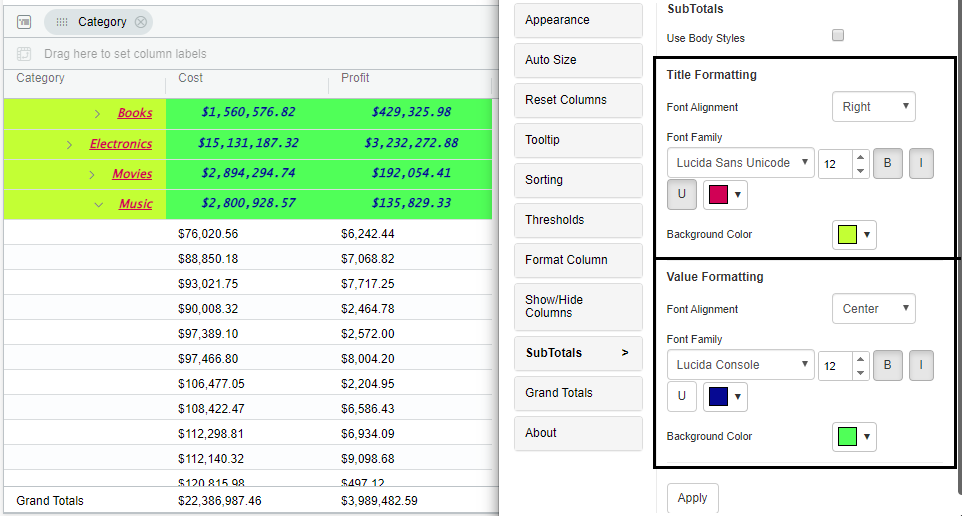
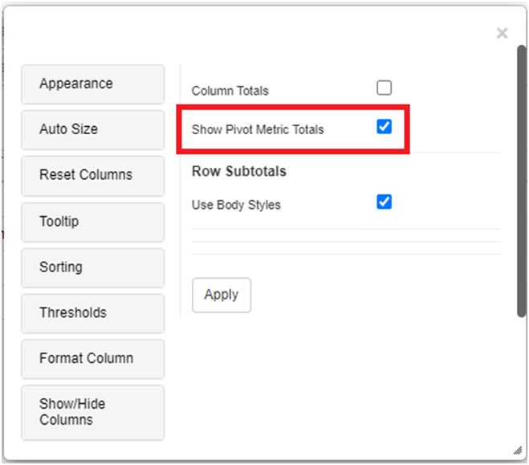
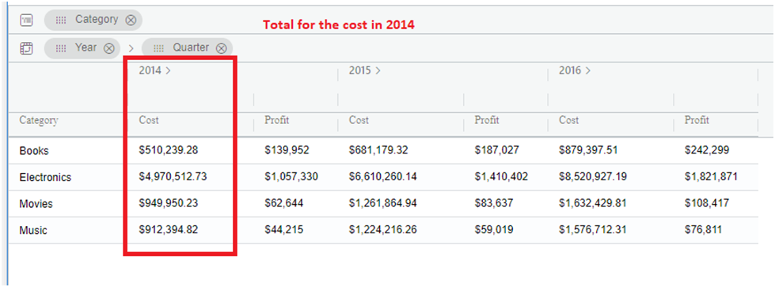
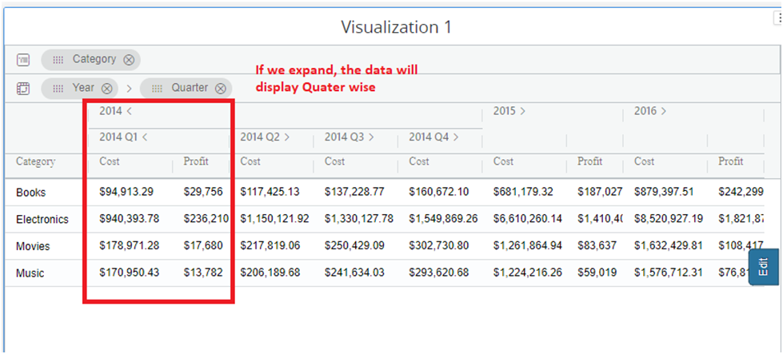
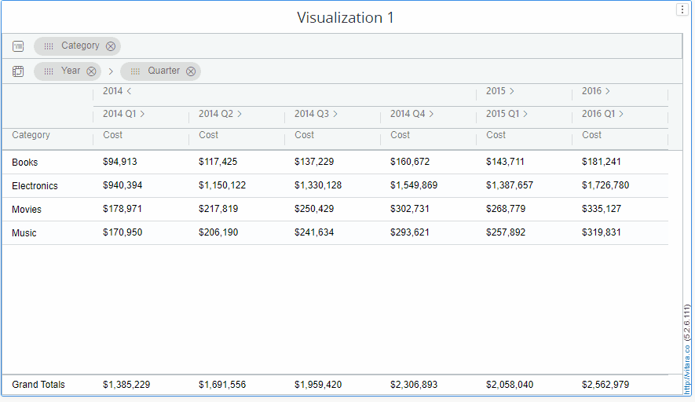
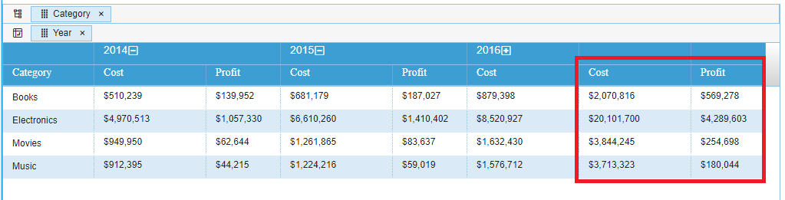
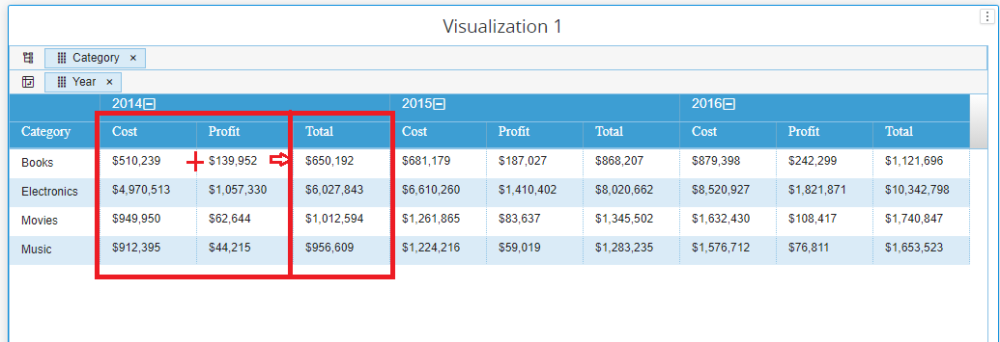

# Subtotals

## Overview

A subtotal lets you see the totals for subgroups of your report data. Vitara Grid chart shows the Subtotals when you group by any column. The subtotal functions include sum, count, minimum, maximum, average, first, last and Ratio in Vitara Grid chart.

Subtotals editor by default enables the ‘Use body styles’ option where it is shown same as body styles of the chart; and we cannot do text formattings on Subtotals. Below is the screenshot shown where ‘Use Body Styles’ is enabled.

<figure><figcaption></figcaption></figure>

In Subtotals editor, if we disable the ‘Use body styles’ option, you can do the text formatting options and apply background color to the Subtotals; font family, font size, bold, italic, underline, text color, font alignment and back ground color. Below is the screenshots of ‘Title formatting’ and ‘Value formatting’ of Grand totals editor.

<figure><figcaption></figcaption></figure>

Examples of screenshots where the text formattings and back ground colors are applied for subtotals.

<figure><figcaption></figcaption></figure>

### Show pivot Metric Totals 

To ensure Pivot Metric Totals function correctly, it is essential to have at least two attributes in the pivot drop zone. In version 5.2.6, we introduced a new feature called “Show Pivot Metric Totals.” By toggling the “Show Pivot Metric Totals” option in the Subtotal tab, you can easily view individual metric totals. This feature allows you to see the sum of each metric within the pivot, providing a comprehensive overview of the data.

<figure><figcaption></figcaption></figure>

This new option provides a convenient way to view data in grouped form. When the group is collapsed, the total for that group will be displayed, giving an overview of the data at a glance. This is particularly useful when working with large sets of data, as it allows for quick analysis without having to expand each individual group.

<figure><figcaption></figcaption></figure>

<figure><figcaption></figcaption></figure>

On the other hand, when the group is expanded, the individual data within that group will be shown. This allows for a detailed examination of each data point, providing a comprehensive understanding of the data set. With this option, users can easily switch between the total and individual views, depending on their specific analysis needs. The sample gif file is provided below.

<figure><figcaption></figcaption></figure>

## Introducing Pivot Row Total and Pivot Group Total for Advanced Subtotaling 

Starting with version 5.2.8, the option “Show Pivot Metric Totals” has been renamed to “Pivot Group Metric Totals.” This feature is only available when there are two or more attributes in the pivot drop zones; otherwise, it will be disabled. Additionally, two new options have been introduced: Pivot Row Total and Pivot Group Total.

**Note** : All three options will only be visible when a pivot is active.You can only select one of the following options at a time. Activating one will automatically disable the other:

* Pivot Group Metric Totals
* Pivot Group Totals

## Enhancements in Version 5.2.8: Pivot Row Total and Pivot Group Total 

Version 5.2.8 introduces two powerful new options within the Subtotal tab: Pivot Row Total and Pivot Group Total. These features significantly elevate the data analysis capabilities, offering users greater flexibility and precision in how subtotals are calculated and presented.

<figure><figcaption></figcaption></figure>

### **Pivot Row Total**

The Pivot Row Total option allows users to generate subtotal values of metrics for each row in a pivot table. This feature is particularly useful when you need a clear, row-by-row breakdown of totals within a dataset. It ensures that users can see the sum of data for each specific row category, facilitating easier comparison and analysis across individual records.

By enabling the Pivot Row Totals option, as shown in the screenshot below, you can see the subtotal of metrics such as cost and profit, which sum up the data for each category.

<figure><figcaption></figcaption></figure>

### **Pivot Group Total**

The Pivot Group Total option introduces the ability to calculate and display subtotals for grouped data within a pivot . This feature is ideal for scenarios where data is categorized into groups (e.g., departments, regions, or product lines), and a summary total for each group is needed. By consolidating group data, it provides a more streamlined view of overall data.

By enabling the Pivot Group Totals option, as shown in the screenshot below, you can see the subtotals of grouped data of cost and profit , which sum up the data for each group within the pivot.

<figure><figcaption></figcaption></figure>
