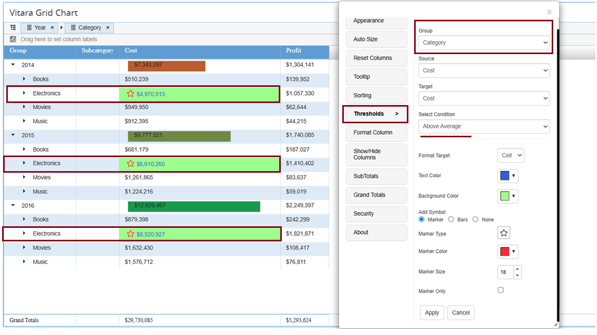
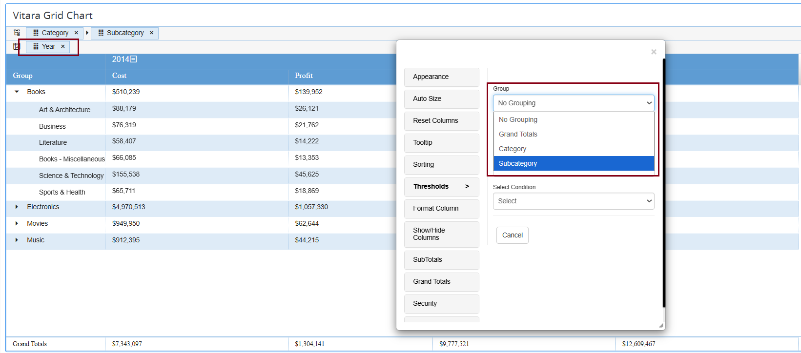

# Thresholds

## Properties Menu - Thresholds 

Thresholds let the user highlight specific values in the chart. In the Vitara grid chart, we can apply thresholds for metrics and attributes. Attributes thresholds is implemented in 4.6.1 version. Applying thresholds is so easy in the Vitara grid chart.

### **How to open the Threshold Editor window**

We can open ‘threshold editor’ window in any of the below mentioned three ways.

### **Using the ‘Edit’ button:**

Move the cursor on the Vitara grid chart, ‘Edit’ button will appear. Click on the ‘Edit’ button to open the properties window. In the properties window select ‘Thresholds’ tab. Click on the ‘Manage Thresholds’ tab.

<figure><figcaption></figcaption></figure>

### **Using the ‘Hamburger button’:**

Move the cursor on the header of any column, hamburger button will appear at the rightmost corner. Click on the hamburger button. A properties popup window will appear. Expand the ‘Thresholds’ tab and click on the ‘Manage Thresholds’ tab.

<figure><figcaption></figcaption></figure>

### **Using ‘Right click’ on the chart:**

Right click on any part of the Vitara grid chart. In the property popup window, expand the ‘Thresholds’ tab and select the ‘Manage Thresholds’ tab.

<figure><figcaption></figcaption></figure>

### **Apply Thresholds**

Below is a screenshot of the threshold editor window. Click on ‘Add’ button to apply a new threshold. The threshold editor window will list all the applied thresholds if any. We can also edit applied thresholds by clicking on the ‘Edit’ button.

<figure><figcaption></figcaption></figure>

Click on ‘Add’ tab to apply a new threshold.

<figure><figcaption></figcaption></figure>

### **Metric:**

Select the metric on which you want to apply a threshold in ‘Metric’ drop down box.

**Select Target:**

In ‘Select Target’ drop down box select the type of threshold you want; a row or cell highlighter. For example, if I apply a threshold for Profit top 5 apply green color, using ‘Cell’ in ‘Select Target’, the threshold will display as shown in the below screenshot.

<figure><figcaption></figcaption></figure>

If we apply ‘Row’ in the ‘Select Target’ drop down box the same threshold will be as shown in the below screenshot.

<figure><figcaption></figcaption></figure>

**Select Condition:**

When you select any threshold condition, the threshold editor window will stretch into its complete view. Below is a screenshot of the full threshold editor window.

<figure><figcaption></figcaption></figure>

Give all the inputs in the threshold editor window. In the ‘Value(s)’ text input box, give appropriate input value according to the threshold condition.Using ‘Background Color’ we can apply colors to the background of the text.Using ‘Color’ we can apply colors to the text where the threshold condition is true. We can show an icon along with text, in the cells where the threshold condition is true. Select any icon from the drop-down box. Apply color for the icon using the ‘Icon Color’ color input tab, and assign a size to icons using the ‘Select Size’ text input box. We can show only in the cells where the threshold condition is true. To apply this property, enable ‘Icon Only’ checkbox. After all the inputs are entered click on the ‘Apply’ tab.

<figure><figcaption></figcaption></figure>

Below is a screenshot of the Vitara grid chart showing the result of the above threshold on the metric - ‘Profit’.

<figure><figcaption></figcaption></figure>

If you want to apply another threshold condition on the same metric click on the ‘Add’ button.

<figure><figcaption></figcaption></figure>

## Grouping Level Thresholds in Vitara Grid

In Vitara Grid, thresholds can be applied not only to individual rows but also to grouped rows when attributes are grouped. This allows you to highlight data either at the **detail row level** or at the **aggregation (group) level**.

<figure><figcaption></figcaption></figure>

### How It Works

When grouping is applied on any row of the Grid Chart, you can choose whether thresholds should be applied at the group row level or at the individual row (no grouping) level.

* Use the **Group** field in the Thresholds panel to select the level:
* **No grouping** → Thresholds are applied on normal (individual) rows.
* **Group** rows → Thresholds are applied on the grouped rows.

#### Example Use case

Please see the below screenshot of the Vitara grid chart, where grouping is applied on the ‘Product Category’ attribute. The default aggregation function applied is ‘Sum’.

<figure><figcaption></figcaption></figure>

We can also apply thresholds on these group header aggregations. Open threshold editor window using any of the three possible ways: ‘Edit’ button, ‘Hamburger’ button, ‘Right click’ on the chart.Below is the screenshot of the threshold editor window. Click on ‘Add’ button to define a new threshold.

<figure><figcaption></figcaption></figure>

Expand the ‘Group’ drop-down box. It will show two segments, ‘No grouping’ and the attribute names on which grouping is applied. In our example, as we applied to group on the ‘Product Category’ attribute, the threshold window will show this attribute.

<figure><figcaption></figcaption></figure>

Select ‘No grouping’ if you want to apply thresholds for normal data rows and select the attribute name, e.g. Product Category, to apply thresholds on group headers.Give all the inputs in the threshold editor window. Below is the screenshot applying thresholds on aggregation values.

<figure><figcaption></figcaption></figure>

#### Example Scenarios at Different Levels

In the screenshot below, thresholds are applied at the Year level:

<figure><figcaption></figcaption></figure>

The next example shows thresholds applied at the Category level:

<figure><figcaption></figcaption></figure>

#### Last Grouping Level

If no additional attribute is grouped beyond the last level:

* The last attribute in the grouping is treated as “No grouping”.
* Applying thresholds at the Sub-category level or at No grouping produces the same behavior, since both represent the last level of grouping.

<figure><figcaption></figcaption></figure>

### Pivot Behavior

When the chart is pivoted:

* You can still apply thresholds at the row-grouped level.
* Attributes added in the pivot will not appear in the Group field of the Threshold Editor.

<figure><figcaption></figcaption></figure>

### 2. Thresholds on Metrics Column

#### How It Works

* When **Metrics → Move to Rows** is enabled, a **Metrics Column** is created.
* This Metrics Column behaves like an attribute and can be placed in **Row Grouping**.
* Thresholds can then be defined at the **Metrics grouping level**, just as with any other grouped attribute.

Refer to the attached GIF file for a demonstration of how thresholds work when the Metrics Column is row grouped.

<figure><figcaption></figcaption></figure>

### Enhancements in 4.6.1 version 

There are two enhancements in thresholds property in 4.6.1 version.\
**1. Ability to select threshold source and target.**\
2\. Ability to apply threshold on attributes.

### Ability to select threshold source and target. 

In the new threshold editor window you can select source and target for a threshold. The source and target can any metric or attributes availabel in the grid. Basically, this feature allows you to apply threshold on metric using the values of other metric.&#x20;

<figure><figcaption></figcaption></figure>

### Attribute thresholds in Grid chart 

From the 4.6.1 version of Vitara charts, we can apply thresholds using attributes.

The source and target drop down boxes in the threshold editor window will list all the attributes and metrics in the chart. We can select an attribute as source and select an attribute as target then define a threshold condition. We have ‘Equal to’, ‘Not Equal to’, ‘Contains’, ‘Not Contains’, ‘Starts with’, ‘Not Starts with’, ‘Ends with’ and ‘Not Ends with’ are the attribute conditions that can be applied.

Click on the ‘Add’ tab to apply a new threshold. Select the Category attribute in Source and Target dropdowns.

<figure><figcaption></figcaption></figure>

In the below screenshot, Month attribute is selected in Source and Target drop downs and applied ‘Starts with’ condition with value ‘J’ and applied .svg marker. The threshold can be displayed as shown in the below screenshot.

<figure><figcaption></figcaption></figure>

### Example Scenarios of Attribute-Related Thresholds

#### Grid Chart Without Grouping

* Thresholds can be applied directly from attributes to metrics.
* Example: Source → Category, Target → Cost

<figure><figcaption></figcaption></figure>

#### With Row Grouping

When attributes are row grouped, attribute related thresholds can be applied (e.g., Category, Year, or Sub-category).

<figure><figcaption></figcaption></figure>

<figure><figcaption></figcaption></figure>

#### With Pivot

* When a chart is pivoted, thresholds on pivoted attributes will not work.
* Only threshold conditions on row-grouped attributes will be applied.

Please refer to the attached screenshots for examples of thresholds when the chart is pivoted. 

<figure><figcaption></figcaption></figure>

<figure><figcaption></figcaption></figure>

**Note**: When using attribute-related thresholds, the **Group** field is inactive because the threshold source and target are using attributes.

## Thresholds Priority

When multiple thresholds are applied to the same metric, the most recently added threshold takes precedence—even if the conditions differ.

For example, if a threshold is applied to the Cost metric with a "greater than" condition and sets a background color, and then another threshold is added to the same Cost metric with a different condition that includes a text color and a marker, the chart will reflect only the styling from the most recently applied threshold. 

<figure><figcaption></figcaption></figure>

 
