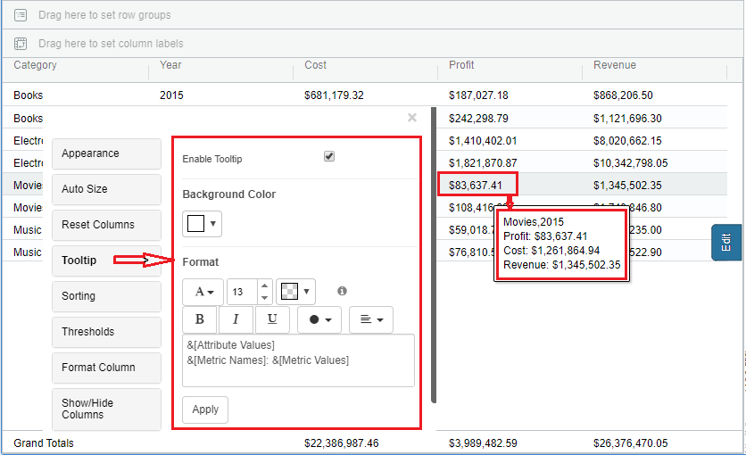
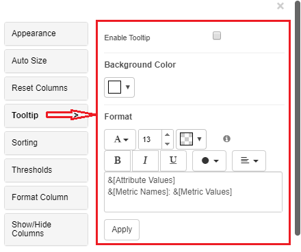
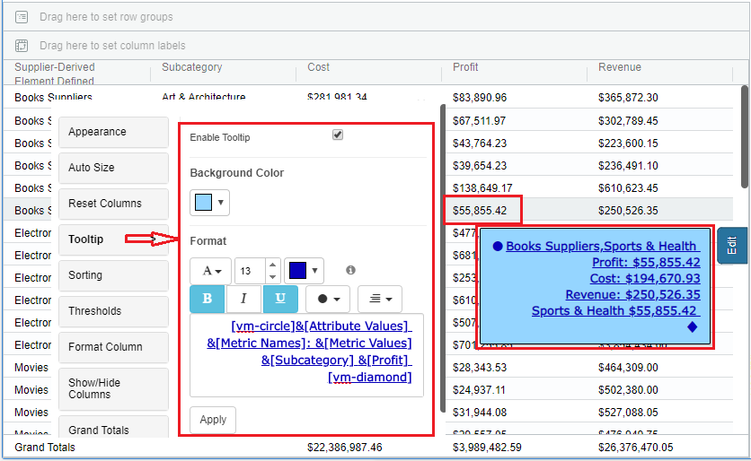
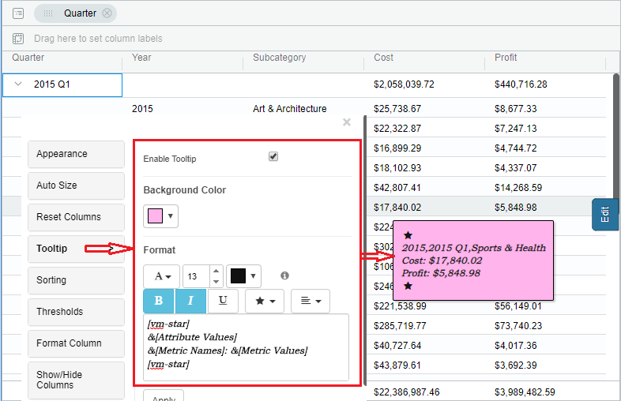
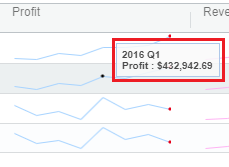
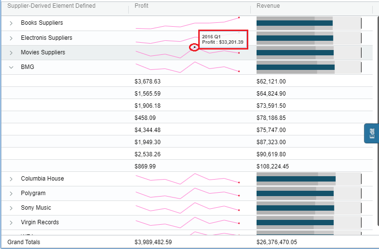

# Tooltip

## Properties Menu - Tooltip 

From Version 4.1 of Vitara Charts, we added custom formatting for Tooltip. Tooltip is a rectangular text box which is hidden by default and appears when the user hovers over a point. Below is the screenshot of Tooltip enabled in the grid chart.

<figure><figcaption></figcaption></figure>

By default, the tooltip is not shown in the Vitara grid chart. You have to enable the tooltip in the property editor. Below is the screenshot to enable the tooltip.

<figure><figcaption></figcaption></figure>

Example of tooltip in the grid chart Create a Grid chart and enable the tooltip in the property editor.Apply background color, required text formattings and background color formatting. Below-shown is the Example of the applied tooltip with all the possible formattings.

<figure><figcaption></figcaption></figure>

### **Tooltip doesn’t apply on the grouping rows**

When any of the columns are grouped in the grid chart, the tooltip cannot be applied to the grouping rows. Tooltip can be applied only on the No-Grouping rows, when grouping is enabled. Below is the screenshot where you can see the Tooltip on the ‘No-Grouping’ rows

<figure><figcaption></figcaption></figure>

### **Trendlines Tooltip-Micro chart**

When trendlines are applied in the grid chart, the trendline tooltip will be different from the text tooltip. By default, trendlines tooltip is applied in the chart. It is smaller in size than text tooltip and cannot be customised.

Below is the screenshot of the Trendlines tooltip.

<figure><figcaption></figcaption></figure>

Example of the Micro chart trendlines tooltip

Create a Vitara grid chart and apply trendlines for a metric and hover on a point of the trendline chart, you can see the tooltip.

<figure><figcaption></figcaption></figure>
