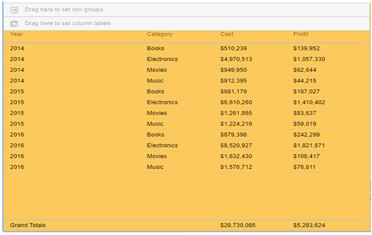
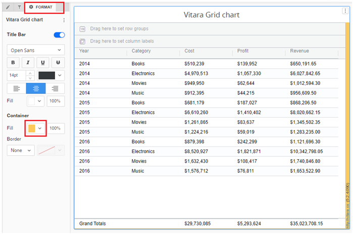
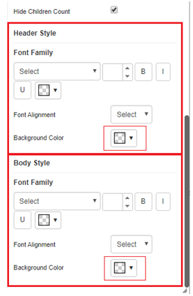
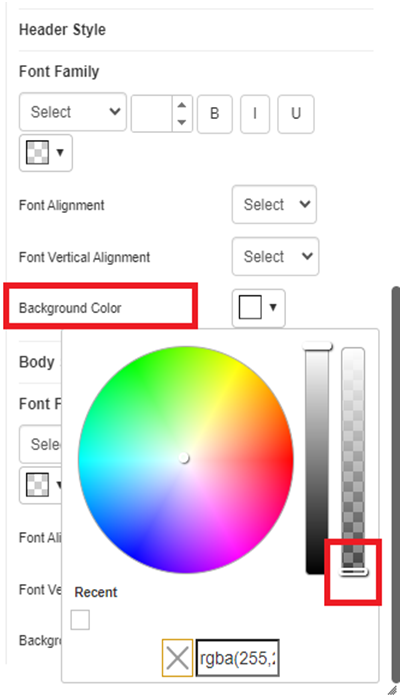
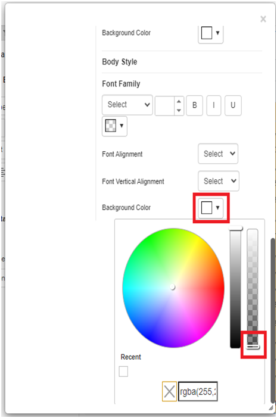
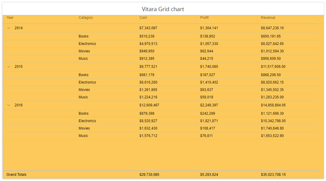

# Transparency

\

## Grid Transparency 

The Vitara grid chart now supports transparency in version 5.2.4. Grid chart transparency lets users change the visibility of grid lines and data points. Please see the image below.

<figure><figcaption></figcaption></figure>

We have to set it at the dossier level in order to view the grid transparency. First, we have to fill the container color from the Format tab.

<figure><figcaption></figcaption></figure>

Later, in the appearance tab of the property editor window, set the background color opacity for both the header and body styles to nil (move to complete down).

<figure><figcaption></figcaption></figure>

<figure><figcaption></figcaption></figure>

<figure><figcaption></figcaption></figure>

The Vitara grid chart is now visible in transparent form.

<figure><figcaption></figcaption></figure>
