# Trend Lines

## Properties Menu - Trend Lines 

From the 4.1 version of Vitara Charts, trendlines are introduced in Grid Chart. This feature helps in converting the grid chart to micro chart.\
Below is the screenshot of trendlines in the grid chart.

<figure>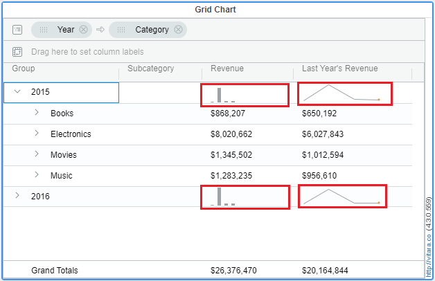<figcaption></figcaption></figure>

### Inputs 

Attributes: 2 or more\
Metrics: 1 or more\
In the Grid chart, the **trendlines are always applied for the second level grouped attribute** in the chart irrespective of the number of attributes. And that attribute is called the **‘trend by’** attribute.

To use trendlines in a grid chart, **the grid should be either in grouped mode or pivoted**. To know about Grouping and Pivoting in Grid chart, click here

There are **three types of trendlines** in the Vitara Grid chart. They are

1. Line Chart
2. Bar Chart
3. Bullet Chart

### Steps to apply trendlines 

#### **Step 1**

Create a Grid chart with a minimum of 2 attributes and 1 metric. Drag an attribute with which you have to create groups into the Group dropzone.\
Below is the screenshot of a grid chart with 3 attributes and 2 metrics and the groups are created using the ‘year’ attribute.

<figure>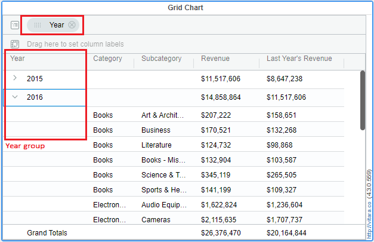<figcaption></figcaption></figure>

#### **Step 2**

Hover onto a metric \[Revenue metric in this case] for which the trendlines need to be applied so that the hamburger button will be displayed. Click on the hamburger button, then a menu will be opened.\
Hover the mouse onto ‘Display as’, then a submenu will be opened which has the trendline charts. See the screenshot below:

<figure>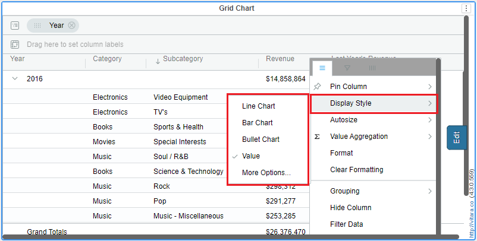<figcaption></figcaption></figure>

#### **Step 3**

Click on the trendline of your choice on that menu. For example, we will click on the ‘Line chart’ here. Then the trendlines for the ‘Revenue’ metric looks the below way. See the screenshot.

<figure>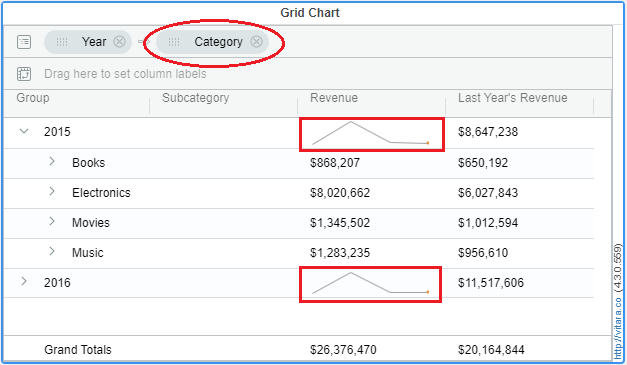<figcaption></figcaption></figure>

\
If you have noticed the above screenshot, the ‘Category’ attribute got grouped automatically after applying trendlines for a metric. This is because the trendlines are always applied for the second attribute in the chart.

### Unsetting the Trendlines: 

After applying trendlines for metrics, we can remove them using the below steps.

1. Open the hamburger menu of the metric in which trendlines need to be removed.
2. Hover onto ‘Display as’ and wait for the submenu to open.
3. Click on the list item ‘value’. See the screenshot below.

 (1).png>)\
Then the trendlines will be removed for that metric and value will be shown as in the screenshot attached in Step 1.

### Formatting the Trendlines: 

In Grid chart, we cannot simply apply trendlines but we can also format them. We can format the trendlines according to the type of chart applied.

To go to the trendlines format window, apply trendlines for a metric and open its hamburger menu. Hover on to ‘Display as’ and wait for the submenu to open up. Click on ‘more options’.\
See the screenshot.

<figure>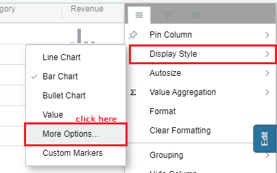<figcaption></figcaption></figure>

When you click on ‘more options’, the below window will be opened.

<figure>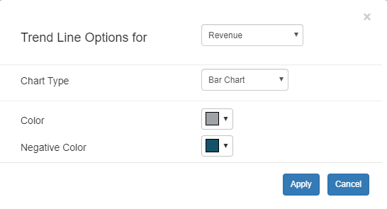<figcaption></figcaption></figure>

In the above screenshot, Trend Line Options for dropdown allows you to select a metric on which you need to apply trendlines.\
And Chart Type dropdown allows you to select a trendline chart for a particular metric selected in the above dropdown.

### **Let us look into chart-wise formattings**

**1. Line Chart**\
For Line charts, we can format the line color and the final spot color.\
To start with, first apply the ‘Line Chart’ trendline for a metric and open the format window. Then set line color (e.g, red) and also the final spot color (e.g, blue). Click on ‘Apply’.\
See the screenshot below with applied formattings.

<figure>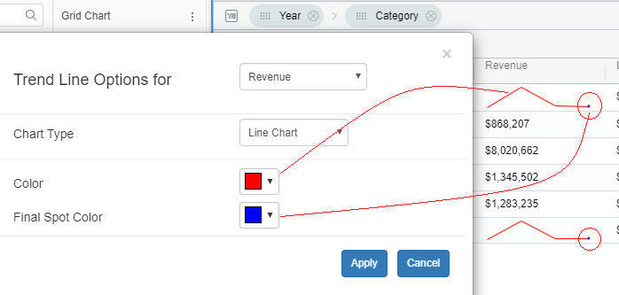<figcaption></figcaption></figure>

**2. Bar Chart**\
For Bar charts, we can format the bar colors and negative bar colors. To start with, first apply the ‘Bar Chart’ trendline for a metric and open the format window. Then set Bar color (e.g, green) and negative color (e.g, red). Click on ‘Apply’.\
See the screenshot below with applied formattings.

<figure>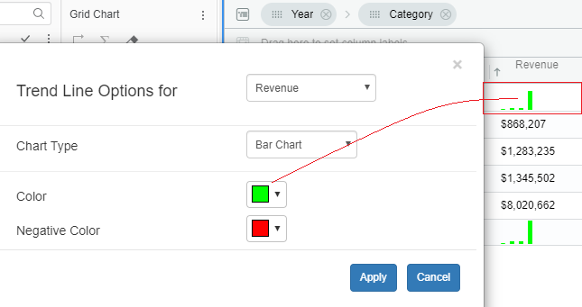<figcaption></figcaption></figure>

**3. Bullet Chart**\
For Bar charts, we can format the bar colors and negative bar colors. To start with, first apply the ‘Bullet Chart’ trendline for a metric and open the format window. Then set Actual color (e.g, green), Target color (e.g, red) and 3 band colors (e.g, blue, yellow and aqua). Click on ‘Apply’. See the screenshot below with applied formattings. 

<figure>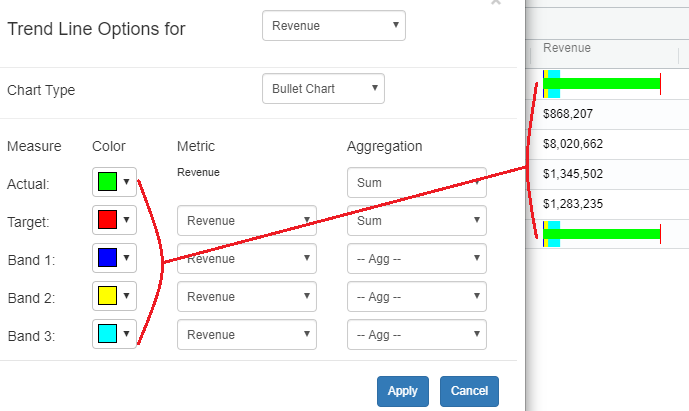<figcaption></figcaption></figure>

### **Axis Specificity**

From the 4.5.4 release, for the line chart and bar chart as trend lines, user can select the specificity of the axis for the same.\
Earlier we default to using the same scale across all the rows for the same metric. Of course with this any large outliers are a problem. In the 4.5.4 release we added an optional setting to not use the same scale and show each row’s trends independently.\
Now the customer can choose one of the option from the two,

**a) same scale across all the rows for the same metric:**\
This is the default option and the minimum and maximum of the scale will be based on the minimum and maximum of that metric.

**b) Apply at each cell:**\
Apply at each cell will be based on the trending minimum and maximum under a display group.

In the below example the use these two options is explained in detail.\
As stated above, by defalut for each metric the bars hieght is set by considering minimum and maximum values from the entire metric. The least hieght of the bar corresponds to the minimum values of the metric and biggest bar corresponds to the maximum values of the metric.\
In the below screenshot, the category - Electronics has biggest numbers when compared to the other other categories. Therefore the hieght of the bars for other categories - Books, Movies, and Music are too small and not visible properly.\
The below screenshot is the vitara grid chart in which bars are set as trendlines.

<figure>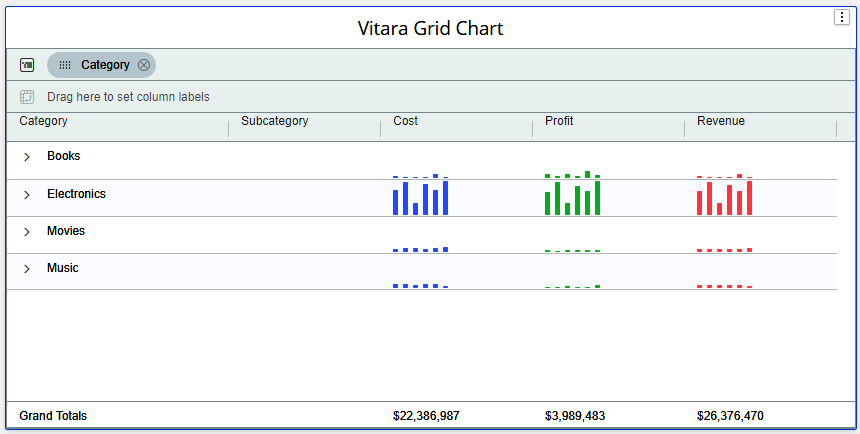<figcaption></figcaption></figure>

\
If we want to make hieghts of the bar in each cell (group element) independent with other cell we have to choose the option - Apply at each cell. Click on hamburger button of the metric on which you want to enable this feature.

<figure>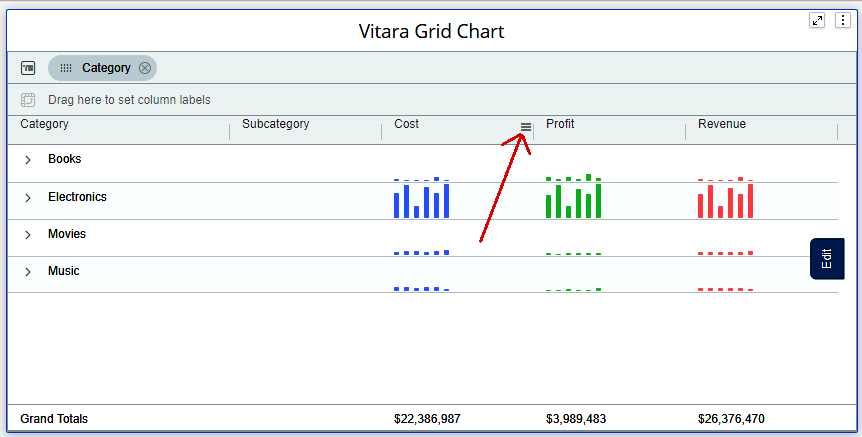<figcaption></figcaption></figure>

Expand the _“Display Style”_ menu and select _“More Options”_.

<figure>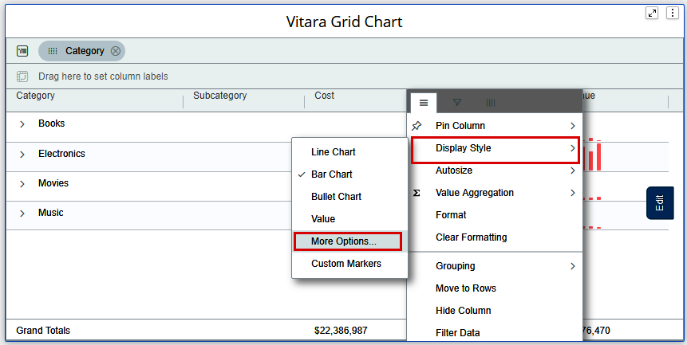<figcaption></figcaption></figure>

Expand the **Scale** dropdown box and select the option - **Apply at each cell** and click on **Apply** button.

<figure>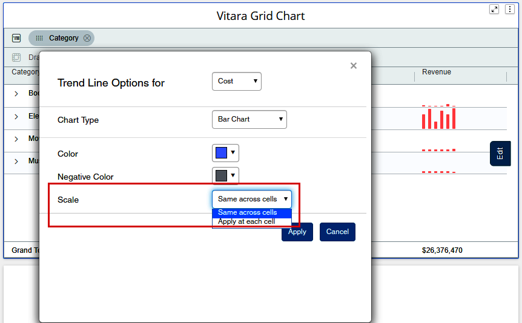<figcaption></figcaption></figure>

By selecting this option Vitara Grid chart will consider the maximum and minimum values with in the cell (group element) of that particular metric.\
For example, if we consider the _Cost_ metric, from all the bars of _Books_ category the least value is given smallest bar hieght and the maximum value is given the biggest bar hieght.\
Likewise the minimum and maximum values are calculated for each category of the metric instead of whole metric’s minimum and maximum values.

<figure>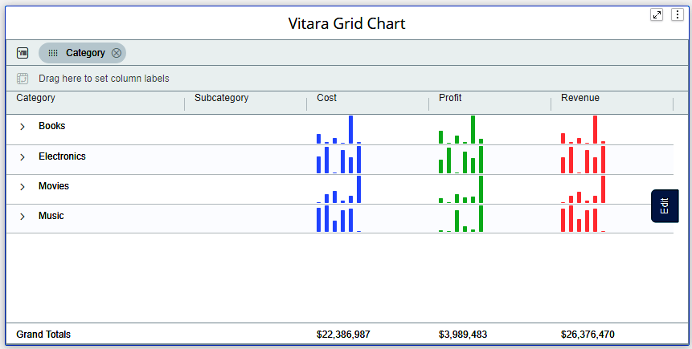<figcaption></figcaption></figure>

## Bullet Chart

For the “Bullet Chart” display style, users can customize the aggregation type and the color of the bands. Refer to the screenshot below for reference. 

<figure><figcaption></figcaption></figure>

## Trend Lines — Start & End Value Options

The Trendline scaling feature allows you to adjust the Start and End Values that determine how data is displayed. These values can be defined by specifying a fixed value, or setting them based on a percentile\
Hamburger Menu >> More options  provides access to these properties.

&#x20;Below is the screenshot for reference.

<figure><figcaption></figcaption></figure>

### Example : Fixed Start Value&#x20;

#### Steps:

1. Navigate to Trendline Settings to a metric
2. Under Start Value, select Fixed Value.
3. Enter 30,000 and click Apply.
4. Leave End Value as Auto (or set another fixed value if required).
5. Review the chart — bar heights are recalculated from the new baseline of 30,000.\
   \
   Before applying Start Value

<figure>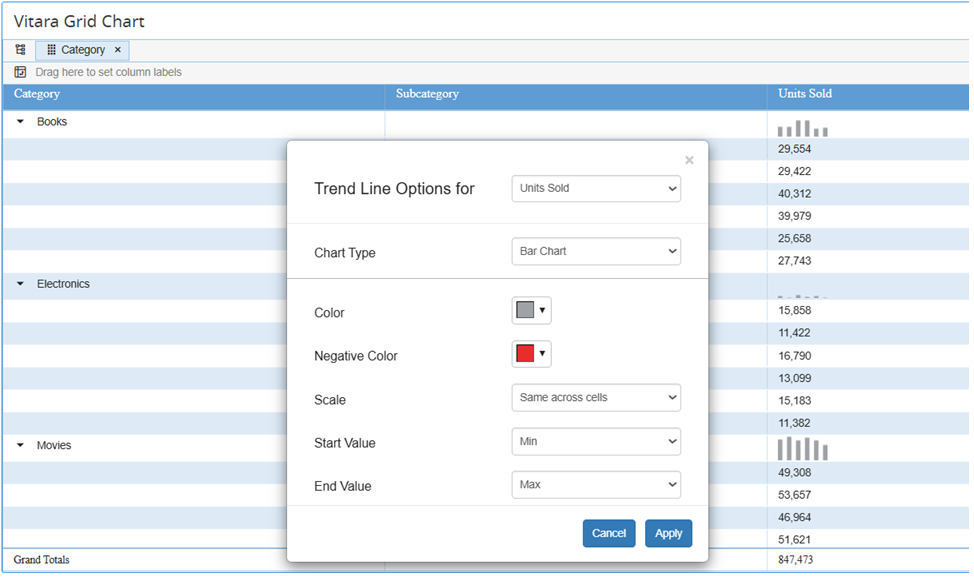<figcaption></figcaption></figure>

After applying Start Value = 30,000

<figure>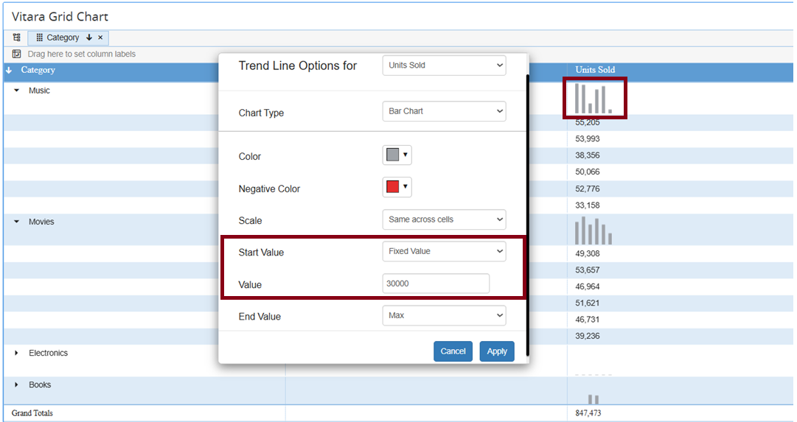<figcaption></figcaption></figure>

when a Fixed Start Value (e.g., 30,000) is applied, the following changes are observed:

* **Baseline Adjustment:** The bars no longer start from zero but from the specified start value (30,000). This recalculates the relative height of all bars.
* **Data Emphasis:** Variations above the start value become more visible, helping in highlighting small differences that might otherwise be hidden when starting from zero.
* **Comparative Clarity:** It becomes easier to compare values that are closer in range since the unnecessary portion below the baseline is excluded.

### Example : Using a Fixed End Value

Steps

1. Open the Grid chart and navigate to Trendline Settings.
2. Under End Value, select Fixed Value.
3. Enter a desired value (e.g., 70,000) and click Apply.
4. Keep Start Value (eg : 30,000)
5. Review the chart — all bars are scaled relative to the fixed maximum of 70,000. 

Before applying Fixed End Value

<figure>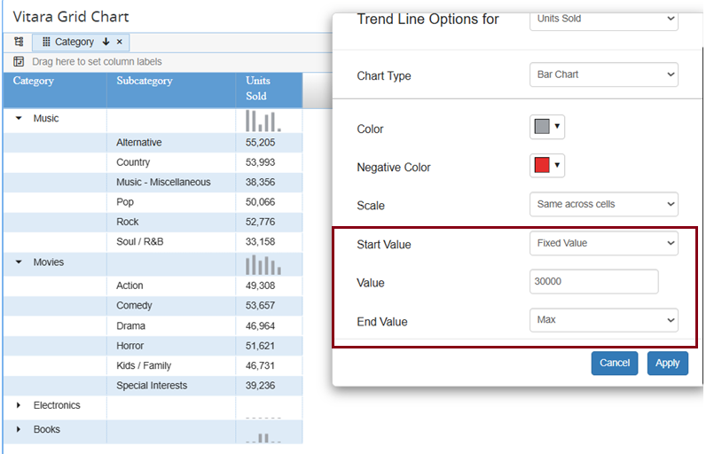<figcaption></figcaption></figure>

After applying End Value = 70,000

<figure>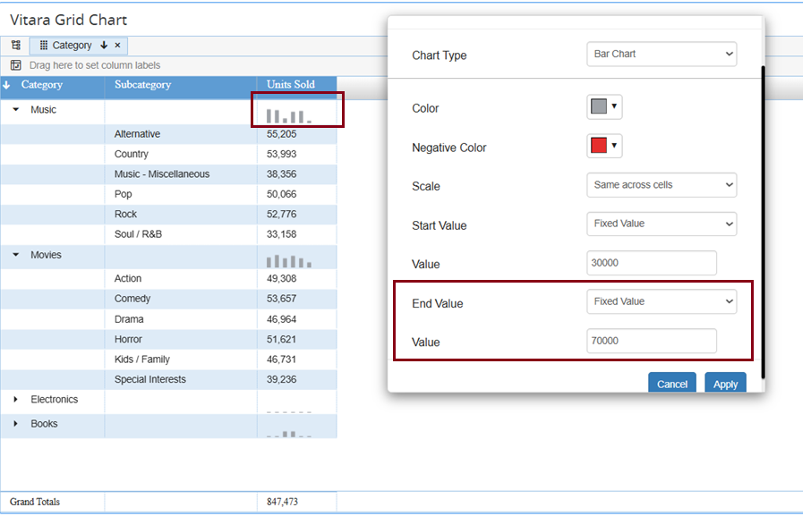<figcaption></figcaption></figure>

**Observation** : When a Fixed End Value (e.g., 70,000) is applied:

* **Consistent Upper Scale**: The chart’s maximum scale remains fixed at 70,000 even if the highest value is lower.
* **Highlighting Gaps**: Bars may appear shorter if the data values are much lower than the fixed maximum.
* **Flexibility**: Can be combined with a fixed start value for a fully customized scale range.

Similarly, the Start and End Value settings can also be applied to other display styles, including horizontal bars/pins, line charts, and bullet charts.

## Creating a Bullet Chart in a Grid Chart

The Bullet Chart display style allows you to measure performance against a target, with colored bands indicating qualitative ranges such as Low, Medium, and High

### Example Use Case

To analyze Region-wise Actual Sales  and visualize the performance trend by Channel using  a Bullet Chart , it includes bands to represent performance ranges (Low, Medium, High).

#### Data Setup Requirements

* Category: At least 2 attributes (e.g., Region, Channel).
* Actual Sales : 1 metric (displayed as a bar).
* Target: 1 metric (displayed as a tick).
* Bands: Derived metrics based on the Target, used to define qualitative ranges such as Low, Medium, and High.

### Steps to Configure

#### Step 1: Add Attributes and Metrics

1. Add **Region** and **Channel** as attributes.
2. Add **Actual Sales** and **Target** as metrics.
3. Place **Region** as the grouping attribute in the grid.

#### Step 2: Change Display Style to Bullet Chart

* Open the hamburger menu of Actual Sales
* Select Display Style → Bullet Chart.
* Configure the Target metric

<figure>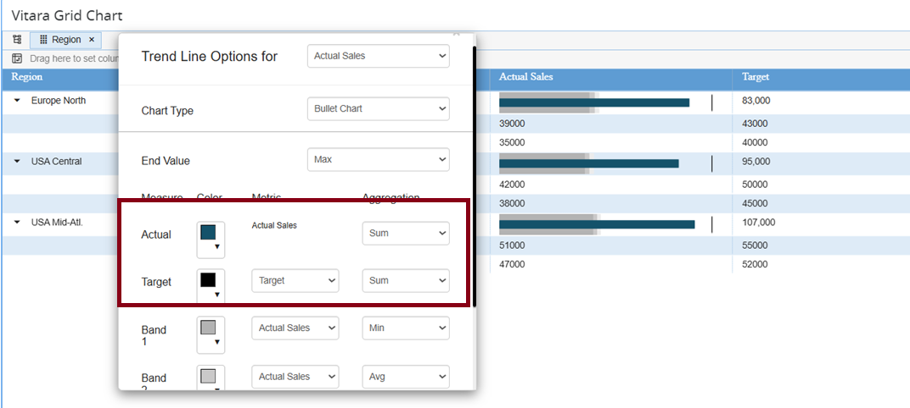<figcaption></figcaption></figure>

#### Step 3: Create Bands for Performance Ranges

Using the Target metric, define derived metrics to represent the qualitative bands:

* Low Band = Target × 0.5
* Medium Band = Target × 0.8
* High Band = Target × 1.2

#### How to create Derived Metrics:

1. Right-click on the Target metric.
2. Select Create Metric.
3. Define the formula for the band (e.g., Target × 0.5 for Low Band)
4. Save the metric.
5. Repeat for Medium and High bands.

Refer to the screenshot below for an example.

<figure>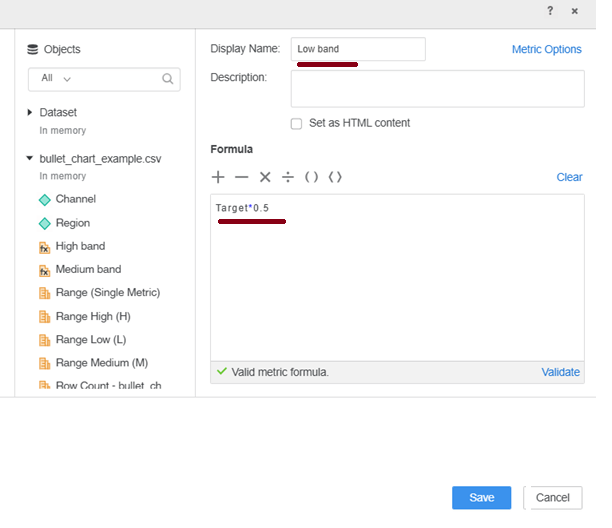<figcaption></figcaption></figure>

#### Step 4: Add Bands to the Chart

* Add the derived band metrics to the grid.
* Open Bullet Chart Settings and configure
* Low Band → Sales below 50% of target
* Medium Band → Sales between 50% and 80%
* High Band → Sales above 80% &#x20;

\
Refer to the screenshot below for an example of the Bullet Chart Settings with the bands configured

<figure>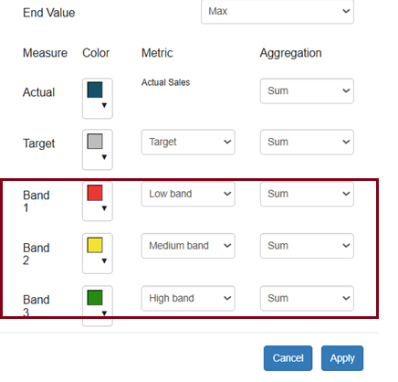<figcaption></figcaption></figure>

#### Step 5: Hide Band Columns

* Use the Hamburger Menu on each band column → select Hide Column.
* This keeps the grid clean while preserving the Bullet Chart configuration.

The screenshot below shows the Bullet Chart in Vitara Grid after the bands are configured

<figure>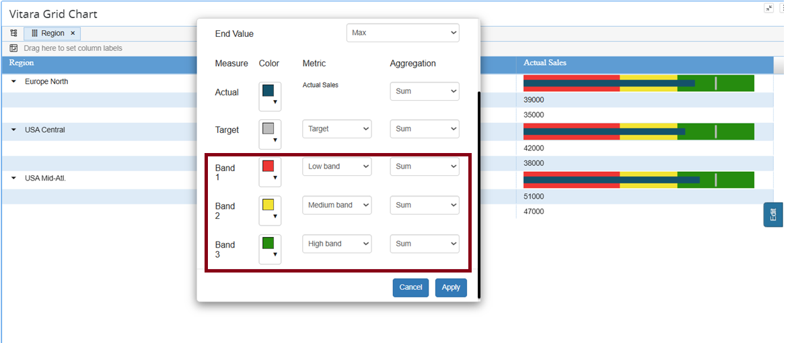<figcaption></figcaption></figure>
