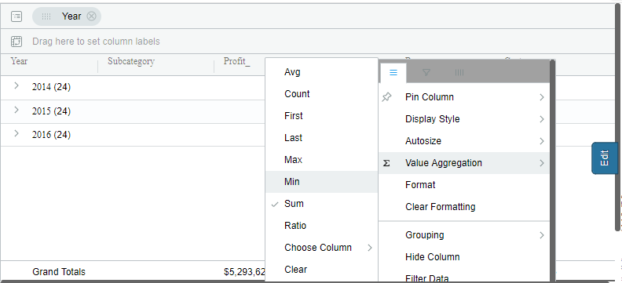
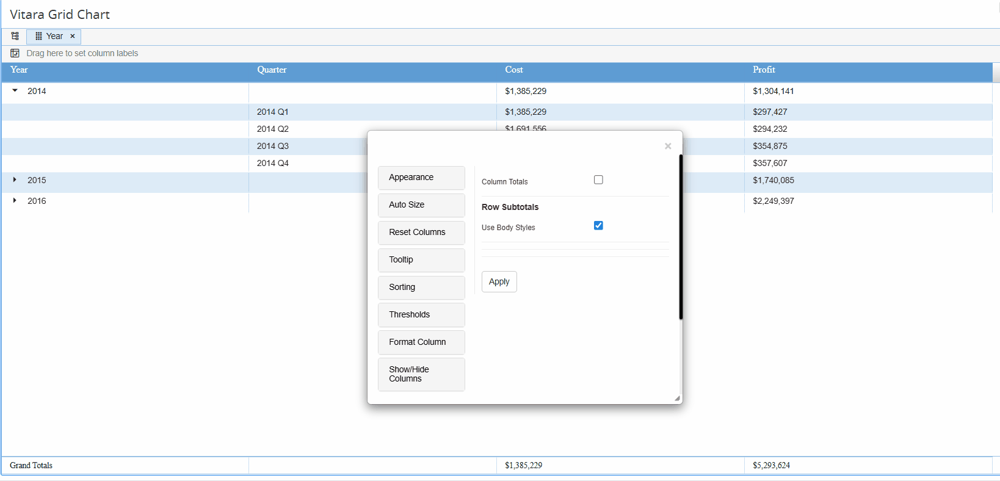
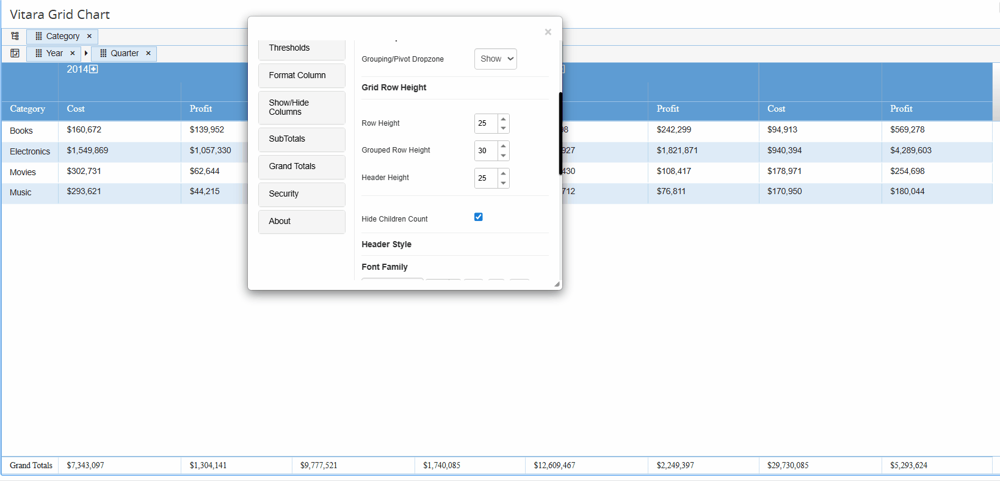

# Value Aggregation

## Properties Menu - Value Aggregation

Once we apply to the group, we can apply value aggregations to the group headers. Click the hamburger button of the respective column on which you want to apply value aggregations. Expand the ‘Value Aggregations’ tab and select the aggregation function. Below is a screenshot of the ‘Value Aggregation’ tab.

<figure><figcaption></figcaption></figure>


Vitara grid chart allows applying only the aggregation functions which are listed in the ‘Value Aggregation’ tab. The default aggregation function is ‘Sum’.

### **Choose Column**

In the ‘Value Aggregation’ tab of the grid chart, there are some basic functions that can be used to apply aggregations. If we want a function other than these functions, by using the ‘Choose Column’ option in the ‘Value Aggregation’ tab we can implement it.

It is possible to use aggregation from a different metric (say metric B) as the aggregation for metric A. The way to set it up is to use both metric A and metric B on the grid. Now metric B is something you would define in MicroStrategy having the right type of aggregation at the desired dimensionality. On the Vitara Grid column for metric B, you would just choose a trivial aggregation (like first or last).

In the column for metric A, choose aggregation and choose a column to select metric B. Now you can just hide column for metric B if you don’t want it displayed.

### **Example:**

For example, in the below screenshot group by is applied at the ‘Product Category’ level. I want to show ‘value aggregation’ for profit metric as (Profit - Shipping Cost).

<figure><figcaption></figcaption></figure>

But using the Vitara grid chart ‘Value Aggregation’ formulas I can’t define this aggregation. The following is the procedure for defining this aggregation.

#### **Step 1:**

Define a derived metric using the formula we want in aggregation. Let us assume the derived metric name is ‘Actual Profit’.

```
                      Actual Profit = Profit - Shipping Cost
```

<figure><figcaption></figcaption></figure>

The level at which we want this aggregation is the ‘Product Category’ level. Therefore, the derived metric also defined at this level. The MicroStrategy formula for this derived metric will be

```
                      Sum ((Profit-[Shipping Cost])){[Product Category]}
```

#### **Step 2:**

Add this metric to the grid chart.

<figure><figcaption></figcaption></figure>

#### **Step 3:**

Apply aggregations like First, Last, Max or Min for ‘Actual Profit’ derived metric.

<figure><figcaption></figcaption></figure>

#### **Step 4:**

The derived metric ‘Actual Profit’ is showing exactly the same aggregation values which we want to show at the ‘Profit’ metric. To copy this aggregation value at ‘Profit’ metric, open ‘Value Aggregation’ for ‘profit metric, go to ‘Choose Column’ and select the derived metric ‘Actual Profit’.

<figure><figcaption></figcaption></figure>

#### **Step 5:**

Now as we defined the derived metric ‘Actual Profit’ for calculating value aggregation for the ‘Profit’ metric and we don’t need this metric in our grid chart we can hide this metric. Click on the hamburger button of the ‘Actual Profit’ metric and select ‘Hide Column’.

<figure><figcaption></figcaption></figure>


You can verify in the below screenshot, the aggregation value of ‘Profit’ metric, is it showing exactly (Profit - Shipping Cost). The aggregation functions applied for ‘Profit’ and ‘Shipping Cost’ is Sum.

<figure><figcaption></figcaption></figure>

## **Ratio Aggregation**

In the 3.9 release, Vitara Grid and Micro charts have a new aggregation function called ‘Ratio’. We can implement a ratio of two metrics as aggregation in the chart. The following is the screenshot of the ratio option.

<figure><figcaption></figcaption></figure>

When we select ‘Ratio’ as aggregation function a new ratio editor window will open. Below is the screenshot of the ratio editor window.

<figure><figcaption></figcaption></figure>

Apply all the required fields and click on the ‘Apply’ button.

### Column Totals

When Column Totals are enabled, you can configure a separate aggregation for the total column. This aggregation applies only to the total column and does not impact the aggregation settings of the other columns.

Please refer to the attached GIF for a visual reference.

<figure><figcaption></figcaption></figure>

**Note:** The **Ratio** and **Choose Column** functionalities are not supported for **Column Totals** or **Pivot Totals**.

### Pivot Totals

#### Default Behaviour with Pivot

When an aggregation is applied to primary (non-pivoted) columns, the same aggregation is automatically reflected in the row totals when Pivot Mode is enabled—unless a different aggregation is explicitly configured.

#### Pivot Group Metric Totals

**Note**: To enable Pivot Group Metric Totals, at least two attributes must be placed in the Pivot Drop Zone.

* Only the outermost (parent) column in the pivot hierarchy supports custom aggregation for group metric totals.
* Inner (child) group levels do not support separate aggregation logic.

#### Pivot Group Totals Limitation

No additional aggregation options are available for pivot group totals beyond the configured settings.

Please refer to the attached GIF for a visual reference.

<figure><figcaption></figcaption></figure>

&#x20;For more details on Pivot Row Totals, Pivot Group Totals, and Pivot Group Metric Totals,[ click here.](subtotals.md)

<br>
