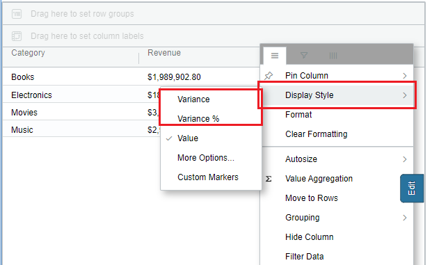
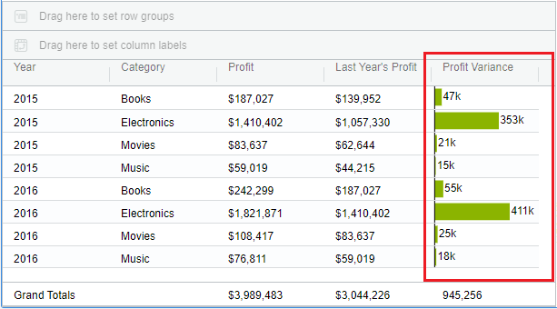
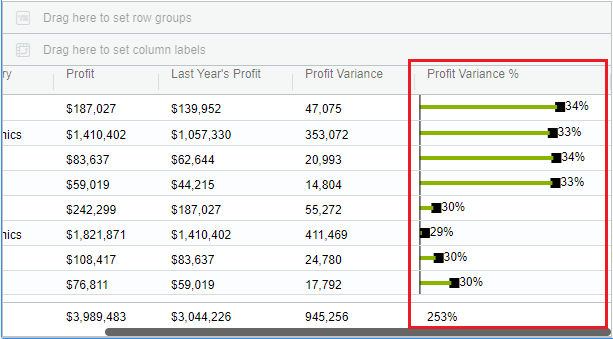

# Variance

\

## Variance (Delta Charts) 

From 4.7 version of VitaraCharts, a feature called **‘Variance’** is introduced in the Grid chart. This feature allows to plot a variance chart for a particular metric/column. For this type of chart, the scenarios are mapped using metrics. So the user will need to define separate metrics (for the same set of category elements) representing each scenario. There are two kinds of functional properties in this feature

1. Variance
2. Variance %\

These properties are available in Hamburger menu of the metric column. See the screenshot below

<figure><figcaption></figcaption></figure>

### **Steps to apply this feature**

1. Create a grid chart in either grouped mode or normal mode
2. Click on the hamburger menu of metric column on which the variance is to be enabled
3. Hover onto ‘Display as’ and wait for a sub menu to open up
4. Click on ‘Variance’. Then variance graph will be plotted for that metric column as in the below screenshot

<figure><figcaption></figcaption></figure>

In the same way, enable ‘Variance %’ for a percentage metric/column, then the chart looks like in the below way.

<figure><figcaption></figcaption></figure>

**Enhancement:**\
The **"Variance"** and **"Variance %"** chart types have been renamed to **"Horizontal Bars"** and **"Horizontal Pins"** respectively.\
[Click here ](https://docs.vitaracharts.com/grid-microchart-guide/horizontal-bars-pins)for more information.
