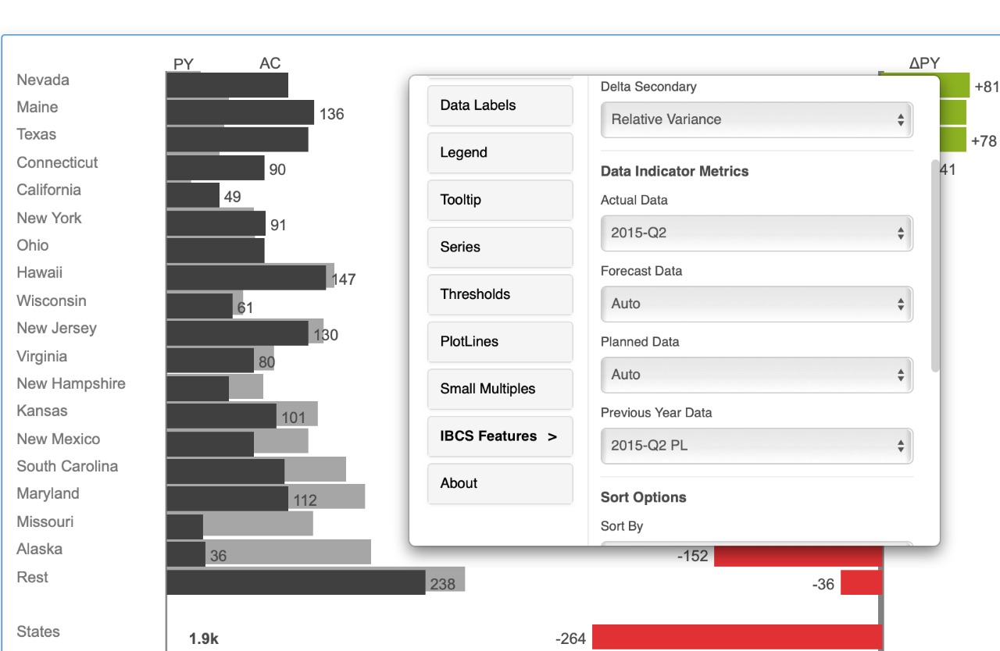
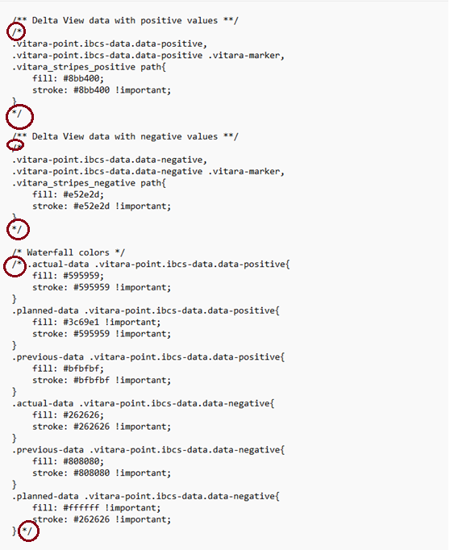
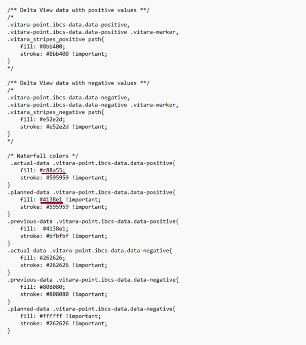
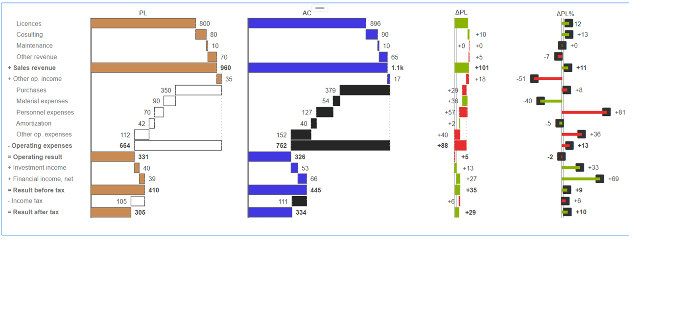

# Mapping IBCS Scenarios

### Support for Planned, Actual, Previous and Forecast <a href="#support-for-planned-actual-previous-and-forecast" id="support-for-planned-actual-previous-and-forecast"></a>

According to IBCS, VitaraCharts supports the following scenarios.

* Actual
* Forecast
* Previous
* Planned

The primary scenarios are Actual and Forecast. The secondary possibilities are Planned and Previous. For the charts to function properly, at least one element (metric or attribute) of the primary scenario must exist in the mapping. At least one element of the primary scenario and one element of the secondary scenario must be mapped in order for the absolute and relative variances (deltas) to be displayed on the chart.

Actual data is always given first attention in all of the charts. If actual data for a particular category is not available, we look at forecast data for that same category. You can compare scenarios by comparing

* Actual/Forecast vs Previous
* Actual/Forecast vs Planned

In each of the comparisons above, representing deltas and delta percentages becomes possible.

### Mapping data to the scenarios <a href="#mapping-data-to-the-scenarios" id="mapping-data-to-the-scenarios"></a>

**Automatic detection**

Based on the name, Vitara Charts can automatically determine which measurements or attributes fit within a given situation. In the global.txt file, you can specify what the name pattern should be. The default settings for the file, which can be found in the Vitara Charts custom folder, are as follows:

```
#Data Types as per IBCS standard data classification
#usage: DT.<dataType> = metricTitle1, metricTitle2 (can be both metric titles and attribute values)
#defaults included below add/change values with comma seperated
DT.AC= AC, Actual
DT.FC= FC, Forecast
DT.PL= PL, Planned
DT.PY= PY, Previous Year
```

The lines beginning with the # symbol are comments that describe the types of data that can be entered here. You can configure the right side of the set of lines to contain every possible way of the metrics or attribute names that fit into each of the scenarios. Regular expressions are also acceptable. Strings containing regular expressions must be enclosed in \[] brackets.

**Examples**

As an example, if you’d like to add \_AC as a suffix for all metrics that fall in the Actual scenario we can add that as follows

```
#Data Types as per IBCS standard data classification
#usage: DT.<dataType> = metricTitle1, metricTitle2 (can be both metric titles and attribute values)
#defaults included below add/change values with comma seperated
DT.AC= AC, Actual, [.*_AC]
DT.FC= FC, Forecast
DT.PL= PL, Planned
DT.PY= PY, Previous Year
```

Here’s another sample that adds different strings and patterns to each of the scenarios

```
#Data Types as per IBCS standard data classification
#usage: DT.<dataType> = metricTitle1, metricTitle2 (can be both metric titles and attribute values)
#defaults included below add/change values with comma seperated
DT.AC= AC, Actual, Current, TY, [.*_AC]
DT.FC= FC, Forecast, [.*_FC]
DT.PL= PL, Planned, [.*_PL]
DT.PY= PY, Previous Year, Previous, [.*_PY]
```

Once this mapping is done, in all of the charts, whenever this pattern is recognized, the metrics and attributes are automatically placed in each of these scenarios.

**Note** : The names of the scenarios in this file should not be modified (i.e. the left side that mentions DT.AC, DT.FC, and so on). While PY appears to signify ‘Previous Year,’ this scenario can reflect anything from the past (previous quarter, previous day, etc.).

**Manual mapping in the properties editor**

In addition to the ability to configure scenarios globally, you can also reconfigure measurements into scenarios in each particular graphic. This is done in the specific chart’s properties editor. For example, here’s a multi-tier bar chart with scenario mapping that may be altered.

<figure><figcaption></figcaption></figure>

### Customize IBCS

We provide flexibility to customize the IBCS chart colors according to your reporting standards.

In the file customIBCSStyles.css, you can define custom hex codes for AC (Actual), PL (Planned), PY (Previous Year), and FC (Forecast), as well as for Delta values (positive and negative).

#### Location of the file:<br>

* **Web:** /MicroStrategy/plugins/VitaraCharts/custom/customIBCSStyles.css
* **Web Library**: /MicroStrategyLibrary/plugins/VitaraCharts/custom/customIBCSStyles.css

The screenshot shared is an example that demonstrates how Actual (AC) and Planned (PL) colors have been defined. Similarly, you can edit this file and assign your own color palette values for AC, PL, PY, FC, and Delta views.

👉 **Important**: To make the changes effective, please ensure you remove the comment marker (/\*) as highlighted in the screenshot. Otherwise, the styles will remain inactive.

<figure><figcaption></figcaption></figure>

<figure><figcaption></figcaption></figure>

In the example screenshot below, colors have been defined for Actual (AC) and Planned (PL) data.

Similarly, users can edit and define colors for the Delta view (positive and negative values), as well as for AC, PL, PY, and FC.

<figure><figcaption></figcaption></figure>

* Once the file is updated and saved, the charts will automatically reflect the new color assignments. (**Note**: clear your browser cache to ensure the changes are visible.)
* For example, bars representing Planned and Actual values will display in the newly defined colors instead of the default palette.

This approach ensures that your IBCS visualizations stay consistent with your corporate colors and style guidelines while still following IBCS standards.

<figure><figcaption></figcaption></figure>
