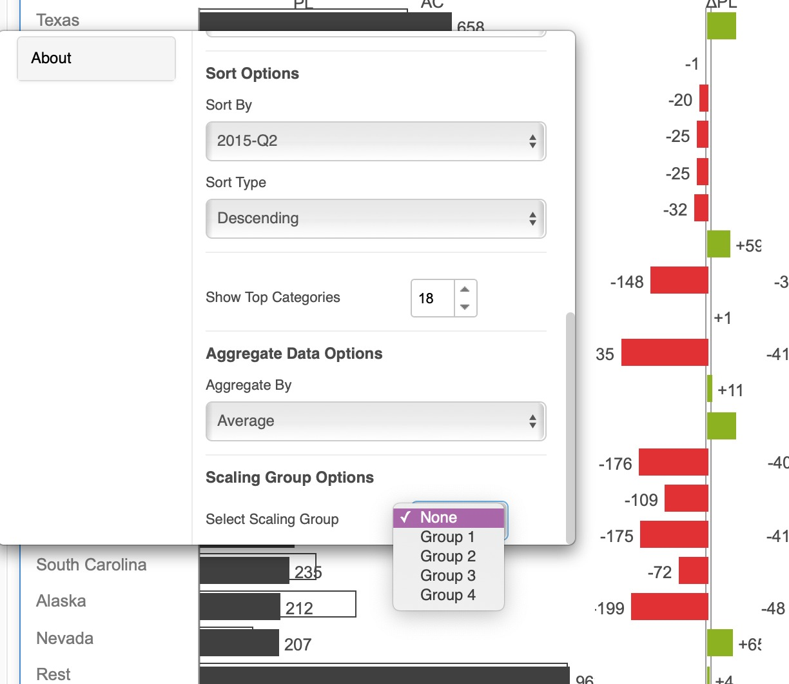
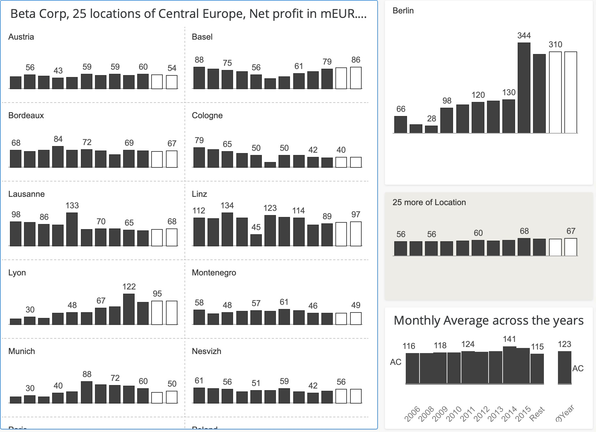

# Scaling Multiple Charts

\

#### Configure multiple charts to use the same scaling 

When there are many charts on a same page or panel of a dashboard, it is generally advantageous to use the same value axes scaling. This may be necessary not only for the same metric but also across metrics (for example, to represent income and spending).

You may simply accomplish this using the properties editor. A drop down selector for the scaling group may be found in the IBCS section of the properties editor.

<figure><figcaption></figcaption></figure>

Choose a scaling group, and then repeat for all of the charts on the same page that must be in the same group. You can also put some of the charts in one group and some in another (on the same page).

Here’s an example of a page with many charts with distinct metrics that are all scaled by placing all charts in the ‘Group 1’ scaling group.

<figure><figcaption></figcaption></figure>

**Demo video**
