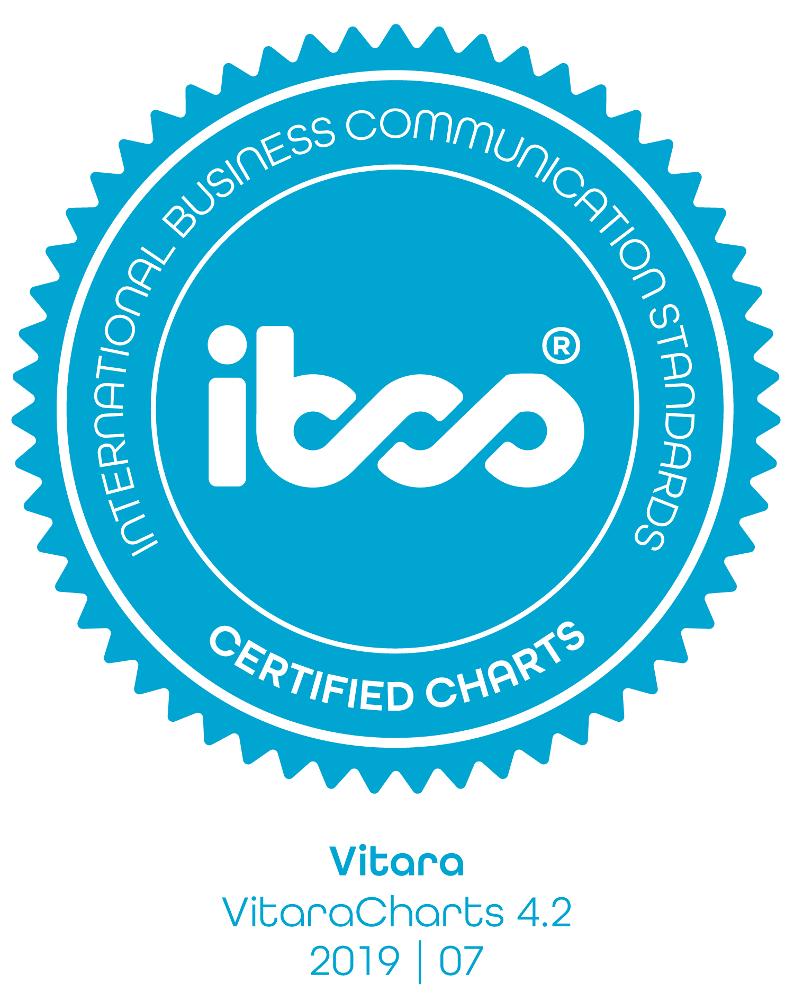

# Why IBCS

\

#### Why IBCS and what is it used for 

VitarCharts is now IBCS certified. All IBCS features are available as a separate add-on to VitaraCharts starting with version 4.3

<figure><figcaption></figcaption></figure>

\
per the [IBCS website](https://www.ibcs.com/standards)

International Business Communication Standards (**IBCS**) are practical proposals for the design of reports, presentations, dashboards and the diagrams and tables contained therein. This involves the conception of the content, the visual perception and the application of a semantic notation.

Essentially its a set of standards that define how to present information in a consistent, easy-to-consume manner while making the presentation of data visually compelling.

As offered in VitaraCharts for MicroStrategy, IBCS compliance ensures that an organization would now be able to, within minutes, create beautiful charts that convey meaning very effectively.

As part of the compliance certification, VitaraCharts currently enabled the following five charts with IBCS semantics (more will be added in the near future)

* Vertical Waterfall
* Small multiples
* Multi-tier Bar
* Multi-tier Column
* Scattergram

Key features in these charts is the notion of scenarios. Scenarios represent a certain perspective or flavor of data. For instance, the data can be actual or can be planned (yet to be realized as actual). These are two scenarios. Similarly you could be looking at past data (Previous) or Forecast. So for the same measure or metric, you can easily represent data in each of these scenarios and compare performance across scenarios.

Please review Mapping Scenarios to understand how to achieve this with VitaraCharts in MicroStrategy.
