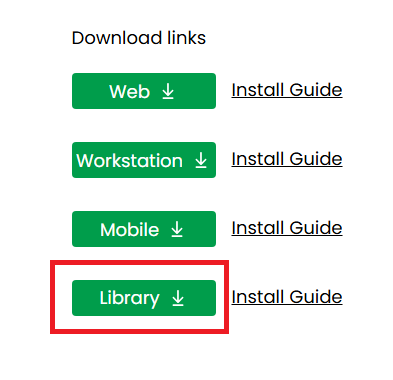

# Installing on MicroStrategy Library

## Download <a href="#download" id="download"></a>

* Download the **library version** of VitaraCharts.

<figure><figcaption></figcaption></figure>

* You can find the latest links for download from our download site at [Main page](https://www.vitaracharts.com/ms-product-downloads)

## Steps <a href="#steps" id="steps"></a>

* This VitaraChartsLibrary zip file will contain a folder named “VitaraCharts” and a separate folder for each of the visualizations.
* Unzip the ‘VitaraChartsLibrary’ zip file, you will get around 30+ folders.
* Stop​ WebServer (IIS/Tomcat or equivalent)
* Delete VitaraCharts related folders under MicroStrategy library plugins directory (if any exist).
* **Please ​do not**​ keep any backup copies of VitaraCharts in the plugins directory
* Copy over all the folders extracted from “VitaraChartsLibrary” zip file into the plugins folder of your MicroStrategy library installation. For instance if library server is installed under _c:\tomcat\webapps\MicroStrategyLibrary_, you will place all folders under _c:\tomcat\webapps\MicroStrategyLibrary_\​**plugins**
*   Below is the screenshot of plugins folder after deployment of vitara charts for library.

    
* **MicroStrategy 2021 Update 4 and newer versions**\
  From MicroStartegy 2021 update 4 version we can edit dossiers in the web library. So you have to provide license file in the library deployment also. REPLACE the license.txt file in the _webapps/MicroStrategyLibrary/plugins/VitaraCharts/_ folder with the license file provided to you.
* Start​ the WebServer.
* Flush any browser caches and access the dossier/documents from a new browser window (to avoid any issues with a previously used license file)

## Configure Mobile Library Server Path <a href="#configure-mobile-library-server-path" id="configure-mobile-library-server-path"></a>

Starting with version 4.7 the following steps are **always** required.

After extracting the VitaraChartsLibrary plugins into plugins folder of MicroStrategy Library server, navigate to the library configuration page. Below are are the example URLs to open the configuration web page.

## **MicroStrategy Installation on IIS/Windows versions**

```
https://<MicroStrategyLibraryServer>/plugins/VitaraCharts/config.aspx 
(Example: ​http://example.com/MicroStrategyLibrary/plugins/VitaraCharts/config.aspx)
```

## **MicroStrategy Installation on Tomcat/Linux versions**

```
https://<MicroStrategyLibraryServer>/plugins/VitaraCharts/config.jsp 
(Example: ​http://example.com/MicroStrategyLibrary/plugins/VitaraCharts/config.jsp)
```

Below is the screenshot of the library configuration page. On this page enter the path to the **MicroStrategy Web application** (not library) and click submit.


* Setting web configuration url also helps to render Vitara Charts without internet access in the ipad/iphone.
* &#x20;**Note** : _Clear cache in the MicroStrategy library mobile application and restart the MicroStrategy library mobile application on your iPad/iPhone to see the changes._
* &#x20;For detailed instructions on clearing the cach&#x65;**,**[ **click here.**](https://docs.vitaracharts.com/faq/how-to-fix-mobile-rendering-issues)

#### **Note:** Starting with version 5.3.6, a new utility named Health Tool has been introduced.

This tool provides a centralized interface to verify the correct deployment of the Vitara Charts plugin and helps identify potential configuration or compatibility issues.

👉[ Click here ](health-tool.md)to access the **Health Tool**.

