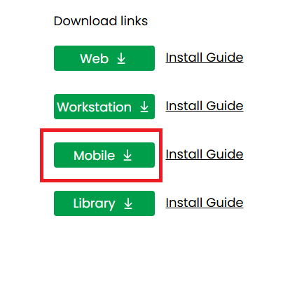

---
layout:
  title:
    visible: true
  description:
    visible: false
  tableOfContents:
    visible: true
  outline:
    visible: true
  pagination:
    visible: true
---

# Installing on MicroStrategy Mobile

## Download <a href="#download" id="download"></a>

* Download the **mobile version** of VitaraCharts.

<figure><figcaption></figcaption></figure>

* You can find the latest links for download from our download site at [Main page](https://www.vitaracharts.com/ms-product-downloads)

## Steps <a href="#steps" id="steps"></a>

The downloaded file will be different from the web version and is called “VitaraChartsMobile.zip”

* This zip file will contain a folder named “VitaraCharts” and a separate folder for each of the visualizations.
* Unzip the ‘VitaraChartsMobile’ zip file, you will get around 30+ folders.
* Stop​ WebServer (IIS/Tomcat or equivalent)
* Delete VitaraCharts related folders under MicroStrategy mobile plugins directory (if any exist).
* **Please ​do not**​ keep any backup copies of VitaraCharts in the plugins directory
* Copy over all the folders extracted from “VitaraChartsMobile” zip file into the plugins folder of your MicroStrategy mobile installation. For instance if mobile server is installed under _c:\tomcat\webapps\MicroStrategyMobile​_, you will place all folders under _c:\tomcat\webapps\MicroStrategyMobile​_\​**plugins**
*   Below is the screenshot of plugins folder after deployment of vitara charts for mobile.&#x20;

    <figure><figcaption></figcaption></figure>
* Start​ WebServer.
* Connect your ipad to the mobile server

## Configure Mobile Server Path <a href="#configure-mobile-server-path" id="configure-mobile-server-path"></a>

Starting with version 4.7 the following steps are **always** required.

After extracting the VitaraChartsMobile plugins into plugins folder of MicroStrategy Mobile server, navigate to the mobile configuration page. Below are are the example URLs to open the configuration web page.

## **MicroStrategy Installation on IIS/Windows**

```
https://<MicroStrategyMobileServer>/plugins/VitaraCharts/config.aspx 
(Example: ​http://example.com/MicroStrategyMobile/plugins/VitaraCharts/config.aspx)
```

## **MicroStrategy Installation on Tomcat/Linux**

```
https://<MicroStrategyMobileServer>/plugins/VitaraCharts/config.jsp 
(Example: ​http://example.com/MicroStrategyMobile/plugins/VitaraCharts/config.jsp)
```

**Setting Mobile Configuration URL**​\
Below is the screenshot of the mobile configuration page. On this page enter the path to the **MicroStrategy Web application** (not mobile) and click submit.


* Setting mobile configuration url to Vitara Charts config also helps to render Vitara Charts without internet access to the ipad/iphone..
* **Note** : _Clear cache in the MicroStrategy mobile application and restart the MicroStrategy mobile application on your iPad/iPhone to see the changes._
* &#x20;For detailed instructions on clearing the cach&#x65;**,**[ **click here.**](https://docs.vitaracharts.com/faq/how-to-fix-mobile-rendering-issues)
