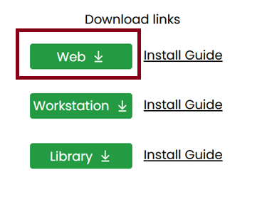

---
layout:
  title:
    visible: true
  description:
    visible: false
  tableOfContents:
    visible: true
  outline:
    visible: true
  pagination:
    visible: true
---

# Installing on MicroStrategy Web

## Download 

* Download the **web version** of VitaraCharts.

<figure><figcaption></figcaption></figure>

* You can find the latest links for download from our download site at [Main page](https://www.vitaracharts.com/ms-product-downloads)

## New Installation 

Please follow the installation instructions below if this is your first time using VitaraCharts.

* Download the web version from the link above
* Extract the VitaraCharts folder from the zip
* Stop WebServer (IIS/Tomcat or equivalent)
* Delete VitaraCharts folder under plugins directory if one exists.
* **Please ​do not**​ keep any backup copies of VitaraCharts in the plugins directory
* Copy over the new version of the VitaraCharts folder into the plugins folder of your MicroStrategyweb installation. For instance if Web is installed under &#x200B;_**c:\tomcat\webapps\MicroStrategy**_&#x200B;, you will place VitaraCharts under &#x200B;_**c:\tomcat\webapps\MicroStrategy​\​plugins**_
* If you had done the installation correctly, the folders will loook as shown below.

<figure><figcaption></figcaption></figure>

* REPLACE the license.txt file in the VitaraCharts folder with the license file provided to you
* Start WebServer.
* Flush any browser caches and access the dossier/documents from a new browser window (to avoid any issues with a previously used license file)

## Upgrading existing installation 

If you are upgrading an existing installation, then please follow the below installation steps.

* Take a backup of the customizations applied to the existing VitaraCharts installation. Basically, there are two files where you can customize Vitara charts. The _**global.txt**_ file and _**customStyles.css**_ file.\
  The _**global.txt**_ file can be used to define custom color palettes, custom fonts, etc. And the _**customStyles.css**_ file can be used to add your own individual styles to the charts.\
  So, take a backup of these two files before starting the deployment process.\
  The location of these files would be as shown below:\
  &#xNAN;_/webapps/MicroStrategy/plugins/VitaraCharts/custom/global.txt_\
  &#xNAN;_/webapps/MicroStrategy/plugins/VitaraCharts/custom/customStyles.css_\
  **Note:** The plugins directory should contain only one folder with the name VitaraCharts. So, please ​do not​ keep any backup copies of the VitaraCharts folder in the plugins directory.
* Download the web version from the link above.
* Extract the VitaraCharts folder from the zip.
* Stop WebServer (IIS/Tomcat or equivalent).
* Delete the VitaraCharts folder under the plugins directory.
* Copy over the new version of the VitaraCharts folder into the plugins folder of your MicroStrategy web installation.
* REPLACE the license.txt file in the VitaraCharts folder with the license file provided to you.
* REPLACE the backup files _**global.txt**_ and _**customStyles.css**_ into the location _/webapps/MicroStrategy/plugins/VitaraCharts/custom/_
* Start WebServer.
* Flush any browser caches and access the dossier/documents from a new browser window (to avoid any issues with a previously used license file)

## **Important : Set up info for the MicroStrategy export server**

If you are using the new export engine on MicroStrategy (available starting 2019 update 2) you have the option of deploying VitaraCharts locally on the export server. The procedure is detailed here [Export engine set up](https://community.microstrategy.com/s/article/New-Customization-Property-for-the-Export-Engine-Service?language=en_US)

Use this web version of VitaraCharts to copy them to the resources folder on the export server. Please do not use the library or mobile version.
