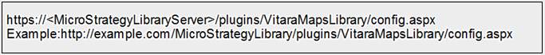
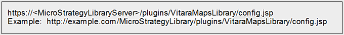

# Installing VitaraMaps on MicroStrategy Library

#### Download

* Download the library version of VitaraMaps from the official download page.
* You can find the latest version links on the VitaraMaps [Main Page.](https://www.vitaracharts.com/ms-product-downloads)

.png>)

### New Installation

Follow the steps below to install VitaraMaps on your MicroStrategy Library Server:

1. **Download and Extract**

* Download the VitaraMapsLibrary.zip file.
* Unzip it to extract the VitaraMapsLibrary folder.

2. **Stop the Web Server**

* Stop IIS, Tomcat, or the equivalent  server.

3. **Remove Existing Installation**

* Delete any existing VitaraMapsLibrary folders under the MicroStrategy Library plugins directory.
* Do not keep backup copies of VitaraMapsLibrary inside the plugins directory.

4. **Copy Files**

* Copy the extracted VitaraMapsLibrary folder into the plugins directory of your MicroStrategy Library installation.\
  Path: **\tomcat\webapps\MicroStrategyLibrary\plugins**

5. **Apply License** (for MicroStrategy 2021 Update 4 and later)

* Replace the existing license.txt file under **/tomcat\webapps/MicroStrategyLibrary/plugins/VitaraMapsLibrary/**
* with the license file provided to you.

6. **Start the Web Server**

* Restart IIS/Tomcat or the respective server.

7. **Clear Browser Cache**\
   Open dossiers/documents in a new browser or incognito window to avoid issues with cached license files.

### Configure Mobile Library Server Path

Starting with VitaraMaps version 4.7, the following configuration is mandatory:

1. After copying the VitaraMapsLibrary plugins, open the Library Configuration Page using the following URLs:

**IIS/Windows Installation:**

<figure><figcaption></figcaption></figure>

**Tomcat/Linux Installation:**

<figure><figcaption></figcaption></figure>

2. On the configuration page, enter the path to your MicroStrategy Web application (not the Library) and click Submit.
3. Once successfully configured, the page will confirm the setup with a success message.\
   .png>)

**Notes:**

* Setting the Web configuration URL enables VitaraMaps to render without internet access on iPad/iPhone.
* Clear the cache and restart the MicroStrategy Library Mobile App on your device to apply changes.
* For detailed instructions on clearing cache [Click here](https://docs.vitaracharts.com/faq/how-to-fix-mobile-rendering-issues#id-2.-clear-mobile-library-application-cache)\
