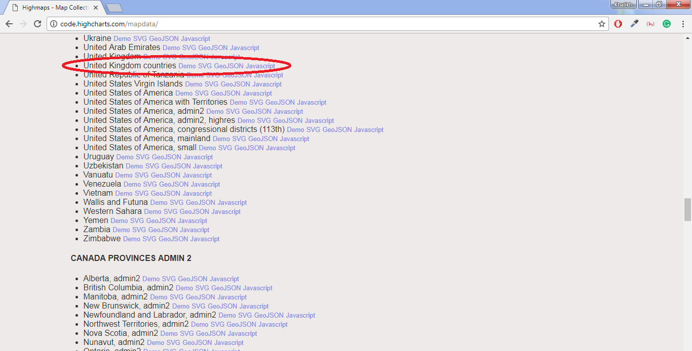
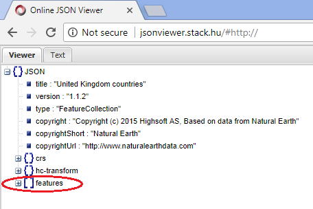
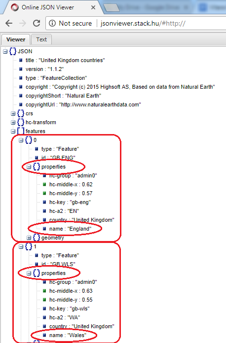
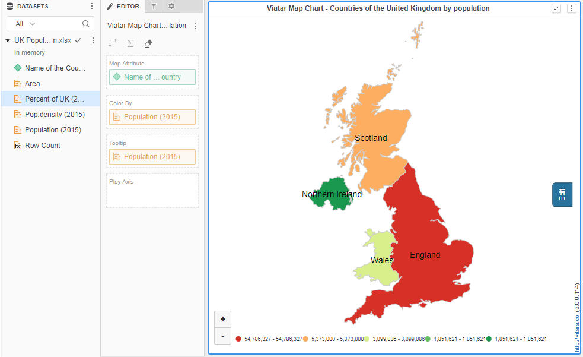

# Creating New Maps

### Creating New Maps other than US 

By default, the Vitara map chart displays the US map and World Countries. However, we may create a map of any other country. Consider the following straightforward example: Creating a population map of the United Kingdom’s countries. I have the following information in a data file:

<figure><figcaption></figcaption></figure>

The first step is to retrieve the shapefile (.geo.json file) associated with our data. Because the data I have is at the nation level, I must find a shapefile of the United Kingdom at the country level (admin-0 level).

The reference web page to download GeoJSON shape-files: http://code.highcharts.com/mapdata/

The geojson file required for our example is shown below.

<figure><figcaption></figcaption></figure>

To download the file, select the GeoJSON file type. We must verify that the downloaded GeoJSON file contains the desired coordinates. Use any online json viewer for this purpose, for example: http://jsonviewer.stack.hu/

<figure><figcaption></figcaption></figure>

Open the downloaded GeoJSON file using any text editor, for example notepad. Copy the entire text and paste in json viewer web page.

<figure><figcaption></figcaption></figure>

Now click on ‘Viewer’ tab beside the ‘Text’ tab.

<figure><figcaption></figcaption></figure>

Now the geojson content will be displayed in json tree structure.

<figure><figcaption></figcaption></figure>

One of the objects in the JSON tree structure is the ‘features’ array. We will have objects for each segment of the chart if we enlarge the ‘features’ array. As there are four partitions in the chart representing each country (England, Scotland, Wales, and Northern Ireland) in our United Kingdom countries example, there are objects named from 0 to 3.

It is clear that the shape we downloaded is exactly what we require. Our data and the coordinates in the shapefile are exactly the same.

The ‘dictionary key’ must now be located. Each partition in the shape file is uniquely identified by the dictionary key. The map of the United Kingdom is divided into four divisions, each of which should have some boundary coordination. Each of these border coordinates is given a unique name. Each GeoJSON file partition’s ‘properties’ column contains a list of these different names. Expand any object, such as ‘0’, and expand the ‘properties’ array to find the dictionary key.

Please note the rounded area in the screenshot below.

<figure><figcaption></figcaption></figure>

This properties array has several fields that can be used as dictionary keys. We can, for example, utilize the ‘hc-a2’ field as a dictionary key. ‘EN’ represents England, ‘WA’ represents Wales, ‘SC’ represents Scotland, and ‘NI’ represents Northern Ireland. You’ve probably noticed that each field is separate.

The point is that any field can be declared as a dictionary key, but it must match our data. In our data file, we have nation names rather than short forms.

<figure><figcaption></figcaption></figure>

Therefore, exact matching fields in the properties array with our data is the ‘name’ field.

<figure><figcaption></figcaption></figure>

We must construct synonyms if there is no matching dictionary key field in shapefile and data file. This is described in the ‘Dictionary property’ part of the ‘Customization of the Map chart’ paper.

We can now create a new map layer for our example after determining the dictionary key. To do so, edit the’mappinglayers.txt’ file in the Vitara map chart installation folder at the following address.

_C:\Program Files\Apache Software Foundation\Tomcat 8.0\webapps\MicroStrategy \plugins\VitaraMaps\custom_

The following is the screenshot of ‘mappingLayers.txt’ file. There are three predefined mapping layers, world physical, US physical, and US Countries.

<figure><figcaption></figcaption></figure>

The following is the notation to add new map layer: \<ns>.\<property>

\<ns>: NameSpace, this can be any combination of alphabets, but choose a unique value for each new map layer. The map layer should contain the following properties;

\<ns>.name =

\<ns>.shape =

\<ns>.dictionarykey =

In the ‘name’ property we define the name of the map we want to give.

For example, i want to give ‘United Kingdom’ as the name, then ‘name’ property definition will be

_kk.name= United Kingdom_

In the shape property definition we should give the path where we copied the shape file of our map. For our example, as we copied the shape file into _VitaraMaps\custom\shapes_ folder, the following is the shape property definition.

_kk.shape= custom/shapes/uk-countries.geo_

All the shape files should be placed in ‘Shapes’ folder in custom folder. This is not compulsory, but in the naming convention point of view it’s better to do.

Dictionary key property definition will be the unique identity field we selected in GeoJSON shapefile.

_kk.dictionarykey = name_

In the mapping layers text file start a new map definition and define name, shape, dictionary key properties.

(please refer section ‘Mapping layers text file‘ in the document titled ‘Customization of the Map chart’for more information about ‘mapping layers text file)

_kk.name= United Kingdom_

_kk.shape= custom/shapes/uk-countries.geo_

_kk.dictionarykey= name_

Please refer the sections ‘Name’ property, ‘Shape’ property, ‘Dictionary key’ property and Dictionary’ property in the document titled ‘Customization of the Map chart’ to know the procedure how to define these properties. After defining all these properties save ‘Mapping layers’ text file.

The following is the screenshot of mappingLayes.txt file after defining United Kingdom mapping layer.

<figure><figcaption></figcaption></figure>

Create a dossier or RS document in MicroStrategy and insert the Vitara map chart. Vitara Map displays the ‘World Physical’ map by default. After hitting the ‘edit’ button, go to the ‘map’ tab. The drop down button for ‘Map Layer’ should be expanded. The ‘United Kingdom’ map definition has been revised. Select this map layer. Please view the image below.

<figure><figcaption></figcaption></figure>

Apply required Map attribute and a metric to the visualization.

<figure><figcaption></figcaption></figure>
