# Custom Layouts

### Creating Custom Map chart from Images <a href="#creating-custom-map-chart-from-images" id="creating-custom-map-chart-from-images"></a>

Welcome to the world of Vitara Map Tool, a fantastic tool that blends the power of SVG drawing with the ease of custom map creation. Think of it as your creative companion, simplifying the process of making unique maps. Similar to other SVG drawing tools, this superhero tool stands out by allowing you to effortlessly build and set up custom Vitara maps in a single go. It’s like having a smart map-making wizard that not only draws but also configures shapes, groups, and mappings all at once!

**Overview and Advantage**

When delving into the functionalities of the Vitara Map Tool, its core similarity to traditional SVG drawing tools is apparent. However, its specialization in Vitara maps brings forth a unique advantage – the ability to create custom maps seamlessly within a single tool. This streamlined approach enhances efficiency significantly, allowing users to transcend traditional complexities associated with map creation. Whether the objective is to depict geographical locations or create detailed layouts, such as those found in shopping malls, the Vitara Map Tool proves to be an invaluable asset.

**Example Scenario: Football Stadium**

Let’s consider a practical scenario to better illustrate the tool’s capabilities. Imagine a football stadium where we aim to visualize the availability of seats across various seating zones. Leveraging existing data, such as sections and the percentage of available seats, we can utilize the dataset’s attributes to label and customize the layouts accordingly. This example serves as a tangible demonstration of the Vitara Map Tool’s prowess in providing dynamic and informative visualizations. In our football stadium example,we used sections as attributes, and the percentage of available seats as metrics.

Check out the following dataset for an example of how we prepared it in the manner described above:

<figure>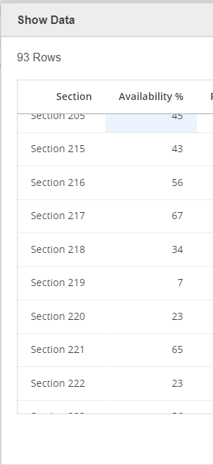<figcaption></figcaption></figure>

#### 1. Step-by-Step Guide: Creating a Custom Map with Vitara Map Tool <a href="#id-1-step-by-step-guide-creating-a-custom-map-with-vitara-map-tool" id="id-1-step-by-step-guide-creating-a-custom-map-with-vitara-map-tool"></a>

**Step 1:Create SVG file from an Image:**

The process of creating a custom map kicks off with the conversion of an image into an SVG file. The Vitara Map Tool facilitates this transformation through a straightforward series of steps.

Open the Vitara Map Tool: Access the tool using the provided URL.[ Vitara Map Tool](https://cloud.vitaracharts.com/maptools/layoutCreator)

**Step 2:**

When the tool is first opened, it looks like this.

<figure>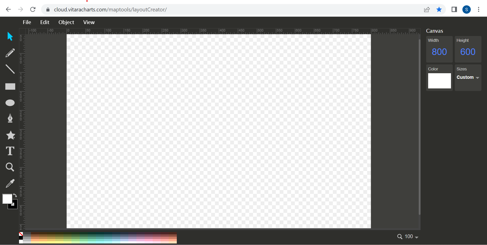<figcaption></figcaption></figure>

**Step 3: Import your Original Image**

Upload your own original image to the layout design tool if you want to use the Vitara map chart with your own custom image. To upload a custom image, go to the **File** menu and click **Import** Image. As an example, consider a football stadium. We want the Vitara map chart in a football stadium to reflect the availability of seats in various seating zones.

<figure>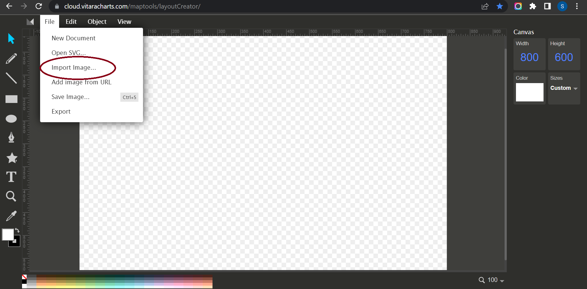<figcaption></figcaption></figure>

<figure>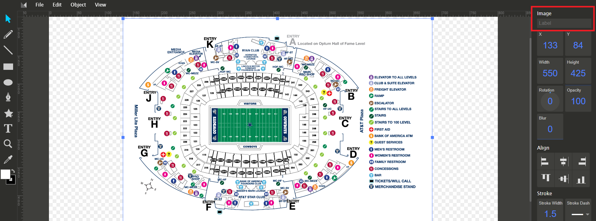<figcaption></figcaption></figure>

**Note :Once the image is imported on the canvas ‘Label’ the image name.**

**Step 4:Draw Shapes/Partitions**

After the image has been uploaded, start drawing shapes/partitions on the image using the path tool.

<figure>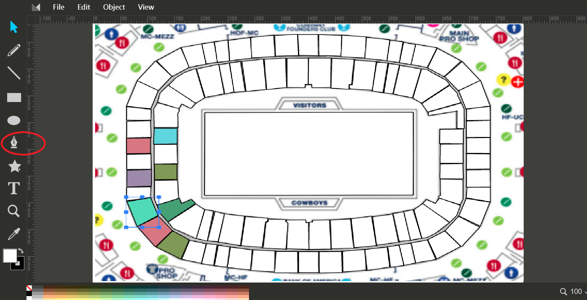<figcaption></figcaption></figure>

Nodes can be removed and added if you make any mistakes.

**Step 5: Labelling the Shape/Partition**

When you begin sketching a shape/partition, at the end of the shape you link to the starting point, the entire shape is highlighted, and the text input box is visible in the right side panel. In this box, type the name of the form you just drew.

<figure>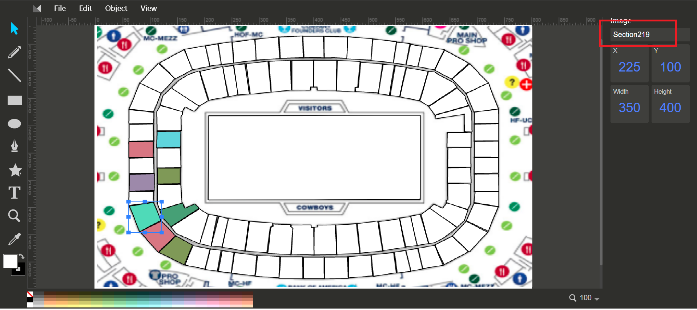<figcaption></figcaption></figure>

For example, Section 219 is the name we gave to the layout based on an attribute we already had in the dataset.

**Step 6:Distinguish Colors**

To distinguish the above-drawn area from other lines, locate the ‘Color Bar’ in the lower left corner of the editor (click the text None to bring up the Fill and Stroke dialogue). Choose a color that you like.

<figure>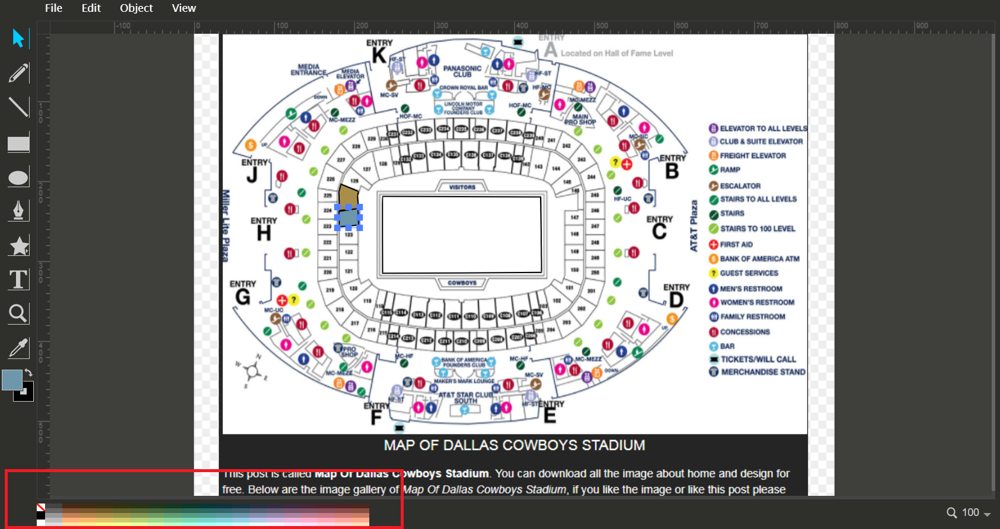<figcaption></figcaption></figure>

**Step 7:**

Repeat steps 5, 6, and 7 to create forms for all of the portions required. In this situation, the boundaries of the two shapes must line so that when we zoom in, we don’t see borders that are close but not on top of each other. This is ensured by selecting the Snap to path button in the right toolbar.

**Step 8:**

After we have labelled all of the layers, we must name the background picture in order to export it (the background image label can be anything irrespective of the image), and then download the layout using the Export option.&#x20;

<figure>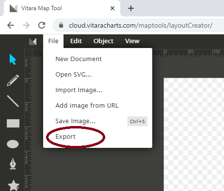<figcaption></figcaption></figure>

Give a name to your layout. The file will be downloaded as a zip file.

<figure>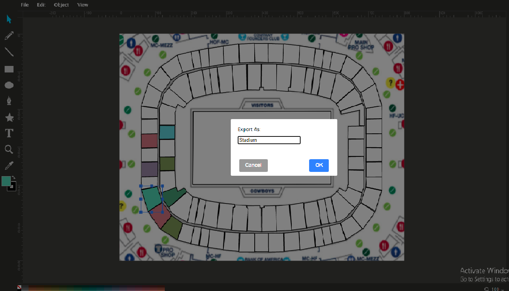<figcaption></figcaption></figure>

### 2. Configure VitaraMaps folder <a href="#id-2-configure-vitaramaps-folder" id="id-2-configure-vitaramaps-folder"></a>

#### Step 1:Export and Upload <a href="#step-1export-and-upload" id="step-1export-and-upload"></a>

Export the created layout and upload the resulting zip file to the MicroStrategy server’s Vitara Maps chart deployment. For example, the MicroStrategy web application path where you must copy the zip file is shown below.

```
      webapps/MicroStrategy/plugins/VitaraMaps/custom/svgmaps/
```

**Copy to Deployment Directories**

Copy the zip file to specified directories for web, library, and mobile apps. This ensures the custom map is accessible across different platforms.

```
      webapps/MicroStrategyLibrary/plugins/VitaraMapsLibrary/custom/svgmaps/
      webapps/MicroStrategyMobile/plugins/VitaraMapsMobile/custom/svgmaps/
```

**Unzip and Make Available**

Unzip the file to make the custom map available in the Map tab of the property editor, ready for use.

The custom map, for example Stadium, will then appear in the ‘Map’ tab of the property editor. Take a look at the image below for an example.

<figure>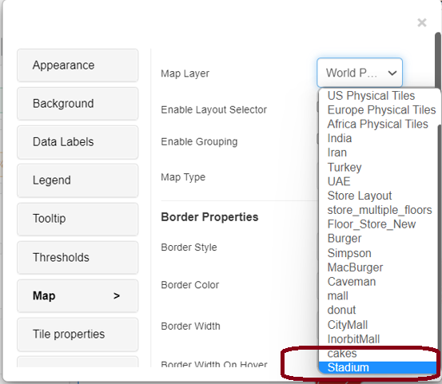<figcaption></figcaption></figure>

#### Step 2: Creating Vitara Map <a href="#step-2-creating-vitara-map" id="step-2-creating-vitara-map"></a>

Launch Microstrategy web. Create Vitara map visualization in a dossier or document. The Vitara map visualisation defaults to a world map.

<figure>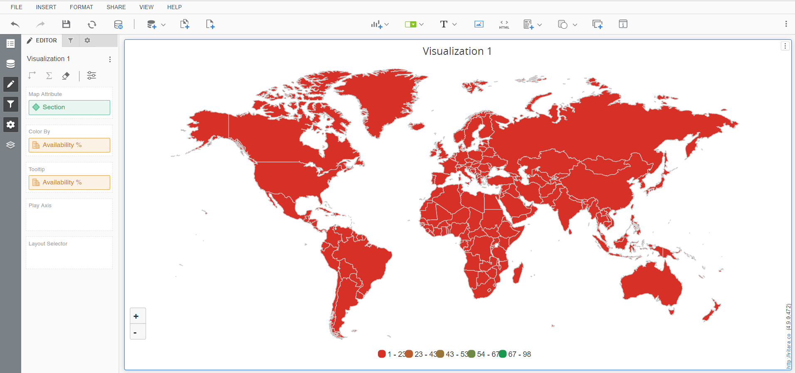<figcaption></figcaption></figure>

Drag the ‘Section’ attribute in map attribute and the ‘Availability%’ attribute in Colour by to include the dataset you mentioned at the beginning.

When the pointer is over the visualisation, the ‘Edit’ button appears. By pressing the ‘Edit’ button, you can access the Vitara map chart’s property editor. Select the ‘Map’ menu in the properties window. Select the map layer you just created from the ‘Map Layer’ drop down list box.

If everything goes as planned, the finished result will look like this.

<figure>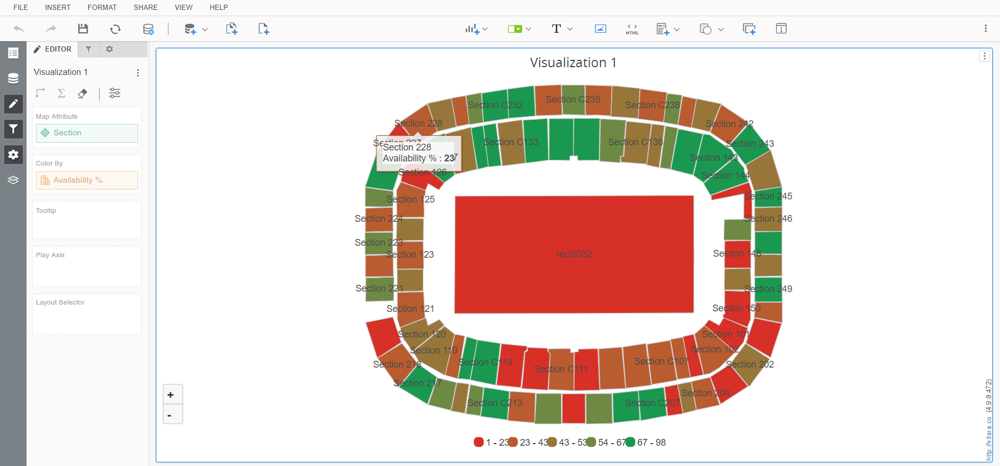<figcaption></figcaption></figure>

**Integration of Background Images (Version 4.9.2.477 and Beyond)**

In an exciting development, starting from version 4.9.2.477, the Vitara Map Tool introduced a game-changing functionality – the ability to seamlessly integrate background images. Let’s take the example of a “Stadium” to illustrate this breakthrough. Previously, when you uploaded a picture and drew shapes in the Vitara Map Tool([ Vitara Map Tool ](https://cloud.vitaracharts.com/maptools/layoutCreator)), you could only see the shapes on the picture. However, with the latest version, the complete background image becomes part of the Vitara map chart, enhancing the overall visualization.

<figure>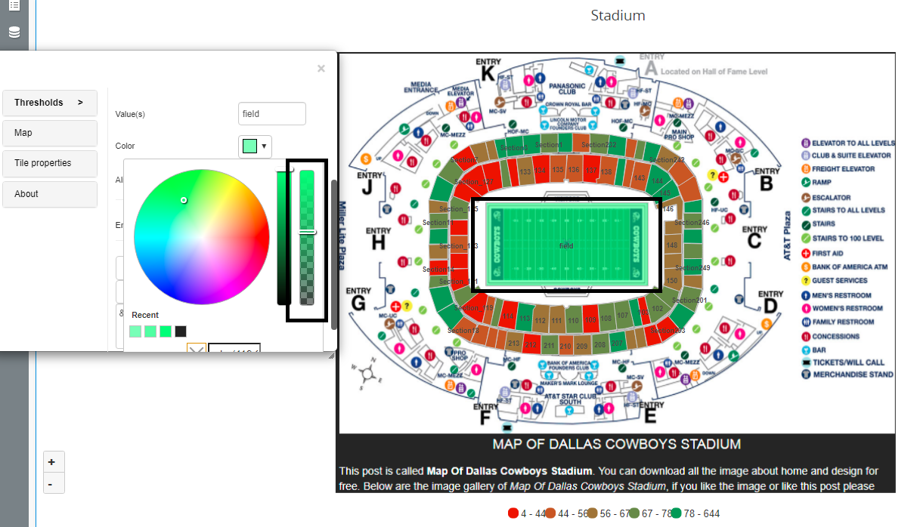<figcaption></figcaption></figure>

### Color Picker with Opacity (Version 5.0.0.484 and Beyond) <a href="#color-picker-with-opacity-version-500484-and-beyond" id="color-picker-with-opacity-version-500484-and-beyond"></a>

Moving forward to version 5.0.0.484, another exciting feature was introduced – the Color Picker with Opacity. This option empowers users to fine-tune the transparency of a selected class by adjusting a slider. This brings a new level of customization, allowing you to control the visual intensity of specific map elements.

### Edit Custom SVG Map <a href="#edit-custom-svg-map" id="edit-custom-svg-map"></a>

If you’ve generated a Custom SVG map layout and need to make changes, follow these straightforward steps:

1. Every exported Custom SVG map zip file includes an SVG image. Use the Vitara Map Tool to open itin the manner outlined below.

<figure>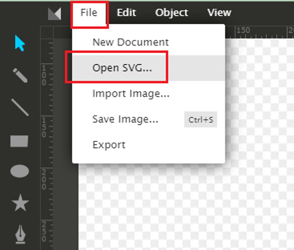<figcaption></figcaption></figure>

2. After making the necessary modifications to the SVG layout, re-export the zip file.
3. Extract the zip file to the MicroStrategy/plugins/VitaraMaps/custom/svgmaps/ folder on the server. The Property editor will display the updated map, allowing you to preview the changes seamlessly.

### Adding Custom SVG to Workstation (Version 5.1.1.495) <a href="#adding-custom-svg-to-workstation-version-511495" id="adding-custom-svg-to-workstation-version-511495"></a>

In the latest release, version 5.1.1.495, a convenient option was introduced for adding Custom SVG directly to workstations. Here’s how:

1. When the workstation is not connected to the server, and you want to generate a new custom SVG map, deploy the build locally.
2. Unzip the downloaded zip file in the ‘svgmaps’ folder obtained from the Vitara Map Tool ([URL](https://cloud.vitaracharts.com/maptools/layoutCreator/)). For example, using ‘Hospital.zip.’&#x20;

<figure>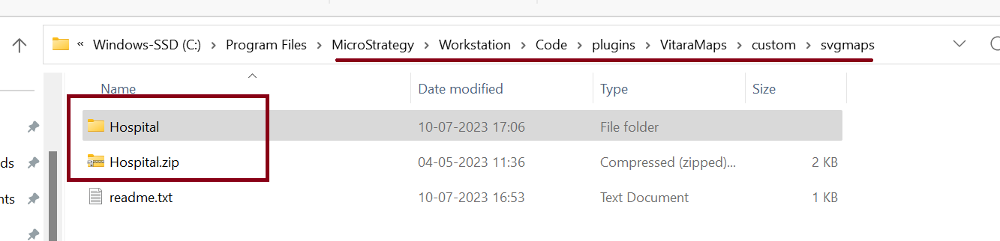<figcaption></figcaption></figure>

3. Following these steps, a text box will appear in the property editor under the Map’s tab. Input the case-sensitive “Custom Map name” in the text field and enable the “Load Custom Map” option.

<figure>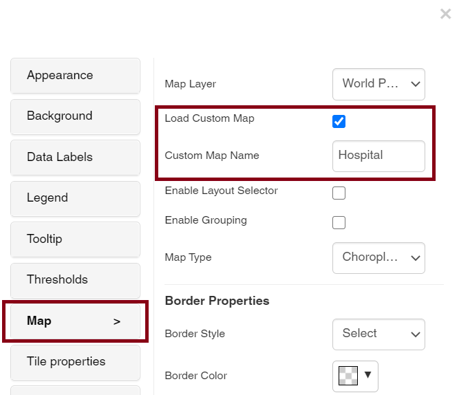<figcaption></figcaption></figure>

These enhancements make the Vitara Map Tool not just a tool but a dynamic ecosystem for crafting visually stunning and customized maps. Experiment with background images, opacity adjustments, and seamless editing to elevate your map visualization experience.
