# Customization of the Map chart

### Customization of Map chart (Creating maps other than default maps) 

Usage scenarios for common customization:

Changes to the standard ISO country names/codes: The country name, USA, for example, can be written in a multitude of ways, including US, United States, America, United States of America, and so on. By adding synonyms to the dictionary file, deviations from ISO-a2 standard names/codes can be addressed. (For further information on building synonyms, see the dictionary property section.)

\*\* A new world map projection is required, or the user desires specific map shapes, such as store layouts or hotel layouts that reflect occupancy, and so on.\*\*

The user must grasp the following terms in order to generate custom maps. Notify us about the files in the map chart folder first. When you unzip the Vitara map chart plugin, the following folders will appear custom, data, javascript, style, and WEB-INF.

<figure>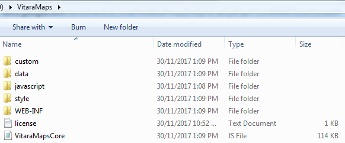<figcaption></figcaption></figure>

When developing custom charts, it is recommended that users generate or save any files under the “custom” folder. The ‘custom’ folder has two important subfolders: dictionaries and shapes. The ‘custom’ folder also contains a text file called “mapping layers.” This root file form contains all mapping layers.

The path to the custom folder in your vitara map chart installation is shown below. **tomcat/webapps/MicroStratagy/plugins/VitaraMaps/custom/**

<figure>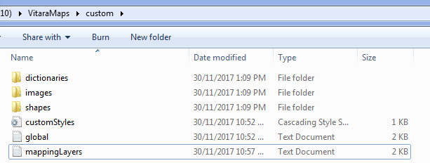<figcaption></figcaption></figure>

The following section will explain the use of ‘**dictionaries**’ folder, ‘**shapes**’ folder, and ‘**mapping layers**’ text file.

#### Mapping layers text file: 

The following is the screenshot of mapping layers text file which will be in the following path _tomcat/webapps/MicroStratagy/plugins/VitaraMaps/custom/_

<figure><figcaption></figcaption></figure>

A map in a Vitara map chart is referred to as a “map layer.” For instance, the Vitara map chart has three pre-set maps. Each of these maps requires a specific map layer to be defined. The mapping layers text file has three definitions for map layers: world physical, US Physical, and US Counties.

The notation ns>.property can be used to add a new map layer.

\<ns>: NameSpace, which can be any alphabetic combination, but must be unique for each new map layer. The map layer should have the following attributes:

* \<ns>.name =
* \<ns>.shape =
* \<ns>.dictionarykey =
* \<ns>. dictionary =
* \<ns>.groups = The ‘groups’ definition is optional.

#### Name Property: 

It’s the name we’d want to give our map. For example, if I want to make a map that shows the human population for each continent and name it ‘world continents,’ the name property definition would be as follows:

_kk.name = World Continents_

Now, by using this name we can create a map which shows world continents. You can see this name in edit popup window → Map → Map Layer.

<figure>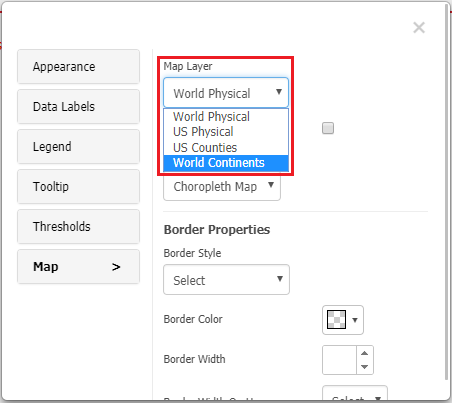<figcaption></figcaption></figure>

**Shape property:**

This file is in geojson (.json) format.This file contains information on the borders of areas on a map. The needed shape file can be downloaded from online resources or produced using various applications. Download geojson shape-files from this link: http://code.highcharts.com/mapdata/

The shape file for our global continent example can be downloaded straight from the URL below. http://code.highcharts.com/mapdata/custom/world-continents.geo.json

A shape file with the name “world-continents.geo” (.geo.json extension) will be obtained by clicking on the preceding link. The downloaded file should be placed in the following directory. VitaraMaps\custom\shapes

The path where we copied our map’s shape file should be specified in the shape property specification.

The shape property definition for globe continents is as follows, as we copied the shape file into VitaraMapscustomshapes folder.

custom/shapes/world-continents.geo.json = kk.shape

All shape files should be saved in the ‘Shapes’ folder of the custom folder. This is not required, however it is preferable in terms of naming convention.

**‘Dictionary key’ Property:**

Dictionary key is the name given specifically to each map section. With the exception of Antarctica, which is void of human habitation, the world’s continents might be divided into six sections on the globe, one for each of the following: Africa, Asia, Europe, North America, Oceania, and South America. Now, each partition ought to have a unique name that may be used to identify it. The shape file contains information on these unique names.

Open the downloaded shapefile “world-continents.geo” in any text editor, such as notepad, for our world continents example. Make a copy of the whole contents of this file.

Use any online json reader, such as http://jsonviewer.stack.hu/, to open the shapefile in json structure.

<figure><figcaption></figcaption></figure>

Now in the notepad copy the entire content of shapefile (.geo.json) and paste it in the “Text” tab of json viewer webpage. Now click on “Viewer” tab in json viewer webpage.

<figure><figcaption></figcaption></figure>

Now the geojson content will be displayed in json tree structure.

<figure><figcaption></figcaption></figure>

The ‘features’ array is one of the objects in the json tree structure. If we expand the ‘features’ array, we get objects for each part of the chart. There are objects numbered 0 to 5 in our globe continents example because there are six partitions in the chart representing each continent (excluding Antarctica).

<figure>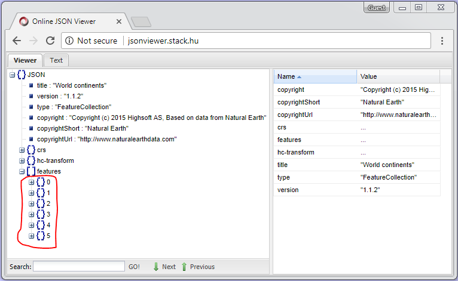<figcaption></figcaption></figure>

Now expand any object, for example ‘0’.

<figure><figcaption></figcaption></figure>

Expand ‘properties’ in ‘0’ object.

<figure>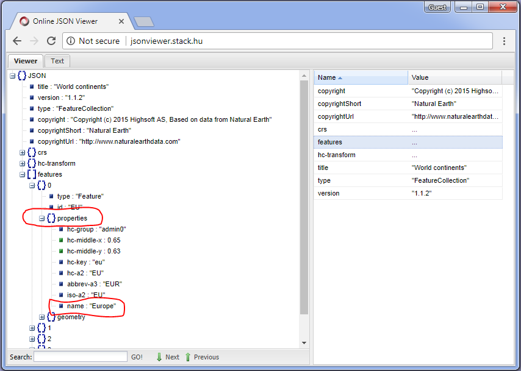<figcaption></figcaption></figure>

A few fields define a unique name for each partition of the map chart. We can use the name that fits our data as a ‘dictionary key’. For instance, I have the following data in which continents are represented by names.

<figure><figcaption></figcaption></figure>

For this use case i have to use ‘name’ as dictionary key. Please refer the below screenshot.

<figure><figcaption></figcaption></figure>

For our world continents example, the following will be the dictionary key definition. _Kk.dictionarykey = name_

**‘Dictionary’ property:**

To know about this property lets take a look at our world continents map data excel file.

<figure><figcaption></figcaption></figure>

Take a look at the ‘Australia’ continent. Let’s compare this to the shapefile and look for unique names linked with each map segment.

<figure><figcaption></figcaption></figure>

Except for Australia, which is named “Oceania” in shape file, the names of the continents in our data and the unique names in shapefile by which each area of the globe is defined are the same. As a result, Map chart does not recognize the word ‘Australia’ in our data file. The map chart displays the partitions in the shapefile. However, because this partition does not match the name we are calling in our data file, it does not display any data in the map chart. Please see the marked region in the screenshot below.

<figure>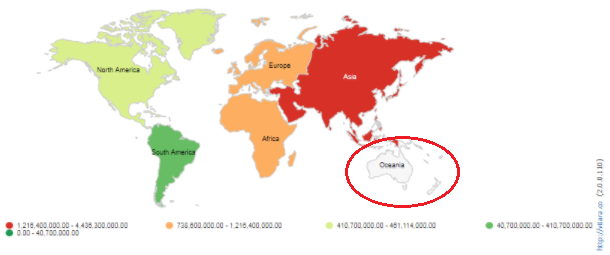<figcaption></figcaption></figure>

Similarly, if the data differs from the unique names in the shapefile, or if the shapefile only contains ISO-a2 codes and our data has names for these codes, we have created a text that lists’ synonyms’ for the names in the shapefile and the names in the data. Let us make a synonym for our example: World continent. We must match the name in the shapefile - “Oceania” - with the name in the data, “Australia.” ‘Australia’ has replaced ‘Oceania’ as a synonym. All of the synonyms must be listed in a text file in this manner.

<figure><figcaption></figcaption></figure>

I created a text file with name ‘worldcontinents’ and entered the synonym ‘Oceania = Australia’, and saved this file in VitaraMaps → custom → dictionaries folder.

We can list multiple synonyms also. Multiple synonyms should be comma separated.

For example, _US = United States, United States of America, America, USA_

Now the dictionary property definition in mapping layer text file tells about the path of the synonyms text file where we saved it.

For our example the property definition is: _Kk.dictionary = custom/dictionaries/worldcontinents.txt_

All such dictionaries files should be saved in ‘dictionaries’ folder in custom folder. This is not compulsory, but in the naming convention point of view it’s better to do.

As we added the synonym for ‘Oceania’ the map chart now shows the synonym i.e. ‘Australia’. Please refer the circled area in the below screenshot.

<figure>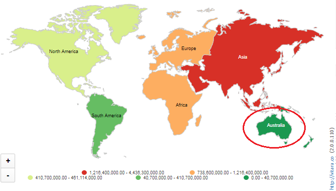<figcaption></figcaption></figure>

Till now, we had created all the property definitions for our example, world continents map, in mapping layers text file.

_kk.name = World Continents_

_kk.shape = custom/shapes/world-continents.geo.json_

_kk.dictionarykey = ios-a2_

_kk.dictionary = custom/dictionaries/worldcontinents.txt_

Save the mapping layers text file. Below is the screenshot of ‘mappingLayers’ text file after adding ‘worldcontinents’ map layer.

<figure>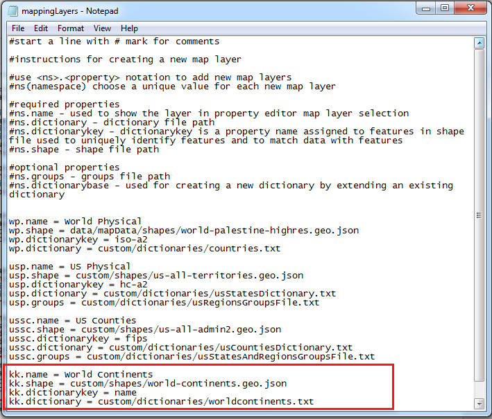<figcaption></figcaption></figure>

After saving mapping layers file, refresh your web browser. Once the map chart renders, go to Edit → Map → Expand - Map Layers, and apply the map which you created.

<figure><figcaption></figcaption></figure>

The below screenshot is the output of map chart, showing population in each continent.

<figure>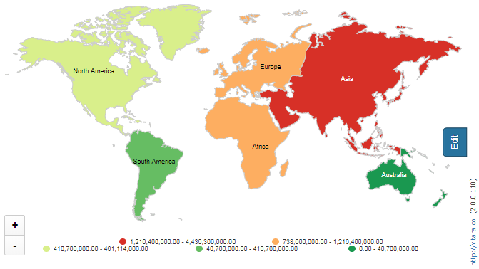<figcaption></figcaption></figure>

Likewise other world map projections can be downloaded from the links provided below.

Reference link to download geojson shapefiles: http://code.highcharts.com/mapdata/

Reference link to convert existing ESRI maps to geojson file https://mygeodata.cloud/converter/shp-to-geojson

Others:

http://www.naturalearthdata.com/

http://geojson.io/

http://www.qgis.org/en/site/forusers/download.html

**‘Groups’ Property:**

The grouping option’s primary function is to make it easier to arrange individual regions on the map as a single unit, rather than regions with a single boundary. By default, the Vitara Map chart will draw any map for the regions specified in the shapefile. The Vitara Map chart, for example, provides a map of the world’s countries in the screenshot below. To make this map, we must use the world countries shapefile. As a result, this map image will take data at the country level by default.

<figure><figcaption></figcaption></figure>

To build this map at a higher level, for example, countries organizations such as NATO, BRICS, and so on, we must enable ‘Grouping’ in the Vitara Map chart. A screenshot of a sample data file with both country and organization columns is shown below.

<figure><figcaption></figcaption></figure>

To show the data in Vitara Map chart at which level, we must add that attribute to the “Map Attribute” drop zone. If we add the ‘Country’ attribute, the map will display data by country, and if we add the ‘Organization’ attribute, the chart will display data at this level.

Because we used a shapefile with nation information in the preceding example, the Vitara map chart will display country level data by default. However, if we wish to display the data at a higher level, we must use the ‘Grouping’ property.

To group separate regions, we must first construct a text file that lists all of the distinct regions. The following is the format for defining a group: _Group name = List of individual areas in comma separated format._

Save this text file in the custom folder’s ‘dictionaries’ folder. The screenshot below is of a group text file that I made. In our example, I named the group file ‘NATOBRICSgroups.txt’.

<figure>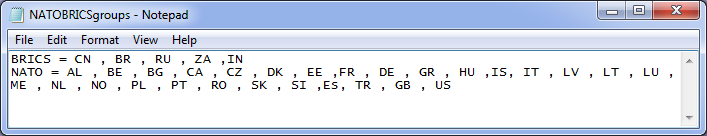<figcaption></figcaption></figure>

The next step is defining ‘groups’ property in ‘MappingLayers’ file. In groups property we have give the path of groups text file where we saved it. _wp.groups = custom/dictionaries/NATOBRICSgroups.txt_

The following is the screenshot of ‘MappingLayers’ file after adding groups property.

<figure><figcaption></figcaption></figure>

The last step to apply groups in vitara map chart is, enable Grouping” option under Map menu in property editor. (Edit → MAP → Enable Grouping). Screenshot is provided below for reference.

<figure><figcaption></figcaption></figure>

The outcome of grouping in the globe physical map is shown below. When we move the mouse over any of the grouping regions, all of the items in the group and all of the regions will appear in a single color.

<figure>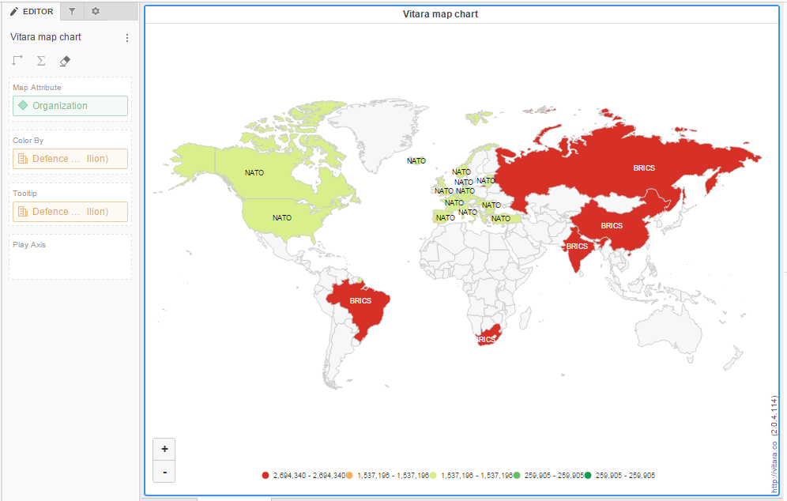<figcaption></figcaption></figure>
