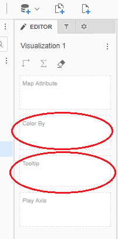
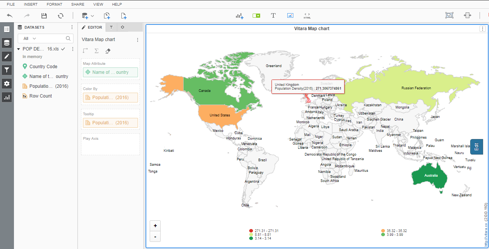
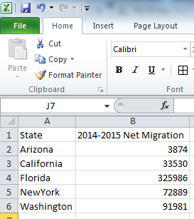
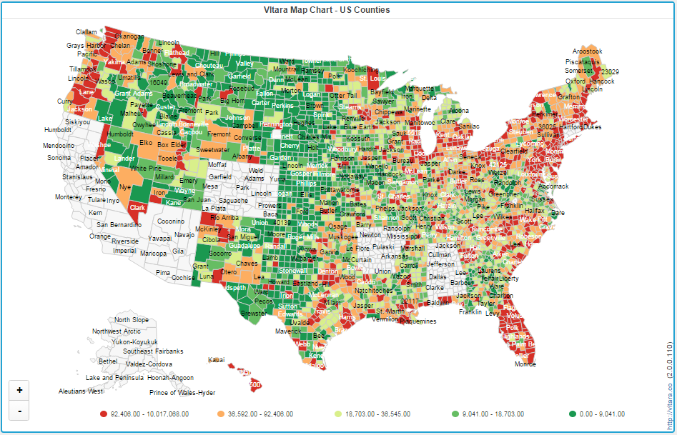
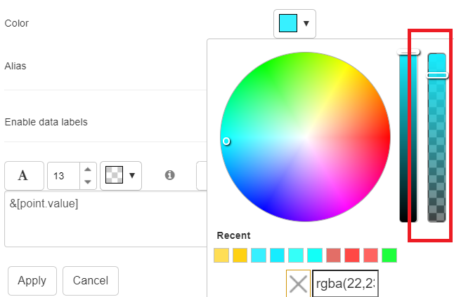
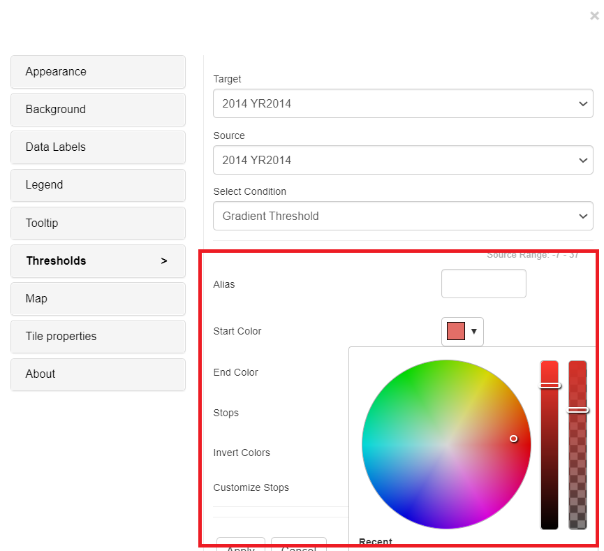
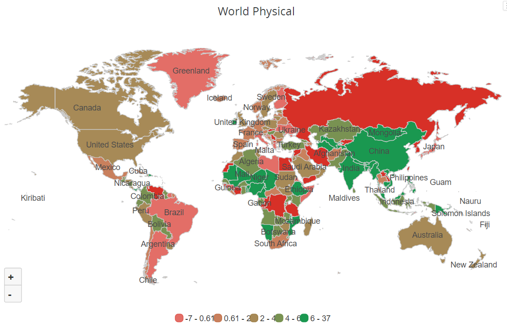
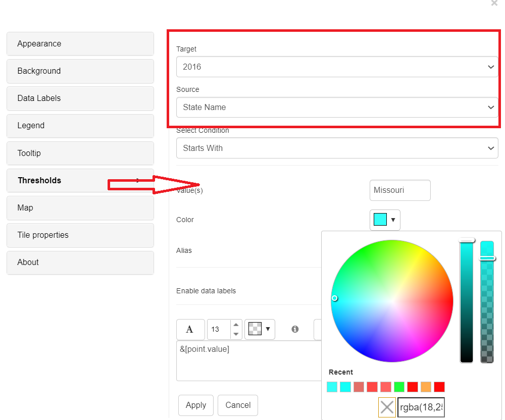
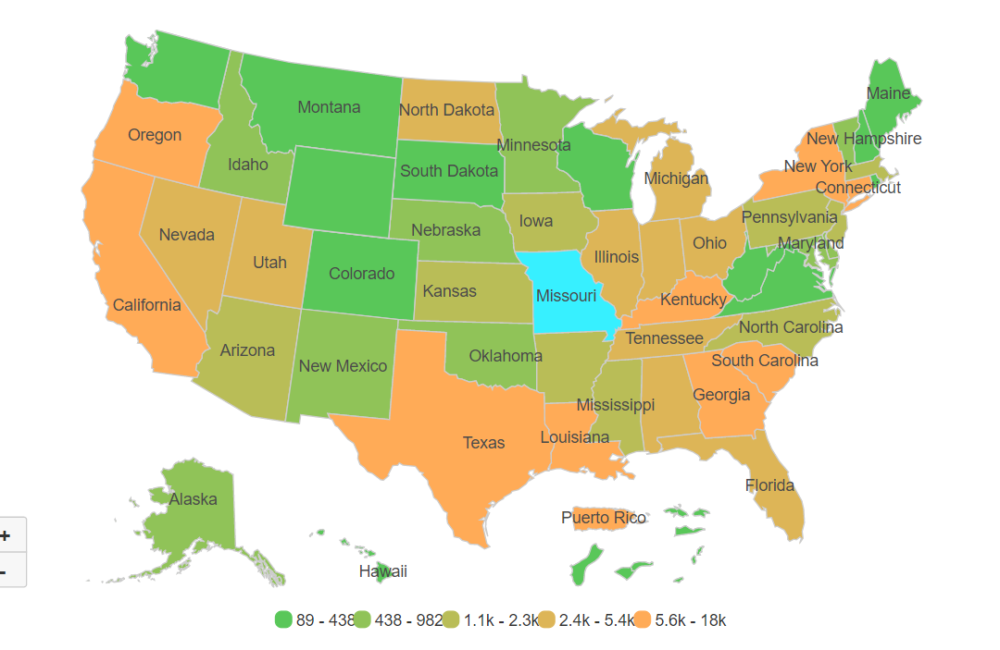
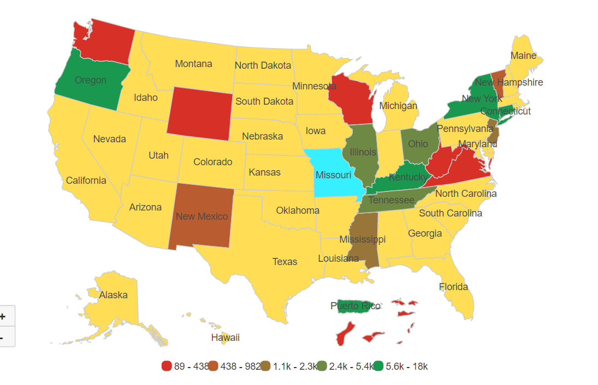

# Default Maps

 

## Default Maps in Vitara Map Chart 

The default charts in Vitara Maps Chart installation are World Physical, US Physical, and US counties. The charts list can be enlarged by adding additional nations or picture shapes, as explained in the next sections.

## Vitara Map Chart Inputs: 

Vitara Map is a heatmap. The map regions are color coded depending on a single metric. The required inputs are described in the next section.

**1. Attributes:** One attribute. We may use the world physical map without any adjustments if the attribute components contain either ISO-standard country names or ISO-a2 country codes. The screenshot below is from a website where we may obtain country ISO-A2 codes.

<figure><figcaption></figcaption></figure>

If there is a mismatch between the nation names in our data and the country names in the shape file, we must add synonyms. This notion is covered in the ‘Mapping layers’ chapter.

The attribute should contain the names of US states for the US Physical map.

**2. Metrics:** A minimum of one measure is required to create a map chart. Drag a metric into the ‘Color By’ drop zone. In this drop zone, any metric at the map area level can be used to generate the Heatmap. We can add as many metrics as we want to the ‘tooltip’ drop zone. These metrics will not be used in map plotting but will be displayed in a tooltip when we hover the cursor over the map.

<figure><figcaption></figcaption></figure>

The following sections will explain about the three vitara default maps.

## Default Maps in Vitara Map Chart 

### **1. World Physical:**

Consider the population density of the five countries listed below: the United States, the Russian Federation, Canada, Australia, and the United Kingdom. The data file is shown in the screenshot below.

<figure><figcaption></figcaption></figure>

Insert the data file into the MicroStrategy dashboard or document. Drag and drop the country name attribute and Population Density metrics into the drop zone field’s ‘Map Attribute’ and ‘color by’ fields, respectively. These nations will be displayed on the default global physical map.

<figure><figcaption></figcaption></figure>

The below screenshot is the Vitara map chart showing Population density for all the countries.

<figure><figcaption></figcaption></figure>

### **2. U.S. Physical map:**

To illustrate this chart, consider net migration from 2014 to 2015 for the five states of Washington, Arizona, California, Florida, and New York.

<figure><figcaption></figcaption></figure>

Insert the dataset into MicroStrategy’s web or desktop client. Drag the attributes and metrics into the drop zone. By default, the Vitara map chart will display a physical map of the world. Click the ‘Edit’ button to set it to US Physical. The Properties window will appear. Go to the ‘Map’ menu, expand the ‘Map Layer’ tab, and then pick US Physical. The output of the US Physical map is seen in the screenshot below.

<figure><figcaption></figcaption></figure>

### **3. U.S. Counties:**

By default chart will show ‘World Physical” map. Go to ‘Edit’ and change the map layer to ‘US Counties’ map. The following screenshot is from the example data for counties in US.

<figure><figcaption></figcaption></figure>

The below screenshot is output of the ‘US Counties’ map.

<figure><figcaption></figcaption></figure>

## **Thresholds**

The maps will draw gradient thresholds by default. Gradient thresholds with the required number of stops are applied between two colors. Gradient thresholds are applied to Metrics with the Start and End colors based on the Target and Source choices.

Click on the Edit Button→ Thresholds Button→ We can set Gradient Thresholds through conditions.

From version 5.0.0.484 , we have the option to adjust the slider to change the opacity of the desired class.

<figure><figcaption></figcaption></figure>

Examples for Gradient Threshold:

In the below screenshot, for the Vitara maps, we applied the Gradient threshold on Background Bar, and Red as Start color and Green as End color, with 5 Stops. Apply all the inputs and click on ‘Apply’ button.

<figure><figcaption></figcaption></figure>

<figure><figcaption></figcaption></figure>

Note: From 4.6 version we can apply thresholds using attributes. The source drop down box in the threshold editor window will list all the attributes and metrics in the chart. We can select an attribute as source and define a threshold condition. The target of the threshold depends on the metrics in the chart. In this case we can set threshold using attribute. The attribute threshold conditions are listed as ‘Equal to’, ‘Not equal to’, ‘Contains’, ‘Not Contains’, ‘Starts with’, ‘Not Starts with’, ‘Ends with’, and ‘Not Ends with’ in these types.

Below is the screenshots how to apply attribute thresholds using property editor. Set target as ‘2016’ year and source as ‘State Name’ and select condition as ‘Starts with’ and enter the value ‘M’ and color as ‘blue’. Apply all the inputs and click on ‘Apply’ button.

<figure><figcaption></figcaption></figure>

Below is the screenshot after applying the attribute threshold condition ‘Starts with’ with value ‘Missouri’.

<figure><figcaption></figcaption></figure>

Here’s an other example, where ‘State Name’ contains ‘a’ and with color ‘Yellow’.

<figure><figcaption></figcaption></figure>

<figure><figcaption></figcaption></figure>
