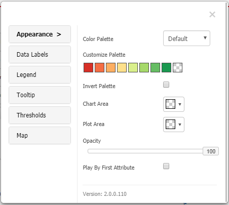
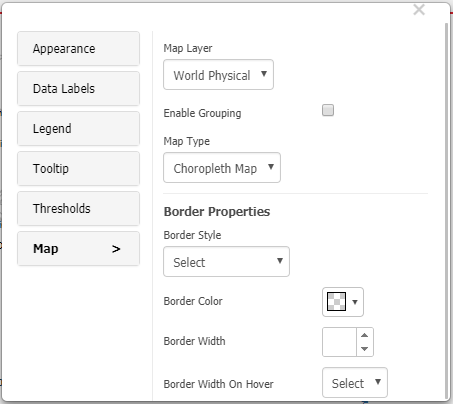
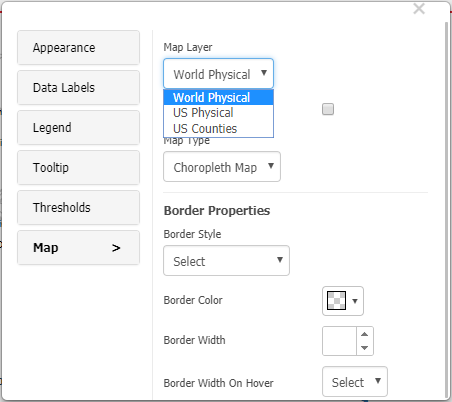
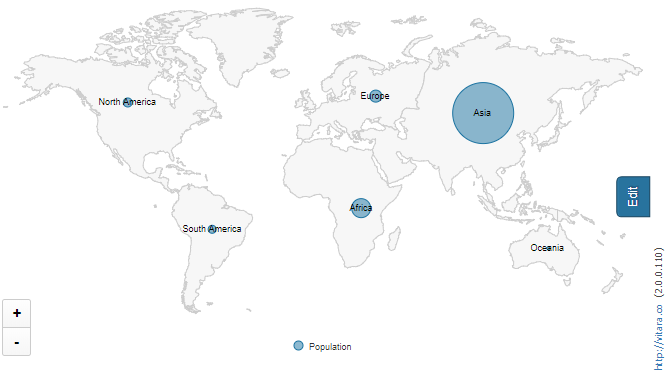

# Formatting Options

### Formatting Options in Vitara Map Chart 

Vitara Maps includes an infinite number of formatting possibilities. When the user hits the ‘Edit’ button, a popup window with all of the formatting options appears. The ’Edit Properties’ panel of the map chart is seen in the screenshot below.

<figure><figcaption></figcaption></figure>

This is the properties editor, which may be used to change the palette colors, data label style, enabling or disabling the tooltip, and legend of the map chart. We can also use Thresholds to colorize the chart when a specific condition is met. To do this, go to the ‘Thresholds’ page and set a new threshold.

The ‘Map’ tab contains map-specific properties. This tab contains map layer, map type, grouping, and border properties.

<figure><figcaption></figcaption></figure>

Expand the option ‘**Map layer**’. You can see the three default map layers. To apply any map, our visualization should contain respective data.

<figure><figcaption></figcaption></figure>

## Map Types - Choropleth map and map bubble 

### **Choropleth map:**

A choropleth map displays metric data as color gradients. The metric data will be divided into five ranges: top 20%, 20% to 40%, 40% to 60%, 60% to 80%, and below 20%. For each range, a color is applied. The snapshot for this type of chart, which depicts the human population for each continent, is shown below.

<figure><figcaption></figcaption></figure>

### **Map bubble:**

Map bubble shows a bubble for each attribute element and the size of the bubble is decided by the metric value.

<figure><figcaption></figcaption></figure>

### Play By - Animation: 

To enable this option two attributes are needed in vitara map. One is for normal ‘Map Attribute’ drop zone which will be related to the Map type, and other is for ‘Play by’ drop zone.Drag and drop the attribute in to ‘**Play Axis**’ drop zone.

<figure><figcaption></figcaption></figure>

The ‘Play By’ option causes the vitara map chart to display ‘Map Attribute’ elements for each element of the ‘play by’ attribute at a specific time instant. We can halt and restart the game at any moment.The screenshot below is of a dashboard that displays information about US states by area.

<figure><figcaption></figcaption></figure>
