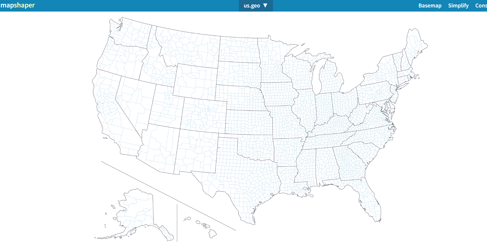

# Generic Merge tool

## Unleashing Custom Grouped Regions with Vitara’s Dynamic Merge Tool

Vitara’s Generic Merge Tool offers a powerful solution for creating custom grouped regions on geographical maps, allowing users to merge individual regions based on specified criteria. This guide walks you through the process of using the tool to generate CBSA (Core-Based Statistical Areas) regions using a geojson collection of US counties.

## Embracing the Power of Vitara’s Generic Grouping Tool 

Nestled within Vitara’s arsenal is the Generic Grouping Tool, a powerhouse capable of merging individual regions on a map into a singular, cohesive masterpiece. This tool derives its strength from a data file containing invaluable grouping information, weaving an intricate tapestry of insights.

To embark on this journey, navigate through the digital realm by following this enchanted link: [VitaraMaps - Tool for grouping features](https://cloud.vitaracharts.com/maptools/generic.html)

Behold, the following snapshot encapsulates the mystique of the Generic Grouping Tool’s web page:&#x20;

<figure><figcaption></figcaption></figure>

## Example of generic aggregation: 

Now, let’s dive into a practical example—creating CBSA regions using a geojson collection of US counties. Before diving into the tutorial, ensure that the VitaraMaps package is installed.

## **Step-by-Step Walkthrough:**

### **Step 1 : Select GeoJSON**

* &#x20;**Using Existing County-Level GeoJSON**&#x20;

Locate the US county-level GeoJSON file within the package at the following path:\
&#xNAN;**/plugins/VitaraMaps/custom/shapes/us-all-admin2.geo.json**.

* &#x20; **Acquiring US States GeoJSON**&#x20;

Alternatively, you can begin by downloading the GeoJSON file for US States from a trusted source, such as [Highmaps](https://code.highcharts.com/mapdata/).

After downloading, open the GeoJSON file to verify that it contains the necessary geographical data corresponding to your Excel sheet. This step ensures that the locations in the GeoJSON file align correctly with the data you intend to visualize

### **Step 2 :** Access Mapshaper

* Begin by visiting[ Mapshaper](https://mapshaper.org/) a powerful tool for transforming geojson files into the Topojson format.
*   Upload your GeoJSON file through Mapshaper’s intuitive interface for seamless conversion.

    The screenshot below illustrates the Mapshaper webpage.

The screenshot below illustrates the Mapshaper webpage.

<figure><figcaption></figcaption></figure>

### Step 3 : Upload the GeoJSON File

* On the  MapShaper  webpage, locate the “Select” button prominently displayed.
* Clicking on the “Select” button will prompt a file selection dialog. Navigate to the directory where you saved the GeoJSON file is saved on your local machine.
* Once you’ve chosen the GeoJSON file, Mapshaper will dynamically render it as an interactive map on the webpage.

<figure><figcaption></figcaption></figure>

### Step 4 : Export Options

Next, click the "Export" button, located at the top-left corner of the Mapshaper interface.

 

### Step 5 : Convert and Download as TopoJSON

In the export options dialog:

* Select the required layer(s).
* Set the file format to "TopoJSON".
* Click the export button to initiate the download of your newly created TopoJSON file

A screenshot is provided below to illustrate this step.

<figure><figcaption></figcaption></figure>

After saving the TopoJSON file to your local machine, go to the Generic Merge Tool webpage and upload the file to proceed with the next step of the merge process.

### Step 6 : Retrieve the TopoJSON Object Name

To identify the TopoJSON object name from the downloaded TopoJSON file, follow these steps using[ jsonviewer.stack.hu](https://jsonviewer.stack.hu):

1. Open[ jsonviewer.stack.hu](https://jsonviewer.stack.hu).
2. Paste the content of the downloaded TopoJSON file into the "Text" tab.
3. Review the file structure to locate the TopoJSON object name required for the next steps in custom map generation.

This process allows you to inspect the file structure and identify the specific TopoJSON object name needed for the next steps in the[ Custom Map Chart customization](https://docs.vitaracharts.com/guideMapFeatures/customizingMapChart.html).

### Step 7: Upload TopoJSON to the Generic Merge Tool

With the TopoJSON file saved to your local machine:

1. **Navigate** to the [Generic Merge](https://cloud.vitaracharts.com/maptools/generic.html) Tool.
2. Upload the **TopoJSON** file you just created.\
   Use the provided screenshot as a reference to assist you during this process.

 

### Step 8: Enter the TopoJSON Object Name

Enter the TopoJSON object name retrieved in Step 5 into the designated field on the Generic Merge Tool webpage. This ensures that the tool recognizes and utilizes the correct TopoJSON object for the subsequent stages of the custom map generation process.

### Step 9 : Upload Grouping CSV File

In this step, you’ll integrate grouping information into the process by uploading a CSV file containing CBSA and FIPS codes:

1. Ensure your CSV file is structured with columns corresponding to CBSA and FIPS codes, containing the relevant grouping information.
2. Identify the designated data field on the Generic Merge Tool webpage where you’ll upload your CSV file.
3. Click on the appropriate area, typically labeled “Upload” or “Browse,” to select your prepared CSV file from your local machine.
4. Once selected, confirm the upload to integrate your CSV file into the tool.

 

<figure><figcaption></figcaption></figure>

<figure><figcaption></figcaption></figure>

### Step 10: Specify Grouping Column

In this step, you’ll specify the column on which the grouping will be performed:

1. On the Generic Merge Tool webpage, identify the “Group By” field.
2. Enter the column name on which the grouping is to be performed. In this example, use the CBSA column from your uploaded CSV file.\
   This ensures that the tool correctly groups the geographical features based on the specified column.

### Step 11 : Configure Data Prop and Shape Prop Fields

In this step, you’ll configure the Data Prop and Shape Prop fields, which are crucial for mapping features between your shapefile and data file:

* **Data Prop:** In the “Data Prop” field, enter the column name from your CSV file that contains the relevant data. In this example, it is the **FIPS** column.
* **Shape Prop:** Enter the corresponding column name from your TopoJSON file. If the TopoJSON file uses lowercase for the FIPS codes, such as fips, input **fips** here.\
  \
  By accurately configuring these fields, you establish a direct link between the CSV data and the TopoJSON file. This alignment ensures that the Generic Merge Tool can intelligently merge and map the data, maintaining accuracy and consistency in your grouped regions.

### Step 12 : Finalize and Export the Merged GeoJSON File

1\. **Review and Complete Required Fields**:\
Carefully fill in any remaining required fields on the Generic Merge Tool webpage. Ensure all inputs, such as the TopoJSON object name, grouping column, Data Prop, and Shape Prop, are accurately populated.

2.**Initiate the Merging Process:**\
Click on the “Export” button to commence the merging process. The tool will intelligently merge the specified regions based on your configurations.

3.**Download the Merged GeoJSON File**:\
Once the merging process is complete, the tool will generate and provide a link to download the merged GeoJSON file. This file can be used to create a new map layer in your application.\
Refer to the screenshot below for visual guidance on this step.

Congratulations on successfully downloading the Merged GeoJSON file!

### Step 13 : Preview Merged Map

1. **Access Mapshaper:**\
   Open your web browser and navigate to[ https://mapshaper.org/](https://mapshaper.org/)
2. **Upload the Merged GeoJSON File:**\
   On the Mapshaper homepage, you'll see an area labeled "Select files." You can either drag and drop your merged GeoJSON file into this area or click to browse and select the file from your local machine.
3. **Preview the Map:**\
   Once the file is uploaded, Mapshaper will display an interactive map visualization of your merged regions. This allows you to inspect the merged areas for accuracy and ensure that the grouping has been applied as intended. 

<figure><figcaption></figcaption></figure>

### Step 14: Create a Custom Map Using the Merged GeoJSON File

Congratulations on successfully downloading the Merged GeoJSON file!

The final step is to create a new map layer using this file. To proceed, refer to the "[Creating New Map Layer"](https://docs.vitaracharts.com/maps-user-guide/creating-new-maps) documentation available in the tool’s resources. This guide provides detailed, step-by-step instructions on how to add your downloaded GeoJSON file as a new map layer.

 
