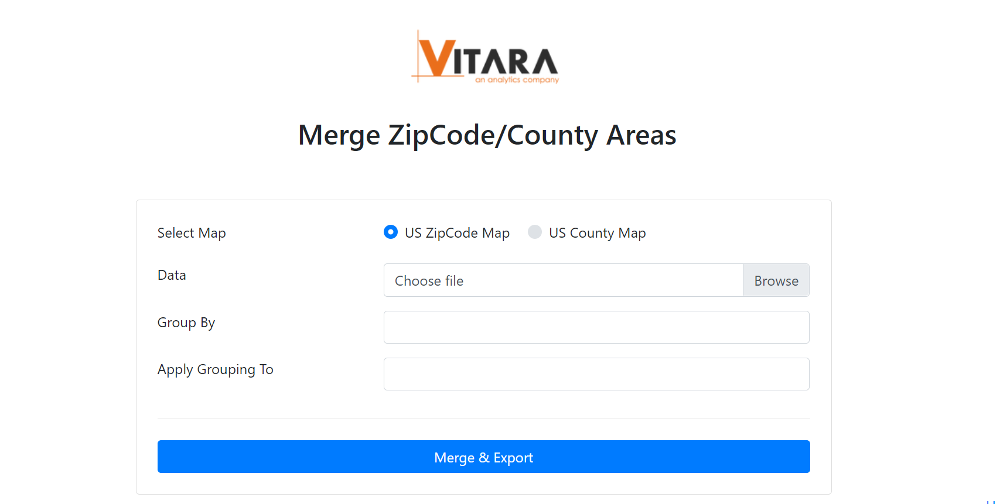
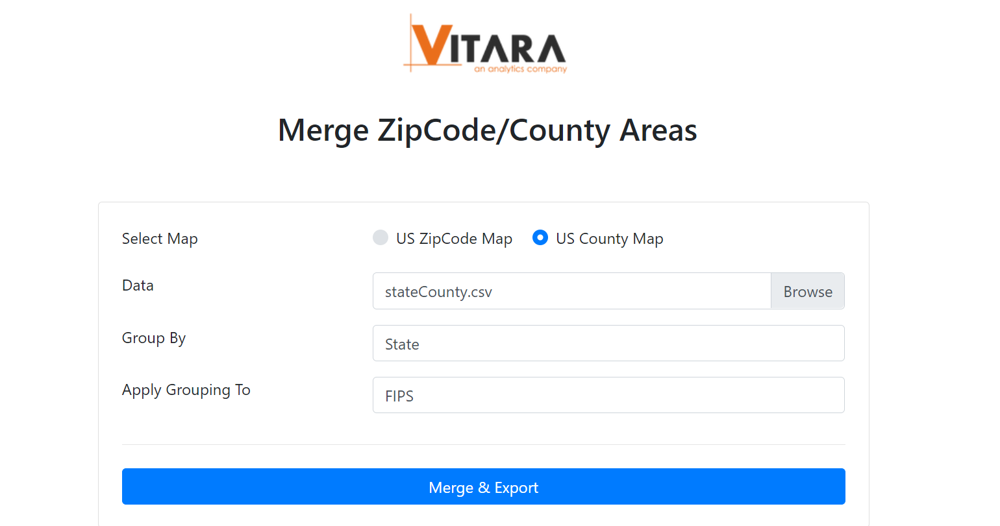

# US map using counties data

US Counties can be used to build a US Map with any custom grouping of Counties using VitaraMap tools.

## Vitara County grouping tool 

County grouping is done using the same tool used for ZipCode grouping.

Click on the link to access the tool:

[VitaraMaps - Tool for merging counties](https://cloud.vitaracharts.com/maptools/zipcode.html)

The below is screenshot of the tool.

<figure><figcaption></figcaption></figure>

### **Steps 1:**

After navigating to the webpage select the “US County Map” as shown in the image above.

### **Step 2:**

To arrange counties based on column data, select a “Data” file (csv format) with at least two columns of data.

### **Step 3:**

Fill “Group By” and “Apply Grouping To” fields to merge and export.

## Example of County’s aggregation: 

The sample below shows counties organized into states (approximate data for county and state categorization is utilized).

FIPS indicates the county code and related states in the image below.

<figure><figcaption></figcaption></figure>

Now using this data, merge tool fields can be filled as shown below.

<figure><figcaption></figcaption></figure>

Merge and Export to create a geojson shapefile with the specified grouping information.

The screenshot below is of a Vitara map chart made from a county map of the United States, sorted by state.

<figure><figcaption></figcaption></figure>
