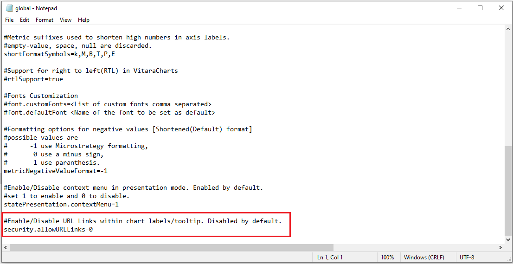
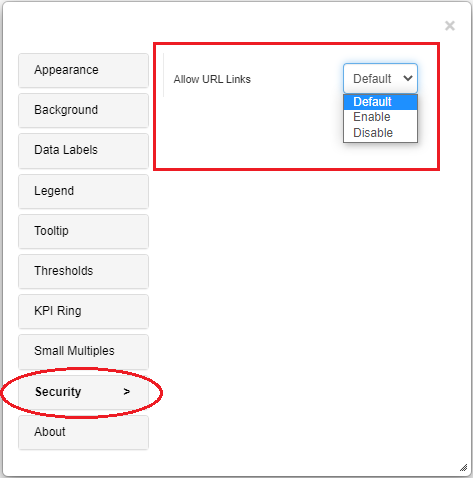
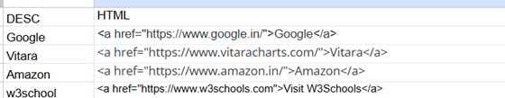

# Allow/Block URLs

## Allow/Block URLs in the Vitara Charts 

To address the requirement of having URLs in the VitaraCharts, we have made some enhancements in the 5.1.3 release.

### **1. An option in the ‘global.txt’ file:**

A property is included in the global.txt file. By using this property you can enable/disable the URLs in all the dossiers/documents where VitaraCharts are used. Below is the screenshot of this property from the global.txt file.

<figure><figcaption></figcaption></figure>

For the MSTR web application, the global.txt file can be located at the below path\
&#xNAN;**\*webapps\MicroStrategy\plugins\VitaraCharts\custom\***

For the MSTR Library application, the global.txt file can be located at the below path **\*webapps\MicroStrategyLibrary\plugins\VitaraCharts\custom\***

_**Note: You have to configure the respective global.txt file for web and library applications.**_

_**security.allowURLLinks = 0 or 1**_. Setting 0 (zero) will not allow URLs used within the anchor tag ‘href’ property. With this setting enabled only anchor tag titles are allowed. While setting to value 1 (one) will enable URLs used within the anchor tag ‘href’ property. By default the value of the property _**security.allowURLLinks = 0**_. This means URLs in the VitaraCharts will not work.

### **2. Security Tab:**

The properties window of all the VitaraCharts will now have the option to control the URLs within that particular chart. This means the global.txt file can be used to control the URLs globally in all VitaraCharts used in any of the dossiers or documents. Whereas, the _Security_ tab property in the property editor of a specific chart is used to control the URLs in that particular chart in the particular dossier/document. Below is the screenshot of this option.

<figure><figcaption></figcaption></figure>

By default, the _**‘Allow URL Links’**_ is set to the value _**Default**_. This means the functioning of the URLs is governed by the property set in the global.txt file. If global.txt is = 0, then URLs will not work. _**Enable/Disable:**_ Set the ‘Allow URL Links’ option to either Enable/Disable to allow URLs or block URLs in that particular chart.

### Example Use Case

Starting from Version 5.1.3, a new feature has been introduced to enable or disable URLs.

* The dataset must include a column containing HTML tags.
* Once this column is included, the URLs will automatically display on the chart.

A sample dataset is provided below for reference.

<figure><figcaption></figcaption></figure>

Next, add attributes and metrics to the chosen drop zones, then enable Allow URL Links from the Security tab

..png>)

**Important:** To open a file path, users must press **`Ctrl + Left Click`** on the URL (opens in a new tab). If direct-click access is required within the visualization, the URL must be added to the **whitelist**.

## Handling Relative URLs for XSS Protection 

### **Allowed Relative URL Formats**

When specifying relative URLs in the href or src attributes, they must start with a forward slash (/). This requirement ensures proper XSS (Cross-Site Scripting) encoding and enhances the security of your application.

### **Summary of URL Filtering Logic**

To enforce the rule for relative URLs:

1. Ensure the URL value starts with /.
2. Trim any leading and trailing whitespace from the URL value.
3. If the URL does not meet the criteria, replace it with an empty string to prevent XSS attacks.

### **Safe Attribute Function Implementation**

The following function filters href and src attribute values to ensure they comply with allowed formats and prevent XSS attacks: `"http://","https://","mailto:","tel:","data:image/","ftp://","./","../","#","/"`

## **Important Notes**

* Starting Character: Ensure that all relative URLs start with a forward slash (/). This is essential for correct XSS encoding.
* Trimming Whitespace: Trim leading and trailing whitespace from the URL value before validation.
* Default Behavior: If a relative URL does not start with a forward slash, it is replaced with an empty string to prevent potential XSS attacks.

By adhering to these guidelines and implementing the provided function, you can mitigate the risk of XSS attacks through careful validation and filtering of relative URLs.

_**Note: If you do not configure the functioning of URLs using any of the above methods, VitaraCharts will block all the URLs.**_

**Enhancemen**t: Starting from version 5.3.6, a new tool called the Customization Tool has been introduced. This tool allows users to easily edit configuration files such as global.txt and customStyles.css through a user-friendly interface.\
For more details, [click here](../customization-guide/customization-tool.md).
