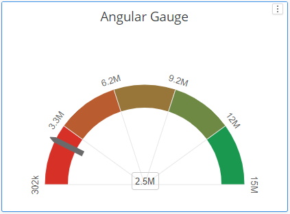
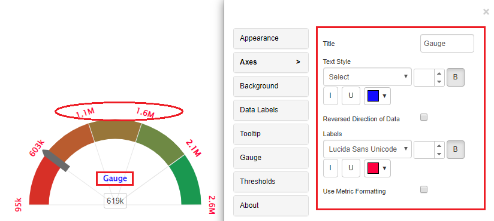
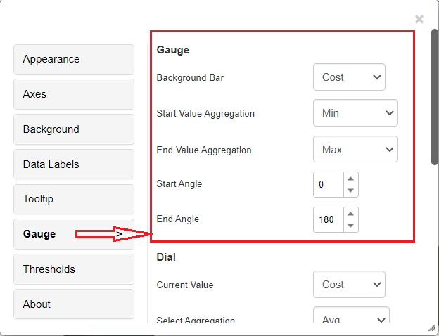
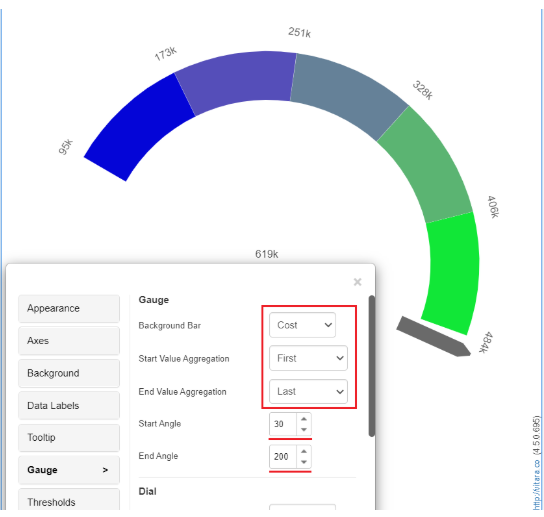
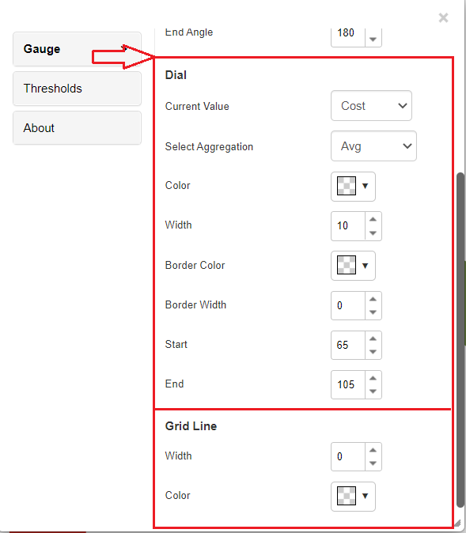
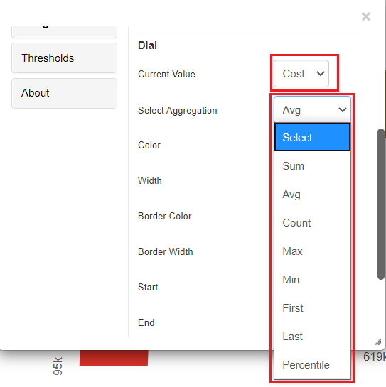
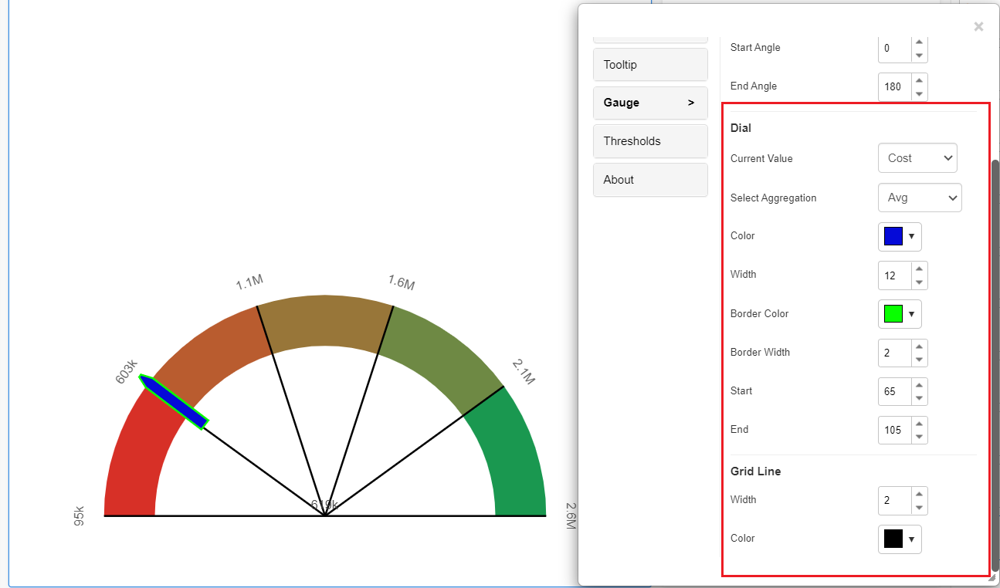
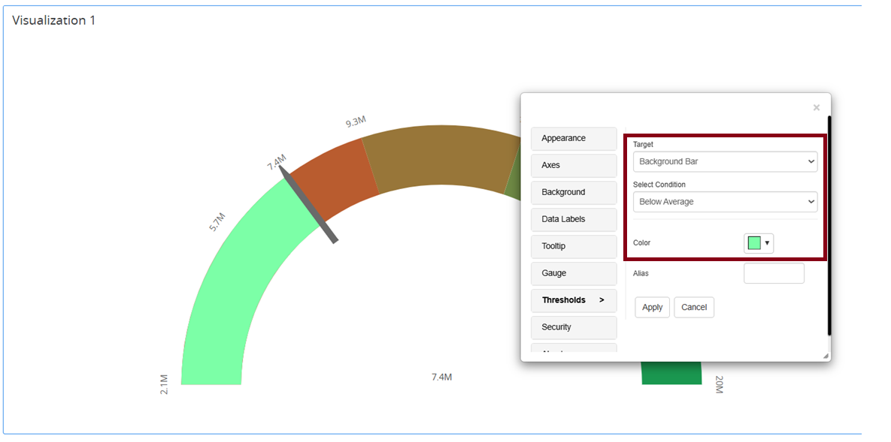

# Angular Gauge Chart

The Angular Gauge chart is designed to display specific data using a semicircular shape with the pointer. The semicircular shape is created by defining the lower limit and upper limit, using functions like sum, min, max, count. Within that scale, we can create various color ranges in thresholds to classify the data.

We can make the pointer to indicate the sum/ avg/ min/ max/ count/ first/ last values of the metric over the semicircular shape. Thresholds can also be created on the pointer.

#### Inputs 

Metrics: 1 or more metrics

Attributes: 1 attribute.

Use as Filter Option - Not Available

<figure><figcaption></figcaption></figure>

## Axes 

You can add a title in Angular gauge chart and can do text formattings to the title. User can do labels formattings too in the Axes property tab.

<figure><figcaption></figcaption></figure>

From the 4.5 version of Vitara Charts, the new features added to the Gauge chart where there are some implementations in the Gauge property editor. Now, we have Dial, Gauge and Grid Line properties in the Gauge property.

## Gauge 

Users can see the pointer at any aggregation level of metrics with start and end values. We can apply Start and End angles for the gauge from the 4.5 version of Vitara charts.

<figure><figcaption></figcaption></figure>

Below is the example of the Cost metric shown with Avg aggregation with start value as ‘First’ aggregation and end value as ‘Last’ aggregation. The ‘Start’ angle is 30 degrees and the ‘End’ angle is 200 degrees.

<figure><figcaption></figcaption></figure>

## Dial and Grid Line 

We can now see the pointer (Current Value) at any aggregation level of metrics with the start and end values.

<figure><figcaption></figcaption></figure>

From the 4.5 version of Vitara charts, the dial properties are introduced. Dial’s color, dial’s width, dial’s border color, dial’s border width, Start and End position of needle, Grid line width and Grid line color are the new features introduced in the angular gauge chart.

<figure><figcaption></figcaption></figure>

Below screenshot is the example where all the dial and grid line properties are applied. Average aggregation is applied for current value and the dial and dial’s border properties are applied. Dial’s color - blue Dial’s width - 12 Border color - green Border width - 2 Start position - 65 End position - 105 Grid line width - 2 Grid line color - black

<figure><figcaption></figcaption></figure>

### Thresholds

Thresholds can also be applied to both the pointer and the background arc. A reference screenshot is provided below.

<figure><figcaption></figcaption></figure>

## Background Image 

The steps to set a background image for all Vitara charts are explained in [backgroundImage](background-images.md).
