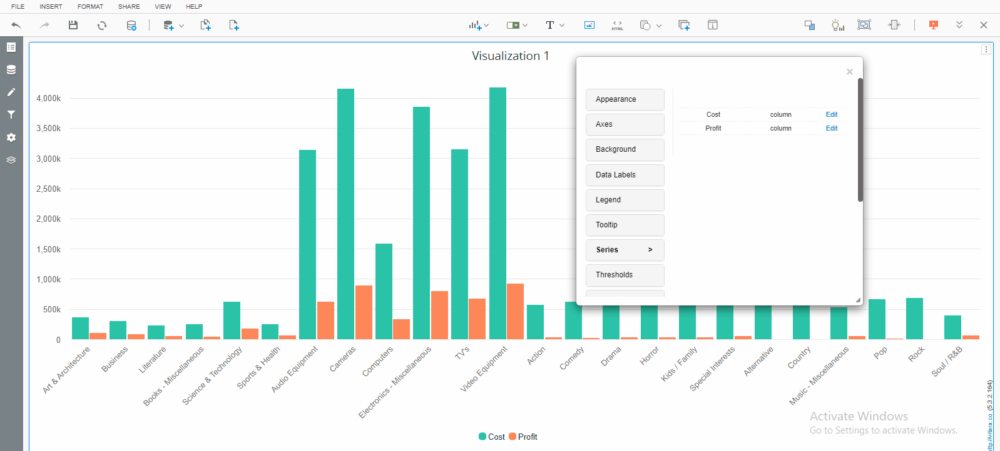
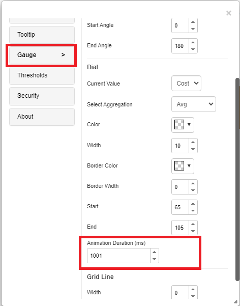

# Animation Duration

## The Power of Animation in Charts:&#x20;

In Modern's data-driven world, effective visualization is crucial for deriving insights and making informed decisions. Chart animations bring a dynamic and innovative touch to data representation by incorporating motion.

This option is available for series, particularly in chart types that support series-specific animations, such as:  Column , Bar , Sparkline  ,Line , Area  , Tornado , Stacked column  , Stacked bar.&#x20;

<figure><figcaption></figcaption></figure>

## The Impact of Charts on Data Visualization:

Users can customize the animation duration to fit their preferences, either speeding up or slowing down animations as needed. This flexibility is especially useful when working with large datasets, as it allows for improved performance and optimized load times through adjustable speeds.

By default, the animation duration is set to **1001ms**, but users can modify it as required. For example, setting the duration to **1ms** effectively disables animations, enabling faster chart rendering—an essential feature for handling large datasets efficiently.

Additionally, users can customize the animation duration for individual series or apply a uniform duration (e.g., 1ms) across all series, ensuring the best possible performance for their specific use case.

<figure><figcaption></figcaption></figure>

### Introducing Animation Duration in Angular Gauge Chart

Starting from version **5.3.4**, an **Animation Duration** option has been introduced in the **Angular Gauge** Chart. This feature allows users to customize the duration of the animation, providing flexibility to tailor the chart's visual experience based on specific requirements.&#x20;

This option is available in the Gauge tab of the Property Editor. Please refer to the screenshot below for more details.

&#x20; 

<figure><figcaption></figcaption></figure>

## Chart Animation Configuration (Introduced in Version 5.3.5)

Starting from version 5.3.5, the animation option for charts can now be toggled on or off, providing greater flexibility for customizing chart behavior. This allows users to control the visual transition effects, improving the overall presentation of data.

To configure the animation, navigate to the specific tab for each chart. The animation setting is available for the following chart types:

* **Angular Gauge**: Available under the Gauge tab.
* **Column/Bar Chart**: Available under the Column/bar tab.
* **Stacked Column/Bar** Chart: Available under the Stacked Bar/Column tab.
* **Sparkline/Line/Area** : Available under the Line tab
* **Tornado:** Available under theTornado tab.

_**Note**_: Starting from version 5.3.5, the animation option has been removed from the Series tab and is now only configurable through the respective chart tabs listed above.

Please refer to the screenshots below for references to the Column and Angular Gauge Charts.

.png>)\
 

### Enable/Disable Animation in Vitara Charts Globally

In the Vitara Charts 5.3.5 release, we have introduced an enhancement that allows users to enable or disable animation across all visualizations.

#### An option in the ‘global.txt’ file:

A property is included in the global.txt file. By using this property, you can enable/disable the “animation” in all the dossiers/documents where Vitara Charts are used.&#x20;

Below is the screenshot of this property from the global.txt file.

### &#x20;**File Location:**

#### **The  global.txt file can be found in the following locations:**

* For **MSTR Web** Application:\
  webapps\MicroStrategy\plugins\VitaraCharts\custom
* For **MSTR Library** Application:\
  webapps\MicroStrategyLibrary\plugins\VitaraCharts\custom 

📌 **Note**: The respective global.txt file must be configured separately for both web and library applications.

### **How to Configure Animation**

In the global.txt file, set the following property:

**Default Setting:** chart.animation=1 (Animation is enabled by default.)

* This ensures that all charts display animation automatically, without requiring manual activation in each chart’s editor menu. 

**To Disable Animation**: Set chart.animation=0 to turn off animation globally.

**Enhancemen**t: Starting from version **5.3.6**, a new tool called the Customization Tool has been introduced. This tool allows users to easily edit configuration files such as global.txt and customStyles.css through a user-friendly interface.\
For more details, [click here](../customization-guide/customization-tool.md). 
