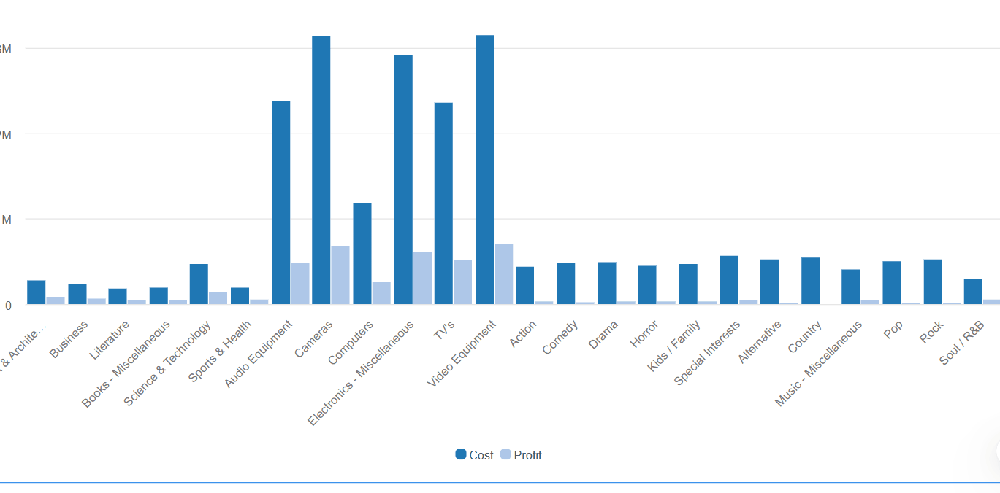

# Appearance

The appearance settings allow customization of the color palette, Chart Area, and Plot Area colors, as well as Auto Scroll. Please refer to the attached GIF for reference.

<figure><figcaption></figcaption></figure>

* Detailed Auto Scroll feature information —[ click here.](https://docs.vitaracharts.com/readme/auto-scroll)
