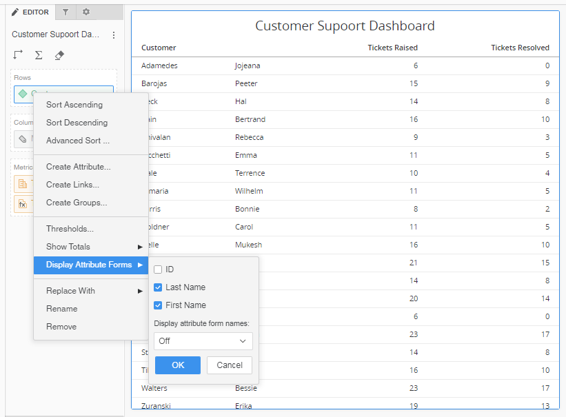
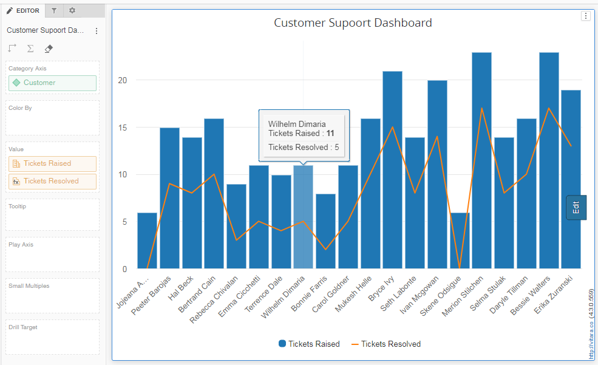
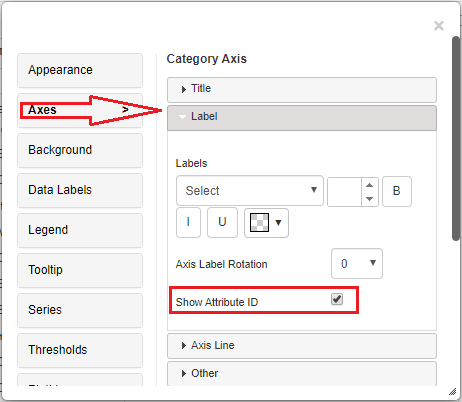
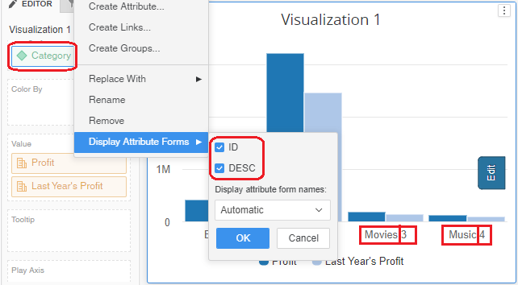
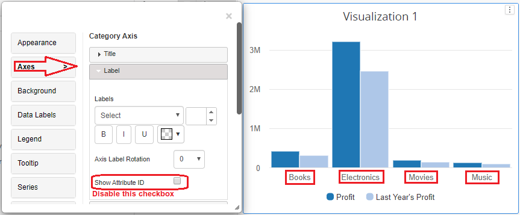
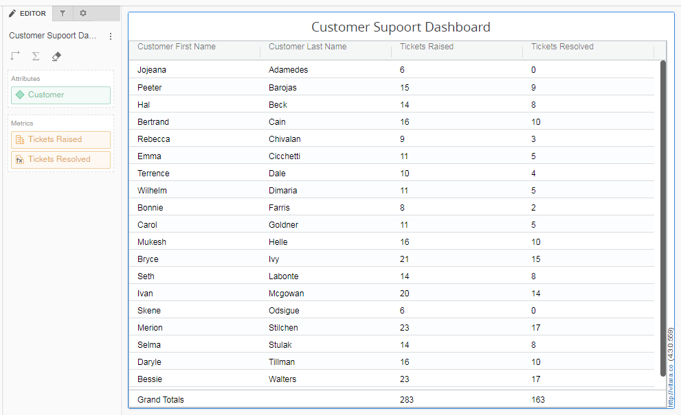

# Attribute Forms

\

### Attribute forms in the Vitara Charts 

Vitara charts supports multiple attribute forms.

#### Attribute forms in XY Charts: 

\
For example, i want to show customer wise number of complaints or tickets raised and the complaints or tickets resolved. The customer attribute has two attribute forms _**First Name**_ and the _**Last Name**_. The chart has to show the complete name of the customer, which is the combination of both the attribute forms _**First Name**_ and the _**Last Name**_.

Attribute and Metrics used in this example are:\
Attributes: 1.Customer\
Metrics: 1.Tickets Raised 2.Tickets Resolved

Below is the screenshot of the MicroStrategy grid visualization. You can see, for the customer attribute both the attribute forms _**First Name**_ and the _**Last Name**_ are enabled.

<figure><figcaption></figcaption></figure>

If we convert this visualization into any of the vitara charts, vitara charts will concatinates both attribute forms and display as a single label. Below is is the screenshot of vitara combination chart with multiple attribute forms enabled for the customer attribute.

<figure><figcaption></figcaption></figure>

#### Choose specific attribute forms to display on the chart 

From 4.4 version, an option ‘show attribute id’ is added in category axis label tab. By default, this option will be in enabled state. See the screenshot:

<figure><figcaption></figcaption></figure>

This feature helps us to choose whether or not to display the attribute forms on the axis even if we enable attribute forms for the chart.\
For example, we have an attribute ‘category’ in a chart. Both attribute forms ‘ID’ and ‘DESC’ are enabled for the category attribute. Then both the attribute forms will be shown on the category axis. See the below screenshot.

<figure><figcaption></figcaption></figure>

If we need the attribute forms to be enabled for the chart and not to display the forms on the axis, then we can disable them from the category axis menu. See the screenshot

<figure><figcaption></figcaption></figure>

#### Attribute forms in Data labels and Tooltip 

Attribute forms can also be used in data labels and tooltip\
To know more about attribute forms in data labels, go to [Data labels](data-label-customization.md)\
To know more about attribute forms in tooltip, go to [Tooltip](tooltip-customization.md)\

#### Attribute forms in Grid and Micro Charts: 

\
In the vitara grid and micro charts each attribute form is displayed as a separate column. Below is the sceenshot of the vitara grid chart showing the same example explained above.

<figure><figcaption></figcaption></figure>
