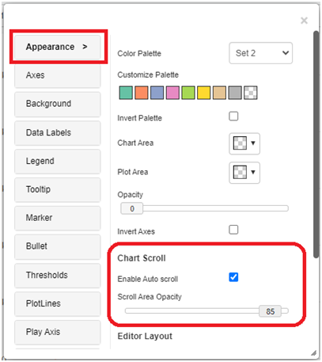
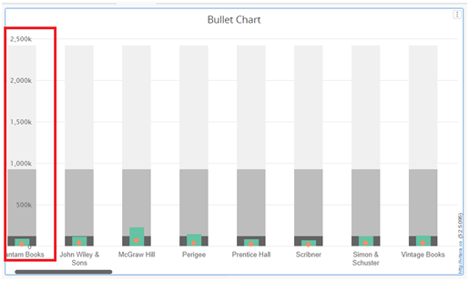
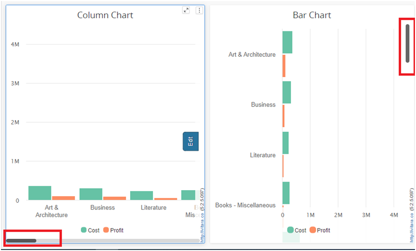
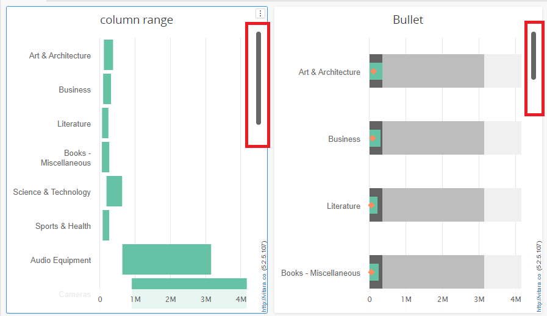

# Auto Scroll

\

#### Auto Scroll 

Vitara Charts added a new feature, auto scroll, in Version 5.2.5. Which the charts will be able to be scrolled along the category axis.

Users can now view charts that expand the category axis according to the density of data points (in relation to the user-specified size or series width). With this new functionality, the size of the scroll area is calculated so that the data doesn’t overlap. (To avoid overlap padding, group padding is set to have a minimum value.)

**List of charts supports this feature:**

1. Bar/Column Charts
2. Stacked Bar/Column Charts
3. Line/Area/Sparkline Charts
4. Tornado Chart
5. Column Range Chart
6. Bullet Chart
7. Waterfall Chart
8. Histogram Chart
9. Slope Chart
10. Dumbbell Chart

**How can we enable Auto scroll feature**

The Auto Scroll option will be available in the Chart Scroll menu under the Appearance tab.

<figure><figcaption></figcaption></figure>

**Options:**

1. Enable Auto Scroll :To enable or disable auto scroll, check the box placed under the Appearance tab’s menu.
2. Scroll Area Opacity: We can change the opacity of the chart region behind the value axis. The default value is 85, which can be changed with the help of a slider,having range of 0 to 100.

A screenshot of the chart with the scroll area opacity set to “0” is shown below, displaying that when you move the scroll bar, the chart will appear behind the value axis.

<figure><figcaption></figcaption></figure>

**Below is the screenshot of charts with Auto scroll feature**

This auto scroll bar can be moved along the category axis and appears horizontally or vertically, depending on how the chart is configured.

<figure><figcaption></figcaption></figure>

<figure><figcaption></figcaption></figure>

Invert axes are supported for the column range, waterfall, dumbbell, and bullet charts. When the invert axes option is disabled, the scroll bar automatically moves to the bottom of the chart and scrolls along the category axis.

<figure><figcaption></figcaption></figure>
