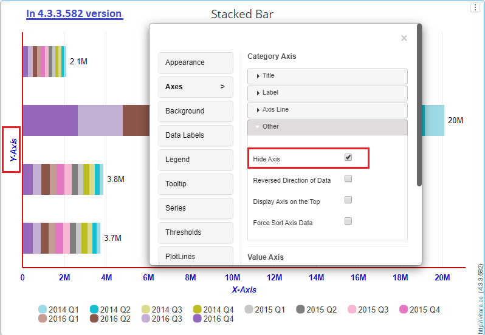

# Backward Compatibility

Backward compatibility is not supported when adding new features or updates. Backwards compatibility is defined as the expectation that responses from earlier iterations of the Vitara Charts will continue to be accurate in later iterations.

The implementation of all small updates and bug fixes ensures that compatibility with current properties is maintained. major upgrades that have a big impact on the way the Vitara charts behave. To use the new capability, users might need to make some adjustments.

Changes to the Vitara charts’ Backwards Compatibility

## Report Services Documents : Use of attributes in colummns or Metrics in Rows 

This applies exclusively to report services materials, not dossiers. VitaraCharts requires the user to organize attributes into rows and measurements into columns. This is done in the report services document design mode. Prior to 4.2, this was not explicitly verified for, and VitaraCharts appeared to work in some circumstances. Starting with version 4.2, an explicit error will be raised when you insert an attribute in a column or metrics in rows. The problem was only raised in version 4.1 when metrics were in rows. In other words, if you have a document saved previous to 4.1 that has characteristics in columns or metrics in rows, the chart will no longer render and an error notice will appear. You have to just go to the design mode and move the attributes to rows and metrics to columns.

## Fonts in Charts created prior to 4.1 now look different (in 4.2 and newer) 

Please review [this page](https://docs.vitaracharts.com/faqs/revertbackFormattings.html) for details on how to fix this issue.

## Stack Totals in Stacked Bar/ Column charts 

Only charts created/modified after version 4.0 have Stack Totals for Stacked Bar/Column charts enabled (by default). When dossiers prepared with stacked bar/column charts in the 3.9 build are opened in the 4.0 through 4.3 versions, the stack totals are displayed by default.

Stack totals are disabled by default in the 4.4.2.618 edition of Vitara charts to meet the customer’s requirement for backwards compatibility from the 3.9 version.

The screenshots below are from the 3.9 and 4.0 releases, where stacktotals are not visible in the 3.9 build but are visible in the 4.0 to 4.3 builds by default.

<figure><figcaption></figcaption></figure>

<figure><figcaption></figcaption></figure>

In the below screenshot, the StackTotals are not enabled by default in 4.4.2.618 version of Vitara charts.

<figure><figcaption></figcaption></figure>

\

## Data Labels Contrast color in XY charts 

The data label contrast colour feature has been introduced to the following chart series: bar, column, area, stacked bar, stacked column, histogram, column range, and bubble. This functionality is enabled by default for the previously mentioned series type and is backwards compatible with versions up to and including the 3.9 release.

The data label contrast color feature is not enabled in versions 4.0 to 4.3.

We implemented the feature in Vitara charts 4.4.2.618 again to meet the customer’s demand for backwards compatibility.

The screenshots below are from the 3.9 and 4.0 releases, where data labels contract colour can be seen in the 3.9 build but not in the 4.0 to 4.3 builds.

<figure><figcaption></figcaption></figure>

<figure><figcaption></figcaption></figure>

In the below screenshot, the data labels contrast color feature is shown in 4.4.2.618 version of Vitara charts.

## Hide Axis option update

The Hide Axis option in prior builds before 4.3 conceals the Axis labels, Axis lines, and Axis title, but in the 4.3 release, the axis hiding option covers only the Axis labels, Axis lines, and not the Axis title.

The samples below show the hide axis option in disabled and enabled states in the 4.0 version.

<figure><figcaption></figcaption></figure>

<figure><figcaption></figcaption></figure>

The same dossier with hide axis option enabled is opened in the 4.3 version shows the Axis title and hides the Axis lines and Axis labels.

<figure><figcaption></figcaption></figure>

## Waterfall default styling update 

The Waterfall chart is displayed by default in the Horizontal axis position up until version 4.1. Since version 4.2 and up, the vertical axis is displayed, and the ‘Invert Axis’ property is by default enabled.

However, documents written using a waterfall chart up until version 4.1 and opened in version 4.2 would only display in the horizontal axis. Therefore, there is no issue with the Waterfall chart’s backwards compatibility.

The Waterfall chart from Vitara Charts, made in version 4.1 and opened in version 4.2, is shown in the screenshots below.

<figure><figcaption></figcaption></figure>

<figure><figcaption></figcaption></figure>

This is the dossier created in the 4.2 version shown with vertical axis by default.

<figure><figcaption></figcaption></figure>

## Axis label property ‘Show Attribute ID’ updated in 4.4 version 

In the Column, Bar, Stacked column, Stacked bar, Waterfall, Trellis, Heatmap, Line, Sparkline, Area charts there is a new option from 4.4 version in Axis Label property In the Column, Bar, Stacked column, Stacked bar, Waterfall, Trellis, Heatmap, Line, Sparkline, and Area charts, the Axis Label setting ‘Show Attribute ID’ is now enabled by default in the 4.4 version. If we open the same dossier in the 4.4 build, we can see an option to ‘Hide/Show Attribute ID’. Because the ‘Show attribute ID’ option is enabled by default, we can now see the Desc and ID in the Category axis labels.

Below is the example of column chart, where the attribute forms are enabled in the 4.3.3.582 version of Vitara charts.

<figure><figcaption></figcaption></figure>

The same dossier when opened in 4.4 version will show the attribute ID enabled form by default.

<figure><figcaption></figcaption></figure>

## Pie chart - Show Total in Center Label 

In the 4.0.5.424 build version, the data labels in the Pie chart have been updated so that you can view the Metric Total in the pie chart when ‘Show Total in Centre Label’ is enabled. In previous versions, you could only see the hovering values, and a dossier produced in 3.9 build and opened in 4.0 build would not show the Total because it is not enabled by default.

The examples in the 3.9 and 4.0 builds are shown below.

The highlighted element ‘Electronics 2015 Q4’ has an 8.6% value in the Pie chart below.

<figure><figcaption></figcaption></figure>

\
In the below Pie chart, the center text is showing the element ‘Books 2015 Q1’ 0.6% value and the show total is in disabled state.

<figure><figcaption></figcaption></figure>

\

In the pie chart, the center text is showing the element ‘Cost 22M’ value and the show total is in enabled state.

<figure><figcaption></figcaption></figure>

## Font changes in Grid chart 

By default font changed to Arial from Times New Roman in 4.2. The dossier or document created in 4.0 Grid chart and opened in 4.2 version will display the Arial font.

In the 4.1 version you can see the default font is Times New Roman.

<figure><figcaption></figcaption></figure>

In the 4.2 version you can see the default font is Arial.

<figure><figcaption></figcaption></figure>

### Children count are hidden in 4.2 by default. 

A change is made in Grid chart property in the 4.2 build, where by default the children count be in hidden mode. In the earlier versions it used to be in unhidden mode till 4.1 version.

In the 4.1 version you can see by default the children count is in Unhidden mode.

<figure><figcaption></figcaption></figure>

In the 4.2 version you can see by default the children count is hidden.

<figure><figcaption></figcaption></figure>

## Threshold Icons replaced as Markers from 4.3 version 

The Icons have been replaced by Markers in the Vitara Grid chart’s 4.3 version. As a result, dossiers generated prior to 4.2 version using thresholds with Icons will be replaced by markers. And the marking will be disabled by default in the 4.3 build.

The screenshot below shows the threshold editors using Icons in the 4.2 build and Markers in the 4.3 build.

<figure><figcaption></figcaption></figure>

<figure><figcaption></figcaption></figure>

## Color by option added in Column Range chart 

The colour by option was not accessible in the Column range chart until version 4.4. Only the option to play by attribute is accessible in report service documents. The colour by option is included in Vitara charts starting with version 4.5. Colour can be seen in papers created on the 4.5 version.

The screenshots below show the colour by option in the 4.5 version and merely the play by attribute option in the 4.0 version of vitara charts.

<figure><figcaption></figcaption></figure>

<figure><figcaption></figcaption></figure>

## Packed Bubble default legend size changed in 4.5 

The Packed bubble chart now has a different default text size for the legend. In earlier releases of 4.5, the legend text size is set to ‘9’ by default. It is ‘12’ from builds 4.5 and higher.

You can see that the legend size is set by default to ‘6’ text size in versions 4.0 to 4.4. See the screenshot I’ve given below.

<figure><figcaption></figcaption></figure>

In the 4.5 version, you can see by default the legend size is ‘12’ text size. See the below attached screenshot

<figure><figcaption></figcaption></figure>

## Calendar Heatmap default legend size changed in 4.5 

The Calendar Heatmap chart now has a different default text size for the legend. In earlier releases of 4.5, the legend text size is set to ‘6’ by default. It is ‘12’ from builds 4.5 and higher.

You can see that the legend size is set by default to ‘6’ text size in versions 4.0 to 4.4. See the screenshot I’ve given below.

<figure><figcaption></figcaption></figure>

In the 4.5 version, you can see by default the legend size is ‘12’ text size. See the below attached screenshot

<figure><figcaption></figcaption></figure>
