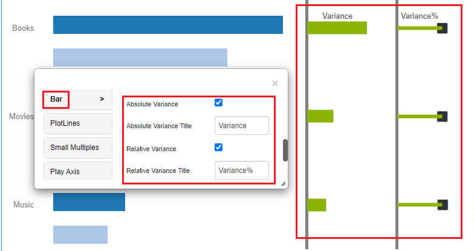
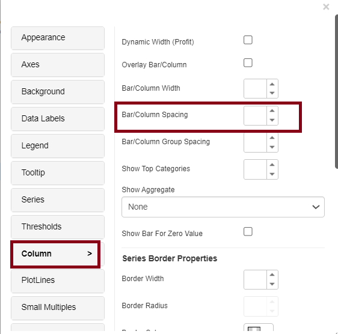

# Bar/Column Chart

A bar chart, often known as a bar graph, is a type of chart that displays organized data using rectangular bars with lengths proportionate to the values they represent. The bars can be plotted horizontally or vertically. A vertical bar chart is also known as a column bar chart. Users will separate icons for horizontal and vertical charts in Vitara Charts and will need to switch as needed.

## Inputs 

Metrics - 1 or more metrics Attributes - 1 or more attributes Use as Filter Option - Available

## Thresholds 

In terms of business, specific parts of the chart should be highlighted to attract the attention of decision makers. For example, highlight the stores with total sales greater than a certain amount, or the top ten products with high sales over the previous winter. Thresholds are extremely valuable items in these scenarios.

Thresholds will use conditional formatting to highlight specific data points in a chart based on predefined criteria.The qualifications are attribute or metric qualifications. If the expression of a qualification evaluates to TRUE, the report indicates the threshold. Markers can also be included in thresholds.

**Note:** From 4.6 version we can apply thresholds using attributes. The source drop down box in the threshold editor window will list all the attributes and metrics in the chart. we can select an attribute as source and define a threshold condition. The target of the threshold depends on the series of the chart. This means, if the chart series is created using metrics then target drop down box will display the metrics. If we enabled ‘color by’ mode, by adding an attribute to the ‘color by’ drop zone in the dossier’s editor panel, the chart series will be created using attributes. In this case the threshold target drop down box will show all the elements of attribute used in the color by drop zone. In this case we can set threshold target using attribute.

<figure><figcaption></figcaption></figure>

In the threshold, the editor window apply source, target, threshold condition and the other related information to set a threshold on the chart.

<figure><figcaption></figcaption></figure>

Apply all the inputs and click on ‘Apply’ button.

From version 4.9.0, we can use pattern fill in thresholds, certain part of the chart can be filled with a pattern.

<figure><figcaption></figcaption></figure>

<figure><figcaption></figcaption></figure>

## Axes 

You can do both Category and Value formattings, by using Title, Label, Axis line and other options in the property editor.

<figure><figcaption></figcaption></figure>

Example of text formatting and color formatting for labels, title and axis line in the column chart.

<figure><figcaption></figcaption></figure>

## Data Labels 

From 4.1 version, a new property is introduced in bar and column charts to show the data labels outside the bar/column. The option to enable this feature is added in data labels tab with ‘**Show Label Outside Bar/Column**’ checkbox. See the screenshot below:\
\

<figure><figcaption></figcaption></figure>

By default, this option will be enabled for the charts created from 4.1. Below screenshot shows how the data labels look before and after enabling ‘Show Label Outside Bar/Column’ option\

<figure><figcaption></figcaption></figure>

\

The feature ‘Show Label Outside Bar/Column’ is tied to horizontal data label positions. If the data label is set to appear outside the bar/column, the horizontal data label positions right, left, and centre have no effect on the chart.

In VitaraCharts 4.7, a new property called ‘Force Outlier Labels Outside’ is added to all charts with bars as series. The data labels will be forced to appear outside the bar if this property is set, even if the bar has the maximum value in the chart. See the before and after screenshots for the bar chart.

### &#x20;Before:

<figure><figcaption></figcaption></figure>

### After: 

<figure><figcaption></figcaption></figure>

## Series 

We can turn the bar/column chart into the combinational chart by changing the ‘series type’ in the ‘series’ tab.

<figure><figcaption></figcaption></figure>

From version 4.9.0, this charts have the Pattern fill option (Grid/Square/Double Square/Slash) in the Series tab, which allows us to display data in a more presentable manner.

<figure><figcaption></figcaption></figure>

<figure><figcaption></figcaption></figure>

## **Addition of Data Markers through Links**

From Version 5.1.1, we have added a new feature that allows us to add markers to bar and column charts using image addresses (links). This functionality can be enabled under the series tab with name ‘Set DataMarker (link),’ where we must enter the URL and press the Apply button.

<figure><figcaption></figcaption></figure>

<figure><figcaption></figcaption></figure>

## Markers 

From 4.6 version, the markers in bar/column charts provide a visual means to highlight specific data points, such as outliers, goals, or key milestones. They enhance data interpretation and focus, making important information easily noticeable amidst the bars, aiding in decision-making and emphasizing critical aspects of the data.

Open the property editor by clicking on the ‘Edit’ button and select the Series tab you can see the Enable marker, Marker type and Marker size options to Enable marker properties. Below are the screenshots with the marker options.

<figure><figcaption></figcaption></figure>

In the below example, the bar changed to line in series property and ‘Thumbs-up’ marker is applied for the ‘2015 Q2’ attribute element. Below is the screenshot with the marker applied in the chart.

<figure><figcaption></figcaption></figure>

## **Data Marker from Attribute Form**

From Version 5.1.1, we added a new feature for adding data markers. The dataset must include a column that contains tags or links since these markers will be activated by html tags or links from attribute forms. The markers will automatically display on the chart as soon as this column is included in the attribute form.

Below you will find URL dummy dataset created for further explanation:

<figure><figcaption></figcaption></figure>

Now, when dataset is being added we have to follow certain steps:

* First, change the ‘Category URL’ datatype to URL or HTML tags as shown below:&#x20;

<figure><figcaption></figcaption></figure>

* The next step is to create a multi-form attribute using two columns, that can be combined using the Ctrl key, as shown below:&#x20;

<figure><figcaption></figcaption></figure>

* Now ,the merged column will show up like this we can now update the changes.&#x20;

<figure><figcaption></figcaption></figure>

* Finally, add attributes and metrics to the chosen dropzones to see markers appear on the charts.&#x20;

<figure><figcaption></figcaption></figure>

## Column/Bar Property 

From 4.5 version of Vitara charts, there is a new property named ‘Column’ in column chart and ‘Bar’ in bar chart. You can see properties like Overlay Bar/Column, Bar/Column width, Bar/Column spacing and Series Border Properties.

Bar/Column width features refer to the ability to adjust the thickness or width of individual bars within the chart. This customization allows you to control the visual representation of data, emphasizing specific aspects or accommodating different data densities for improved clarity and aesthetics in the chart.

Bar/column spacing features in bar/column charts allow you to control the gaps between individual bars or columns. Adjusting spacing can enhance chart readability and aesthetics, making it easier to compare data points, emphasize differences, or convey specific data relationships within the same chart.

Series border properties in a bar/column chart allow you to customize the appearance of the borders or outlines around individual data series. These properties include options to control the color, width, and radius of the borders for each series within the chart. Customizing series borders can help highlight specific data series, improve chart readability, and enhance the overall visual presentation of the data. This customization is particularly useful when you want to emphasize certain data or create a distinct visual effect in the chart

Below is the screenshot of the Bar/Column property editor

<figure><figcaption></figcaption></figure>

From 4.6 version of Vitara charts, there are two enhancements to the Bar/Column chart.

## **1. Variwide Chart:**

Variwide chart can be used to visualize a second dimension in a column chart. Each data point is given a weight, in addition to its value, determining the width of the column. It computes the width for the stack to fill the whole plot area, and simply lets the column widths reflect a value.

For more details about the Variwide feature please refer to vari\_wide.

## **2. Polar Mode**

In polar mode, the Bar/Column charts will use a radial value axis. This way of using axes is called Polar coordinate system.\
Let’s see how to use polar coordinates in simple steps.

**Step 1:**\
Create a Bar chart with a minimum of one attribute and one metric. See the sample screenshot below.

<figure><figcaption></figcaption></figure>

**Step 2:**\
Open the property editor and go to the ‘Bar’ tab. Enable the checkbox ‘Enable Polar Mode’. See the screenshot.

<figure><figcaption></figcaption></figure>

Then the value axis of the chart will be converted into Polar coordinates. Below screenshot shows the default behaviour of the chart with Polar coordinates.

<figure><figcaption></figcaption></figure>

## **Vertical Polar Mode**

With version 5.2, we have included support for the ‘Column’ chart, which displays vertical columns on the polar setting when polar mode is enabled.

Vertical polar mode in a column chart merges the vertical layout of columns with the radial arrangement of polar charts. This offers a unique way to visualize data, especially for cyclic or circular patterns. By utilizing both vertical and radial axes, it can effectively reveal relationships and trends that might be challenging to grasp using traditional chart types. This technique enhances data exploration and communication in specific datasets where circular data distribution plays a significant role. Below are the steps to enable it. Go to the column tab in the property editor and turn on polar mode to observe that the columns are now vertically aligned in polar mode.

<figure><figcaption></figcaption></figure>

<figure><figcaption></figcaption></figure>

### **Polar Mode settings**

Polar mode comes up four settings which include Start angle, end angle, Outer Pane Size, Inner Pane Size.\
The default settings of Polar mode are\
Start Angle: 90, End Angle: 360, Outer Pane Size: 85, Inner Pane Size:20.\
We can modify these settings anytime according to our preference. Let’s see some of the settings below\
Start angle : 180\
End angle : 90\
Outer Pane Size : 90\
Inner Pane Size : 20\
Then chart looks like the below screenshot

<figure><figcaption></figcaption></figure>

All the axes settings available for normal Bar chart are also applicable to Polar coordinate system

## Variances 

From 4.7 version of VitaraCharts, ‘Variance/Delta’ feature is added in Bar/Column charts just like in IBCS charts.

Variance in bar/column chart features allows you to display the difference or deviation between data points and a predefined reference value. It can be presented as error bars or as a separate series of bars/columns, emphasizing how data points vary from a baseline. This feature helps highlight discrepancies or fluctuations in the data, making it easier to identify trends, outliers, or areas of interest within the chart.

To use this feature, the chart should be created with at least 2 metrics and an attribute.The options to enable this feature are available in the Bar/Column tab of the property editor. See the screenshot below

<figure><figcaption></figcaption></figure>

We have ‘Absolute variance’ and ‘Relative variance’ of which either one of them or both can be enabled at a time according to the requirement.\
Absolute variance in bar/column chart features represents the actual difference between data points and a fixed reference value, often displayed as error bars. It quantifies the specific variation from a baseline.

Relative variance, on the other hand, expresses the variance as a percentage or ratio, indicating how much a data point deviates from the reference value in relative terms. It provides a standardized measure of variation, allowing for easy comparison across different data sets or contexts.

To enable Absolute Variance, enable ‘Absolute Variance’ checkbox in Bar tab of the property editor. We can also set a title for absolute variance graph\
See the screenshot below:

<figure><figcaption></figcaption></figure>

To enable Relative Variance, enable ‘Relative Variance’ checkbox in the Bar tab of the property editor. We can also set a title for relative variance graph\
See the screenshot below:

<figure><figcaption></figcaption></figure>

We can also enable both the absolute and relative variances at once. And the chart looks like in the below screenshot:

<figure><figcaption></figcaption></figure>

## Play-by Animation 

Play by - animation shows the chart for each element of the first attribute. For more details about the play by feature please refer to [play-by](https://docs.vitaracharts.com/readme/play-animation).

## Background Image 

The steps to set a background image for all Vitara charts are explained in [backgroundImage](background-images.md).

## Small Multiples 

Bar/Column chart supports small multiples feature. Small multiples feature is explained in [smallMultiples](small-multiples.md).

## Data Markers 

From the version 4.4, data markers feature is introduced in the Bar/Column charts. To know about **Data Markers** feature please [click Here](https://docs.vitaracharts.com/readme/data-markers).

## Bar Fill 

From version 5.0, the Bar Chart can now show fill percentage, where the fill is displayed as a percentage of the attribute and the remaining space is left empty. The fill properties feature plays a crucial role in enhancing the visual representation of data and conveying information effectively.

Unfilled Color: The most fundamental fill property, color choice can influence the overall look and readability of the chart. Different colors can be used to represent different categories, data series, or to highlight specific data points.

Transparency/Opacity: Adjusting the transparency of the fill can help highlight specific data points or show overlapping data more clearly. This is valuable when dealing with complex data sets or when you want to emphasize certain information.

We can enable this feature by going to the Bar tab.

<figure><figcaption></figcaption></figure>

We can set the Max value for ‘Auto’ or ‘Fixed’ or the metrics you’ve taken.

<figure><figcaption></figcaption></figure>

We can specify a value for ‘Fixed.’

<figure><figcaption></figcaption></figure>

Once the maximum value is set, we can also add an unfilled color.

<figure><figcaption></figcaption></figure>

Here is a screenshot of a bar fill using a percentage dataset.

<figure><figcaption></figcaption></figure>

#### Delta Bar 

From version 5.0, Delta Bar/Column feature added to chart, which can be enabled by selecting options from the series tab for individual series. The delta bar feature in a bar chart is a visual element used to represent the difference or change between two data points or categories. It typically consists of vertical bars or lines that connect two bars, highlighting the variance between them. This feature is useful for emphasizing trends, comparisons, or deviations in data, making it easier for viewers to understand shifts or developments over time. Delta bars can be color-coded to indicate positive or negative changes, aiding in the interpretation of data and enabling quick insights into the data’s dynamics.

<figure><figcaption></figcaption></figure>

There are also options to enable delta Labels, set delta Bar width, and invert delta Bar colors.

<figure><figcaption></figcaption></figure>

The delta Bar feature completely disables error bars and vice versa.

<figure><figcaption></figcaption></figure>

The image below shows how the Profit of the financial years 2020 and 2021 will be compared, showing both negative and positive deltas.

<figure><figcaption></figcaption></figure>

This feature is also available with small multiples and bar variance properties.

**Note** : DeltaBar has been disabled for Bar Fill, Polarmode, Dynamic width, Overlay, IBCS view & Play-Axis, and color by.

## **Secondary Delta Feature**

Users of the bar chart can now use the Secondary delta function as of version 5.2.

The secondary delta feature in a bar chart is utilized to highlight the variance or change between two related data points, often presenting the difference as a separate set of bars alongside the main bars. This allows viewers to quickly discern how much value has shifted between categories or time periods. This feature aids in comparing and contrasting data points, emphasizing growth or decline in a clear and concise manner. It’s especially helpful when you want to visually emphasize changes in data and provide a straightforward representation of the differences between two sets of values.

To use this function, go to the IBCS tab in the editor property and enable the Secondary Delta feature.

<figure><figcaption></figcaption></figure>

## Gradient Color 

From version 5.0, Gradient color fill can be added where the series property is available.

The gradient color feature in a bar or column chart is employed to enhance data visualization by applying a color gradient to the bars or columns. It serves multiple purposes, such as highlighting data variations, emphasizing trends, or indicating values. By transitioning colors from lighter to darker shades, it conveys a sense of magnitude, making it easier for viewers to perceive relative differences within the chart. This feature can be particularly useful when showcasing data with a wide range of values, as it provides a more intuitive and visually appealing representation, aiding in data analysis and communication.

It can be enabled by selecting options from the series tab for individual series.

<figure><figcaption></figcaption></figure>

It will show the color palette, which will have two selection handles to choose two colors that will render from beginning to end on the series. (From left to right)

<figure><figcaption></figcaption></figure>

<figure><figcaption></figcaption></figure>

## Zero Value Bar 

In Version 5.1.1.010, we included a new feature that allows users to show zero value bars.

The zero-value bar feature in a bar or column chart is a valuable visual feature for representing data that includes zero values. It ensures that even when there is no data for a particular category or period, a visible and proportional bar is displayed at zero. This is crucial for maintaining the scale and context of the chart, preventing misinterpretation or distortion of data. It allows viewers to accurately assess the absence of data and makes the chart more informative and reliable for analysis and decision-making.This feature can be enabled under the “Bar” tabs, where it can be used to display metrics, whose values are zero.

<figure><figcaption></figcaption></figure>

<figure><figcaption></figcaption></figure>

## Series based Tooltip and Datalabels 

We introduced in version 5.2.4 ,the “Series-based Tooltip” and “Data Labels” features enhance chart data display. When you hover over a data series, series-based tooltips appear, revealing insights into individual data points. Data Labels, on the other hand, allow you to directly display data values on chart elements, which improves data comprehension. These characteristics are useful for expressing precise information and promoting a deeper comprehension of plotted data, making charts more informative and user-friendly.

This feature will be accessible from the “Series” tab in the chart editor menu. Users can access this tab when editing a bar/column chart. Within the “Series” tab, under the metrics two new option named “Data label and Tooltip “ is added, accompanied by a dropdown menu that allows users to select the desired formatting , by default it will be none.

<figure><figcaption></figcaption></figure>

<figure><figcaption></figcaption></figure>

## Show Aggregate and Show Top Categories 

From version 5.2.4 ,in order to enhance the functionality and analytical capabilities of our charting tool, we moved the “Show Aggregate” and “Show Top Categories” features to the bar/column tab from IBCS tab in editor menu. It aims to provide users with the ability to visualize aggregate values (such as sum or average) of data directly within the bar/column chart without IBCS mode (though it, still, can be used in IBCS mode from these options).

Also we have added an option to turn on and off “the aggregate value” for each series in the series tab of editor menu.The “Show Aggregate” feature allows users to enable the display of aggregate values on the bar/column charts.

The “Show Top Categories” feature allows users to enable the display of top values on the bar/column charts.

The “Show Aggregate” feature will be accessible from the “Series” tab in the chart editor menu. Users can access this tab when editing a bar/column chart.

Within the “Series” tab, a new option named “Show Aggregate” will be added, accompanied by a dropdown menu that allows users to select the desired aggregate function (e.g., sum, average), by default it will be none.

<figure><figcaption></figcaption></figure>

<figure><figcaption></figcaption></figure>

<figure><figcaption></figcaption></figure>

<figure><figcaption></figcaption></figure>

<figure><figcaption></figcaption></figure>

## Removing Spaces between Columns 

From Version 5.2.5, removing spaces between columns in a chart is feasible through adjusting the “gap width” or “distance” parameter. By adjusting this feature, one can create a more compact visual representation with a seamless alignment of columns , allowing for a clearer and more impactful presentation of the data.

This option is available in the property editor under the ‘Columns’ tab and is titled Bar/Column Spacing.

<figure><figcaption></figcaption></figure>

In the screenshot below, the spacing of columns is clearly visible in the before and after shots, however in the after image, the spacing is adjusted to ‘0’ among the columns.

<figure><figcaption></figcaption></figure>

#### Adding Grid lines over Columns/Bars 

From veraion 5.2.5, we have introdcued a new feature of adding grid lines over bar/column ,stacked bar/column chart,this feature enhances clarity by aligning gridlines with the bars, aiding in precise data interpretation. Adjust the gridline appearance to suit preferences. By overlaying gridlines over the bars in polar mode, it facilitates a clearer representation of data and assists in analysis within the circular chart structure.

You may enable this functionality in the property editor by going to the ‘Axes’ tab, then ‘Value Axis’ under the ‘Other’ option and checking the ‘Show Grid Lines over Bar’ checkbox.

<figure><figcaption></figcaption></figure>

<figure><figcaption></figcaption></figure>
